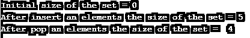

# C++中的 size()

> 原文：<https://www.educba.com/size-in-c-plus-plus/>

 in C++")


## C++中的 size()简介

函数的作用是:返回给定变量、容器或数组的大小。std::size()函数是 C++ STL(标准模板库)中的内置函数。std::size()函数在包含任何头文件时可用，如<array>、<set>、<list>、<map>、<string>、<deque>、<forward_list>、<regex>、<vector>、<string_view>、<unordered_map>、<unordered_set>等，因此 std::size()函数可应用于所有这些变量、容器或数组。</unordered_set></unordered_map></string_view></vector></regex></forward_list></deque></string></map></list></set></array>

**语法:**

<small>网页开发、编程语言、软件测试&其他</small>

```
template< class T, std::size_t N >constexpstd::size_t size(const T (&a)[N]) noexcept
```

其中 a 是存储某个值的变量、容器或数组。该函数返回变量、容器或数组的大小。

### size()函数在 C++ SLT 中的实现

让我们看看最新的移植版本，即 std::size()函数的 c++ 11 版本，如下所示:

**代码:**

```
template< class T, std::size_t N >
constexpstd::size_t size( const T (&a)[N]) noexcept
{
return N;
}
```

在上面的代码中，size(const T (&a)[N])函数是通过引用调用的。references 存储传递变量和直接引用变量的地址，并直接对它们进行处理，返回变量传递的大小。C++重载 size()函数到 std::size_t size( const T (&a)[N])。

### 例子

我们编写 c++代码来更清楚地理解 size()函数，在下面的示例中，我们使用 size()函数来获取字符串变量的大小，如下所示:

#### 示例#1

**代码:**

```
#include<iostream>
using namespace std;
int main()
{
int n;
string s = "Get the size of this string";
n = s.size();
cout<< "The size of the given string is = " << n;
return 0;
}
```

**输出:**

 in C++ Example 1")


在上面的代码中，这个函数用来返回字符串的长度或者字符串对象中的字符数，以字节为单位。该函数不接受任何参数。

接下来，我们编写 c++代码，并对 vector 对象应用 size()函数，因此我们将对 vector 对象调用 size()函数

#### 实施例 2

**代码:**

```
#include <iostream>
#include <vector>
using namespace std;
int main ()
{
vector<int> v;
cout<< "Initial size of the vector = " <<v.size() << '\n';
for (int i=10; i<60; i=i+10)
v.push_back(i);
cout<< "After insert an elements the size of the vector = " <<v.size() << '\n';
v.pop_back();
cout<< "After pop an elements the size of the vector =  " <<v.size() <<endl;
return 0;
}
```

**输出:**

 in C++ Example 2")


在上面的代码中，第一个向量是空的，因此，v.size()函数返回 0，在插入 5 个元素后，它将返回 5，在弹出 1 个元素后，它将返回 4。

接下来，我们编写 c++代码对 list 对象应用 size()函数，因此我们将对 list 对象调用 size()函数

#### 实施例 3

**代码:**

```
#include <iostream>
#include <list>
using namespace std;
int main ()
{
list<char> l;
cout<< "Initial size of the list = " <<l.size() << '\n';
for ( int i=0; i<26; i++ )
l.push_back( 'a'+1 );
cout<< "After insert an elements the size of the list = " <<l.size() << '\n';
l.pop_back( );
cout<< "After pop an elements the size of the list =  " <<l.size() <<endl;
return 0;
}
```

**输出:**

 in C++ Example 3")


在上面的代码中，第一个列表是空的，因此，l.size()函数返回 0，在插入 26 个字符后，它将返回 26，在弹出 1 个元素后，它将返回 25。

接下来，我们编写 c++代码来对 set 对象应用 size()函数，它以特定的顺序存储唯一的元素，因此我们将对 set 对象调用 size()函数

#### 实施例 4

**代码:**

```
#include <iostream>
#include <set>
using namespace std;
int main ()
{
set<int> s;
cout<< "Initial size of the set = " <<s.size() <<endl;
for ( int i = 10; i< 60; i=i+10 ) {
s.insert(i );
}
cout<< "After insert an elements the size of the set = " <<s.size() << '\n';
s.erase(10);
cout<< "After pop an elements the size of the set =  " <<s.size() << '\n';
return 0;
}
```

**输出:**




在上面的代码中，第一个集合是空的，因此，s.size()函数返回 0，插入 5 个元素后，它将返回 5，删除 1 个元素后，它将返回 4。

接下来，我们编写 c++代码对数组对象应用 size()函数，数组对象存储重复的元素，因此我们将对数组对象调用 size()函数

#### 实施例 5

**代码:**

```
#include <iostream>
#include <array>
using namespace std;
int main(void) {
array<int, 5> a;
cout<< "The size of the array is  = " <<a.size() <<endl;
return 0;
}
```

**输出:**


在上面的代码中，第一个数组对象是用 5 个元素创建的，所以 size()函数返回 5。

### 结论

std::size()函数返回变量、容器或数组的大小，这是 C++ STL 中的内置函数。如果包含<array>、<set>、<list>、<map>、<string>、<deque>、<vector>以及所有头文件，则 std::size()函数可用。</vector></deque></string></map></list></set></array>

### 推荐文章

这是一个 C++中 size()的指南。在这里，我们讨论 C++中 size()的简要概述及其示例和代码实现。您也可以浏览我们推荐的其他文章，了解更多信息——

1.  [c++中的堆栈](https://www.educba.com/stack-in-c-plus-plus/)
2.  [c++中的继承](https://www.educba.com/types-of-inheritance-in-c-plus-plus/)
3.  [C++ begin()](https://www.educba.com/c-plus-plus-begin/)
4.  [c++中的 ifstream](https://www.educba.com/ifstream-in-c-plus-plus/)


