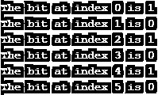
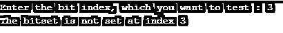

# C++测试()

> 原文：<https://www.educba.com/c-test/>


## C++ test()函数介绍

C++中的 test()函数用于测试在指定索引处的位串中该位是否被置位。test()函数是 C++中的内置函数，在<bits>或<bitset>头文件中定义，这个头文件包含了每个标准库。text()函数只接受一个参数，即位串的索引位置，在该索引位置，如果位是 1，则函数返回 true，否则如果位是 0，则返回 false。</bitset></bits>

**语法:**

<small>网页开发、编程语言、软件测试&其他</small>

```
bool test(int index) ;
```

**c++ test()函数的参数**

**Index:** index 是一个 int 参数，指定测试该位是否置位的索引位置。这不是可选参数。

此函数的返回值是布尔类型，如果该位在给定的索引位置被设置，则返回 true，否则如果该位未被设置，则返回 false。

### C++中 test()函数的使用

test()函数用于或调用位集串(以字符串格式存储的 0 和 1 的集合)，以在位串中的特定索引位置查找该位是被置位(1)还是未被置位(0)，因此 test()函数只接受一个参数，即位串的索引位置，并检查位串中该索引位置的位是 1 还是 0。如果位存储为 1，则返回 true，否则如果位为 0，则返回 false，正如我们在下面的示例中看到的。

### 在 C++中实现 test()函数的例子

下面是 test()函数的例子:

#### 示例#1

我们编写 C++代码来更清楚地理解 test()函数，在下面的例子中，我们使用 test()函数来检查位串的所有位，如下所示:

**代码:**

```
#include <iostream>
#include <bits/stdc++.h>
using namespace std;
int main ()
{
int i;
// Initialization of bitset
bitset<6> bstr(string("010101"));
// code to check all the bits whether set or not
for(i=0; i<6; i++)
{
cout << "The bit at index "<< i << " is "<< bstr.test(i) << endl;
}
return 0;
}
```

**输出:**




在上面的代码中，test()函数被用来在 for 循环的帮助下检查所有的位以获得索引值。索引值 0 到 5 传递给 test()函数，因此在每个循环中，特定的索引函数检查该位是设置为 1 还是没有设置为 0。因此，在输出中，我们可以看到它从右到左打印所有的位，无论是否设置。

#### 实施例 2

我们编写 C++代码来理解 test()函数，其中我们使用 test()函数来检查用户给定的位串的位索引，如下所示:

**代码:**

```
#include <iostream>
#include <bits/stdc++.h>
using namespace std;
int main ()
{
int i, index;
// Initialization of bitset
bitset<6> bstr(string("010101"));
cout<<"Enter the bit index, which you want to test :";
cin>>index;
// code to check whether the bit at given index is set or not
cout << "The bit at given index "<< index << " is "<< bstr.test(index) << endl;
return 0;
}
```

**输出:**


在上面的代码中，用户接受了索引位置，并将其传递给 test()函数，以便只检查给定的索引位是否置位。当用户将索引值 3 传递给 test()函数时，在位串(“010101”)中，我们可以看到索引 3 处的位为 0，这意味着未设置。因此，在输出中，我们可以看到它正在打印给定索引为 0 的位。

#### 实施例 3

我们编写 C++代码来理解 test()函数，其中我们使用 test()函数来检查用户给定的位索引是否已设置，如下所示:

**代码:**

```
#include <iostream>
#include <bits/stdc++.h>
using namespace std;
int main ()
{
int index;
// Initialization of bitset
bitset<6> bstr(string("010101"));
cout<<"Enter the bit index, which you want to test :";
cin>>index;
// code to check whether the bit at given index is set or not
if(bstr.test(index)){
cout << "The bitset is set at index " << index;
}
else
{
cout << "The bitset is not set at index " << index;
}
return 0;
}
```

**输出:**




在上面的代码中，用户接受了索引位置，并通过了 test()函数。当用户传递索引值 3 时，该值被进一步传递给 test()函数，如位串(“010101”)中所示，我们可以看到，在索引 3 处，该位为 0，这意味着未设置，因此 test()函数返回 false，因此在输出中输出 false 语句。

当用户输入 4 时，上述代码的另一个输出是:


#### 实施例 4

我们编写 C++代码来理解 test()函数，其中我们使用 test()函数来比较两个不同的字符串，如下所示:

**代码:**

```
#include <iostream>
#include <bits/stdc++.h>
using namespace std;
int main ()
{
int i;
// Initialization of bitset
bitset<6> bstr1(string("010101"));
bitset<6> bstr2(string("011001"));
// code to check whether the two bit strings are equal or not
for( i=0; i<6; i++)
{
if(bstr1.test(i) == bstr2.test(i)){
continue;  }
else   {
break;     }
}
if( i == 6 ) {
cout<< "Both the bit strings are equal.";
}
else  {
cout<< "Both the bit strings are not equal.";
}
return 0;
}
```

**输出:**


在上面的代码中，test()函数用于逐位比较两个位串。这里两个字符串位不相同，所以输出显示两个位字符串不相等。

### 结论

C++中的 test()函数是一个内置函数，可以用来测试在给定的索引中该位是否被置位。test()函数在<bits>或<bitset>头文件中定义。</bitset></bits>

### 推荐文章

这是一个 C++测试指南()。在这里，我们讨论了 C++ test()函数的简要概述及其工作原理，并给出了示例和代码实现。您也可以浏览我们推荐的其他文章，了解更多信息——

1.  [C++ iomanip](https://www.educba.com/c-plus-plus-iomanip/)
2.  [c++中的堆栈](https://www.educba.com/stack-in-c-plus-plus/)
3.  [c++中的继承](https://www.educba.com/types-of-inheritance-in-c-plus-plus/)
4.  [C++字符串复制](https://www.educba.com/c-plus-plus-string-copy/)


