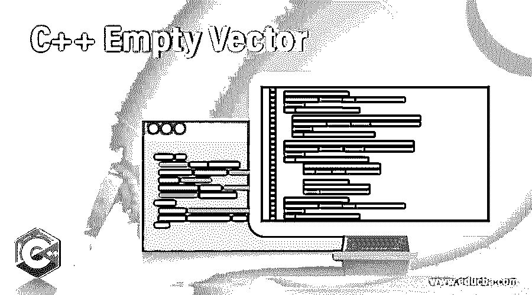
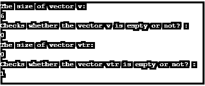
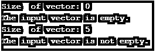

# C++空向量

> 原文：<https://www.educba.com/c-plus-plus-empty-vector/>




## C++空向量简介

在 C++中，vector 有一个 empty()函数，帮助检查 vector 容器是否有元素。向量几乎类似于动态数组，当一个项目被删除或插入时，它可以自动调整自身的大小，它的存储可以由容器自动处理。向量的元素保存在连续存储中，可以在迭代器的帮助下进行访问和遍历。此外，该项是在末尾插入的，这需要不同的时间，因为有时需要数组扩展。让我们仔细研究一个空矢量。

**语法**

<small>网页开发、编程语言、软件测试&其他</small>

下面是空向量的语法。

```
v.empty()
```

这里，v 是矢量的名称。

**参数**:不需要传递任何参数。

**返回值**:如果 vector 为空，则返回 true。否则，将返回 false。

### 空向量函数在 C++中如何工作？

假设有一个向量 v，包含元素 56，73，58，89，10。如果调用 v.empty()方法，可以看到输出将显示为 false。

相同的代码如下所示。

```
v={56,73,58,89,10}
v.empty() ;
```

**输出:**假

同时，如果另一个向量 vtr 存在并且不包含任何元素。如果这次调用 v.empty()方法，可以看到输出会显示为 true。

相同的代码如下所示。

```
v={}
v.empty() ;
```

**输出:**真

**异常:**

下面是 vector 类的 empty()方法的例外。

不保证会引发异常。
传递参数时会显示错误。

### C++空向量的例子

以下是空向量的示例程序。

#### 示例#1

C++程序检查向量是否为空。

**代码:**

```
// C++ program to implement empty() function
#include <iostream>
#include <vector>
using namespace std ;
int main()
{
//create a vector v with different integer elements
vector<int> v{ 39, 52, 62, 31, 91, 24} ;
//print the size of the vector
cout <<"The size of vector v: \n"<< v.size() <<endl ;
//checks whether the vector is empty or not
cout << "Checks whether the vector v is empty or not? : \n" << v.empty() <<endl ;
//create a vector vtr with no elements
vector<int> vtr{ } ;
//print the size of the vector
cout <<"The size of vector vtr: \n" << vtr.size() <<endl ;
//checks whether the vector is empty or not
cout << "Checks whether the vector vtr is empty or not? : \n" << vtr.empty() <<endl ;
return 0;
}
```

**输出:**




首先，用不同的整数元素 39，52，62，31，91，24 创建一个向量 v。创建后，打印矢量的大小。然后，它使用 empty()方法检查向量是否为空。完成后，创建一个没有元素的矢量 vtr，并打印矢量的大小。再次使用 empty()方法检查 vector 是否为空。在执行代码时，可以看到向量 v 的大小是 6，并且向量不为空，因为打印的是 0。同时，向量 vtr 的大小是 0，当打印 1 时，向量是空的。这里，0 是布尔值 false，1 是布尔值 true。

#### 实施例 2

C++程序向 vector 添加元素，并在添加这些元素之前检查 vector 是否为空

**代码:**

```
#include <iostream>
#include <vector>
using namespace std ;
int main()
{
vector<int> v;
//print the size of  vector v
cout << "Size  of vector: " << v.size() << endl ;
//checks whether vector v is empty or not
//if it is empty
if (v.empty())
cout << "The input vector is empty." << endl ;
//if it is not empty
else
cout << "The input vector is not empty." << endl ;
//push elements to the vector
v.push_back(45) ;
v.push_back(23);
v.push_back(56);
v.push_back(25);
v.push_back(57);
//print the size of the vector
cout << "Size  of vector: " << v.size() << endl;
//checks whether the vector is empty or not
//if it is empty
if (v.empty())
cout << "The input vector is empty." << endl;
//if it is not empty
else
cout << "The input vector is not empty." << endl;
return 0;
}
```

**输出:**




在这个程序中，创建一个矢量 v 并打印矢量大小。然后，使用 empty()方法检查 vector 是否为空。检查之后，使用 push_back()方法向其中添加元素。再次打印尺寸，并使用 empty()方法检查向量是否为空。在执行代码时，会显示相应的消息。

#### 实施例 3

C++程序，求向量中元素的和。

**代码:**

```
// C++ program to find sum of elements in a vector
#include <iostream>
#include <vector>
using namespace std;
int main()
{
//declare a variable s which is equal to zero
int s = 0;
//create a vector v with different integer elements
vector<int> v{ 39, 52, 62, 31, 91, 24};
//check whether the vector is empty
while (!v.empty())
{
//find the sum of the elements
s = s + v.back();
v.pop_back();
}
//print sum of the elements
cout << s;
return 0;
}
```

**输出:**


首先，声明一个变量 s，它被初始化为零。然后，用不同的整数元素 39，52，62，31，91，24 创建一个向量 v。创建之后，使用 empty()方法检查 vector 是否为空。如果向量不为空，则进入循环。元素的总和将使用该循环来标识。在执行代码时，可以看到元素的总和被打印出来。

### 优势

以下是 Vector 的优点。

*   向量的大小可以改变
*   可以存储多个对象
*   可以从向量中删除元素

### 结论–c++空向量

在 C++中，vector 有一个 empty()函数，用于检查 vector 是否有元素。本文详细解释了 vector 中 empty()函数的语法、工作原理、优点和示例。

### 推荐文章

这是一个 C++空向量的指南。在这里，我们讨论了空向量函数在 C++中是如何工作的，并给出了代码和输出的例子。您也可以看看以下文章，了解更多信息–

1.  [C++测试()](https://www.educba.com/c-test/)
2.  [C++设定精度](https://www.educba.com/c-plus-plus-setprecision/)
3.  [c++中的信号](https://www.educba.com/signal-in-c-plus-plus/)
4.  [C++头文件](https://www.educba.com/c-plus-plus-header-files/)


