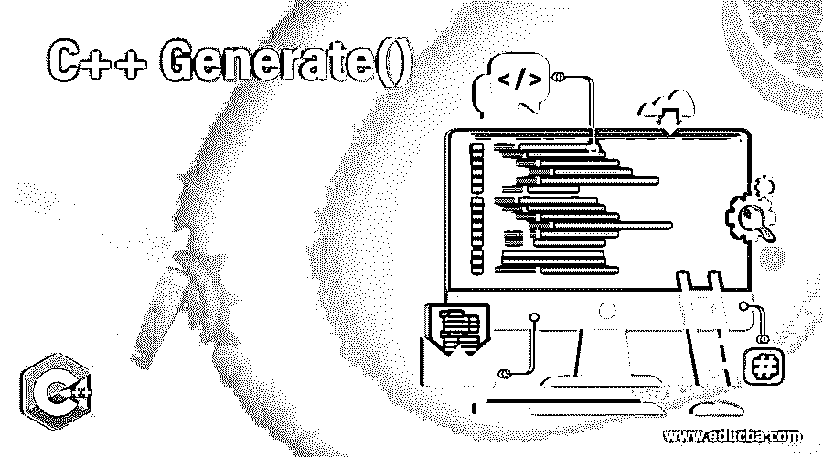
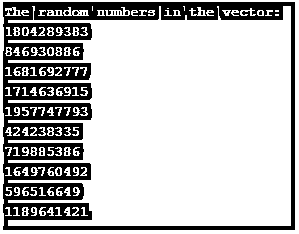
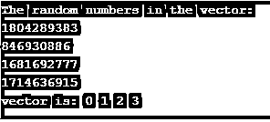

# C++生成()

> 原文：<https://www.educba.com/c-plus-plus-generate/>




## C++ Generate()简介

C++中的生成器函数(std::generate)帮助基于生成器函数生成数字，并将值分配给容器中指定范围[f，l]内的项目。该功能必须由用户描述，并成功调用以分配号码。在这个主题中，我们将学习 C++ Generate()。让我们在下面几节中更详细地研究这个函数。

**语法**

<small>网页开发、编程语言、软件测试&其他</small>

下面是生成函数的语法。

```
void generate ( ForwardIterator f, ForwardIterator l, Generator g ) ;
```

### 因素

**f:** 这里 f 是指向容器第一项的前向迭代器。

**l:** 这里 l 是指向容器最后一项的前向迭代器。

**g:** 这是将被赋值的生成器函数。

**返回值:**由于返回类型为 void，将不返回值。

**异常:**

如果迭代器上的生成函数 g 或操作抛出异常，将会抛出异常。

当使用无效参数时，将导致未定义的行为。

**时间复杂度:**

第一个和最后一个之间是线性的。

**数据竞争:**

对象在第一个和最后一个之间的范围内被修改。在这里，每个对象只被访问一次。

### generate()算法函数在 C++中是如何工作的？

以下是 generator()函数工作必须遵循的步骤。

1.根据用户需求创建任意大小的矢量。

```
vector<int> vt(12);
```

这里，向量 v 的大小是 12。

2.创建一个带有三个参数的 generate()方法:指向第一项的指针、指向第二项的指针和一个生成器函数。

```
generate(vt.begin(), vt.end(), rand);
```

这里，begin、end 和 rand 是三个参数。例如，rand()是一个生成随机数的函数。

3.根据用户需求，使用迭代器或循环打印所有元素。

### C++ Generate()的例子

让我们看看 CPP 中关于生成函数的一些示例程序。

#### 示例#1

CPP 程序使用 generate()和 rand()函数生成限制范围内的随机数。

**代码:**

```
#include <iostream>
#include <vector>
#include <algorithm>
using namespace std;
int main(void)
{
//create vector of size 10
vector<int> vt(10);
//generate random numbers
generate(vt.begin(), vt.end(), rand);
cout << "The random numbers in the vector: " << endl;
for (auto i = vt.begin(); i != vt.end(); ++i)
cout << *i << endl;
return 0;
}
```

**输出:**




在这个程序中，首先创建一个大小为 10 的向量。然后在向量大小的范围内产生随机数。如前所述，generate()方法有三个参数，其中第一个参数指向第一项，第二个参数指向最后一项。第三个参数是 generate 函数，其中考虑了 rand()方法。rand()方法有助于生成随机数。然后在执行代码时打印出所有的元素。

#### 实施例 2

CPP 程序通过将函数作为参数传递来实现生成函数。

**代码:**

```
// C++ program to implement std::generate with generator function
#include <iostream>
#include <vector>
#include <algorithm>
// Define the generator function g
int g()
{
static int n = 0;
return ++n;
}
using namespace std;
int main()
{
int n;
// Declare a vector vtr of size 6
vector<int> vtr(6);
// usage of std::generate
std::generate(vtr.begin(), vtr.end(), g);
//iterator
vector<int>::iterator it;
for (it = vtr.begin(); it != vtr.end(); ++it) {
cout << *it << " ";
}
return 0;
}
```

**输出:**


在这个程序中，首先创建一个大小为 6 的向量。然后调用 generate()方法，其中第三个参数是单独定义的生成函数 g。在函数 g 中，数字从 0 开始递增，一直到 6。在这里，0 不像变量在打印前递增那样具有包容性。之后，使用迭代器打印所有元素。最后，在执行代码时，所有的元素都被打印出来，如结果所示。

#### 实施例 3

CPP 程序通过传递指令而不是函数来实现生成函数。

**代码:**

```
#include <iostream>
#include <vector>
#include <algorithm>
using namespace std;
int main(void)
{
//create vector of size 10
vector<int> v(10);
int i(0);
//generate numbers
generate(v.begin() , v.end(), [&]{ return i++; }) ;
std::cout << "vector is: " ;
for (auto vv: v) {
std::cout << vv << " " ;
}
std::cout << " \n ";
}
```

**输出:**


与第一个程序类似，在这个程序中，首先创建一个大小为 10 的向量。那么变量 I 被初始化为 0。在有三个参数的 generate()方法中，第一个参数是 vector.begin()，第二个参数是 vector.end()。第三个参数是 I 的增量，然后在执行代码时打印所有的元素。

#### 实施例 4

CPP 程序使用 generate()和 rand()函数生成限定范围内的随机数和唯一数。

**代码:**

```
#include <iostream>
#include <vector>
#include <algorithm>
using namespace std;
int main(void)
{
//create vector of size 4
vector<int> vt(4);
//generate random numbers
generate(vt.begin(), vt.end(), rand);
cout << "The random numbers in the vector: " << endl;
for (auto i = vt.begin(); i != vt.end(); ++i)
cout << *i << endl;
int i(0);
//generate random numbers
generate(vt.begin(), vt.end(),[&]{ return i++; });
std::cout << "vector is: " ;
for (auto vv: vt) {
std::cout << vv << " " ;
}
std::cout << " \n ";
}
```

**输出:**




在这个程序中，首先创建一个大小为 4 的向量。然后使用 generate()函数中的 rand()函数在向量大小的范围内生成随机数。然后，再次调用 generate()函数，其中第三个参数是递增变量 I 的指令。在执行代码时，打印范围 4 的随机数和唯一数。

### 结论

C++中的生成器函数(std:: generate)帮助基于生成器函数生成数字，并将值分配给容器中指定范围[f，l]内的项目。在本文中，将详细解释这个函数的更多细节。

### 推荐文章

这是一个 C++ Generate()的指南。在这里，我们讨论 generate()算法函数在 C++中是如何工作的，包括语法、参数、例子、代码和输出。您也可以看看以下文章，了解更多信息–

1.  [C++测试()](https://www.educba.com/c-test/)
2.  [c++中的运算符优先级](https://www.educba.com/operator-precedence-in-c-plus-plus/)
3.  [C++头文件](https://www.educba.com/c-plus-plus-header-files/)
4.  [C++ begin()](https://www.educba.com/c-plus-plus-begin/)


