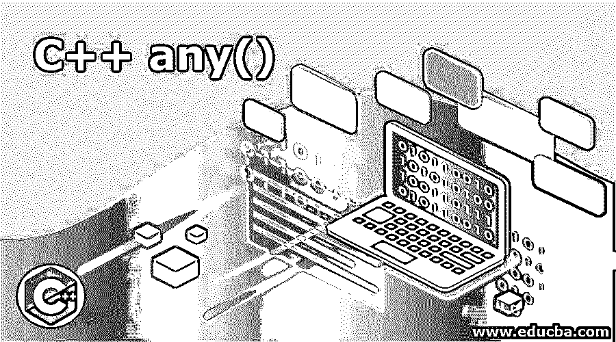
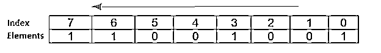
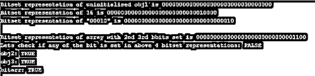

# C++ any()

> 原文：<https://www.educba.com/c-plus-plus-any/>




## C++ any()函数简介

Bitset 是 C++库中的一个重要类，它帮助模拟以位序列形式存储的字符串或数字，就像一个数组，其中每个位都存储在数组中的连续位置。因为使用的存储数据集是一个数组，所以每个位都可以被一个特定的索引引用，这有助于快速访问元素。Any()方法是 Bitset 类中提供的方法之一，用于查找数组中存在的任何位是否被设置，即其值是否为“1”。如果没有位被设置为假，则返回。

**语法**:

<small>网页开发、编程语言、软件测试&其他</small>

*   C++11 之前:

    ```
    bool any() const;
    ```

*   自 C++11:

    ```
    bool any() const noexcept;
    ```

此方法不要求在调用时传递任何参数。只有对 bitset 类的一个对象的引用调用此方法，用于保持 Bitset 表示对象。

*   **Bool:** 确定该方法的返回类型是 Boolean，如果任何一个位被置位，则为真，否则为假。
*   **Const** :限制其任何子类对此方法的任何更改。

C++11 以后这个方法不抛出任何异常，可以用 noexcept 关键字推断出它的声明。

### any()函数在 C++中是如何工作的？

位集有助于模拟布尔数组，其中每一位都以这样的方式存储，以便有效地使用存储器，因为存储位集所消耗的存储器远少于布尔数组或向量的存储。因此，可以推断出使用位集存储的信息是以压缩方式存储的，从而有助于增强阵列和对其进行向量操作的性能。使用 bitset 的唯一限制是数组的大小需要在编译时声明。

**1。**位集数组中的每一位都可以很容易地使用索引来访问，例如，obj[3]从右侧指向位集中索引 3 处存储的元素。




**2。** Bitset 也给构造函数获取给定字符串和数字的位集表示。因此，人们可以很容易地使用这个类来存储信息。它提供了各种方法来对位执行操作，例如:-

1.  数数
2.  全部
3.  任何的
4.  试验
5.  一组

**3。**当触发位集对象的 Any()方法时，编译器从 0 到 N 索引遍历位集的整个数组，其中 N 在编译时声明，并检查该位是否已设置，即该索引处的位值是否为 1。如果是，则中断循环并返回真布尔值，否则返回假布尔值。Any()方法的工作方式与下面给出的循环相同:-

```
for(int i=0;i<bitsObj.size();i++){
if(bitsObj.test(i)){
return true;
break;
}
else{
return false;
}
}
```

### C++中 any()函数的优势

*   对 bitset 的所有按位操作都可以在没有任何类型的转换或转换的情况下执行，这有助于提高性能和效率。
*   主要的重载方法是&，！,==,!=亦作<>移位运算符。并且可以使用 Any()方法来检测给定数是否包含任何 set 位来执行这些操作，否则直接忽略该 bitset。

### C++ any()函数的实现示例

下面是 C++ any()的例子:

#### 示例#1

让我们考虑一个简单的例子来理解 bitset 中的函数是如何工作的。

**代码:**

```
#include <bits/stdc++.h>
using namespace std;
int main()
{
bitset<4> obj1(string("10010"));
bitset<6> obj2(string("000000"));
bool result1 = obj1.any();
if (result1)
cout << obj1 << " has one of its bits set"
<< endl;
else
cout <<  " None of the bits is set in "<< obj1
<< endl;
bool result2 = obj2.any();
if (result2)
cout << obj2 << "  has one of its bits set"
<< endl;
else
cout << "None of the bits is set in " << obj2
<< endl;
return 0;
}
```

**输出:**


**解释**:这里由于 obj1 10010 在第 1 和第 4 个<sup>索引处设置了一个位，因此任何方法都为其返回 true。但是如果 obj2 000000 没有设置任何位，则返回 false。</sup>

#### 实施例 2

在第二个例子中，我们将看到 4 个不同的位集对象的任何函数的工作。

**代码:**

```
#include <bits/stdc++.h>
using namespace std;
#define M 32
int main()
{
bitset<M> obj1;
bitset<M> obj3(string("00010"));
bitset<M> obj2(16);
bitset<M> bitarr;
cout << "Bitset representation of uninitialised obj1 is " <<obj1 << endl;
cout << "Bitset representation of 16 is " <<obj2 << endl;
cout << "Bitset representation of \"00010\" is " <<obj3 << endl;
cout << endl;
bitarr[3] = 1;
bitarr[2] = bitarr[3];
cout << "Bitset representation of array with 2nd 3rd bbits set is "<< bitarr << endl;
cout << "Lets check if any of the bit is set in above 4 bitset representations: ";
if( obj1.any()) cout<< "obj1: " <<"TRUE"<<endl ;else cout << "FALSE" <<endl;
if( obj2.any()) cout<< "obj2: " <<"TRUE"<<endl ;else cout <<"FALSE" <<endl;
if( obj3.any()) cout<< "obj3: " <<"TRUE" <<endl;else cout<<  "FALSE" <<endl;
if( bitarr.any()) cout<< "bitarr: " <<"TRUE"<<endl; else  cout<< "FALSE" <<endl;
cout << endl;
return 0;
}
```

**输出:**




**解释:**在上面给出的例子中，M 为所有给定的位集对象定义了位集数组的长度。由于 obj1 未初始化，因此其值默认初始化为 0。第二个对象 obj2 是一个数字-16，使用位集构造函数将其转换为位集表示。第三个对象是位 00010 的形式，并且在索引 1 处设置了位。第四个索引是未初始化的位集数组，因此在开始时存储 0 值，但是它的 2 <sup>nd</sup> 和 3 <sup>rd</sup> 位在运行时被设置。Any()方法用于查找给定对象中的任何位是否被设置。

### 结论

位集表示扮演着重要的角色，因为它有助于处理字符串或数字的位表示。由于机器理解“0”和“1”的语言，使用这种表示法可以提高性能。Any()是该类中提供的方法之一，用于查找给定的 bitset 对象中是否设置了任何位。

### 推荐文章

这是一本 C++ any()指南。这里我们讨论 C++ any()函数的介绍及其示例，以及代码实现和输出。您也可以浏览我们推荐的文章，了解更多信息——

1.  [c++中的递归函数](https://www.educba.com/recursive-function-in-c-plus-plus/)
2.  [c++的特性](https://www.educba.com/features-of-c-plus-plus/)
3.  [机器学习 C++库](https://www.educba.com/machine-learning-c-plus-plus-library/)
4.  [C++字符串复制](https://www.educba.com/c-plus-plus-string-copy/)


