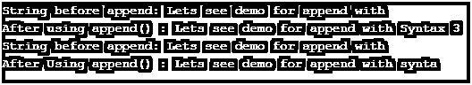
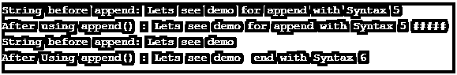

# C++字符串追加

> 原文：<https://www.educba.com/c-plus-plus-string-append/>


## C++字符串追加函数简介

Append 是 C++字符串库中的一个特殊函数，用来将一个字符串追加到另一个字符串中，并返回*这个运算符。这类似于 push_back 或+=运算符，但它允许同时追加多个字符。这意味着字符数组也可以被追加，但是不允许追加单个字符。它还允许将第二个字符串的特定部分附加到第一个字符串上，或者定义一个字符串必须附加的次数。还提供了一个迭代器范围来迭代字符串的字符。

### C++字符串追加的语法

Append 函数允许将一些字符串追加到现有的字符串中。在 C++中有不同语法。

<small>网页开发、编程语言、软件测试&其他</small>

**1。**用于将给定的字符串 str1 追加到另一个指定的字符串 str。如果追加后字符串的长度超过了最大字符数，编译器将抛出 length_error。

```
string& string::append (const string& str1)
```

**示例:** string my_str("第一串")；这里的 Const 意味着附加字符串为常量，并且不能修改。

```
string my_str1(“Second String”);
my_str.append(my_str1);
```

**2。**用于追加最多 n 个字符串 str1 的字符，从 index mind 开始。以防万一找到> str。size()，然后在结果大小超过最大字符数的情况下，抛出 out_of_range error 和 length_error。

```
string& string::append (const string& str1, intind, size_type n)
```

**举例:**

```
my_str.append(my_str2, 0, 7);
```

这将把 my_str2 的前七个字符追加到 my_str。

**3。**用于追加 C 字符串 cstr 的字符数组。如果结果字符串的长度超过了最大字符数，就会抛出 length_error。

```
string& string::append (const char* cstr1)
```

**举例:**

```
my_str.append("This string");
```

**4。**它用于在给定的字符数组字符中添加特定数量的字符，当字符串的大小超过最大字符数时，抛出 length_error。

```
string& string::append (const char* chars1, size_typenums)
```

**举例:**

```
my_str.append("This string",6); //This will append 6 characters of given character array to the string.
```

**5。**用于将一个字符 ch n 次追加到一个给定的字符串中。如果最大字符数小于字符串的最终大小，它会抛出 length_error。

```
string& string::append (size_typenum, char ch)
```

**举例:**

```
my_str1.append(5,'$'); //This will append “$$$$$” to the string tail.
```

**6。**用于追加给定范围[start，end]的所有字符，并在结果字符串大小大于最大字符数的情况下抛出 length_error。

```
string& string::append (InputIteratorstart, InputIterator end)
```

**举例:**

```
my_str.append(str1.begin()+4, str1.end()); // This will append the characters of str1 string starting with 5<sup>th</sup> character upto end to the given string.Here, str1 refers to the string of characters to be appended.
```

### C++中字符串追加函数是如何工作的？

String library 有很多功能，可以对 String 对象进行特定的更改。这种操作是追加、开始、结束等。

这些操作让我们访问字符串来开始一个字符或结束一个字符。

Append()函数就是这样一个函数，用于将某个字符串追加到给定的字符串中。它获取第二个字符串的字符，并遍历第一个字符串，直到到达其最后一个字符。然后它开始一个字符一个字符地复制到第一个字符串。如果超过了字符的长度，就会抛出 length_error。

通过这种方式，字符被复制到给定的字符串，指向结果字符串的指针以*this 的形式返回。

### 实现 C++字符串追加函数的例子

以下是 C++字符串追加的示例:

#### 示例#1

**代码:**

```
#include <iostream>
#include <string>
using namespace std;
intmain()
{
string my_str1("Lets see demo for append with ");
string my_str2("Syntax 1");
cout<< "String before append: " << my_str1 <<endl;
my_str1.append(my_str2);
cout<< "After using append() : ";
cout<< my_str1 <<endl;
string my_str3("Lets see demo for append with ");
string my_str4("syntax 2");
cout<< "String before append: " << my_str3 <<endl;
my_str3.append(my_str4, 0, 7);
cout<< "After Using append() : ";
cout<< my_str3 <<endl;
return 0;
}
```

**输出:**


#### 实施例 2

**代码:**

```
#include <iostream>
#include <string>
using namespace std;
intmain()
{
string my_str1("Lets see demo for append with ");
cout<< "String before append: " << my_str1 <<endl;
my_str1.append("Syntax 3");
cout<< "After using append() : ";
cout<< my_str1 <<endl;
string my_str3("Lets see demo for append with ");
cout<< "String before append: " << my_str3 <<endl;
my_str3.append("syntax 4", 5);
cout<< "After Using append() : ";
cout<< my_str3 <<endl;
return 0;
}
Output:
```




#### 实施例 3

**代码:**

```
#include <iostream>
#include <string>
using namespace std;
intmain()
{
string my_str1("Lets see demo for append with Syntax 5 ");
cout<< "String before append: " << my_str1 <<endl;
my_str1.append(5,'#');
cout<< "After using append() : ";
cout<< my_str1 <<endl;
string my_str3("Lets see demo ");
string my_str4("for append with Syntax 6 ");
cout<< "String before append: " << my_str3 <<endl;
my_str3.append(my_str4.begin()+7 , my_str4.end());
cout<< "After Using append() : ";
cout<< my_str3 <<endl;
return 0;
}
```

**输出:**




### 结论

Append()是 C++字符串库中的一个特殊特性，用于将一个字符串追加到另一个字符串中。这类似于+=或 push_back 操作符，具有一个增强的特性，允许一次追加多个字符。此外，根据我们的需求**，还提供了许多其他特性来执行 append 语句。**

### 推荐文章

这是一个 C++字符串追加的指南。在这里，我们讨论了 C++字符串追加函数的介绍及其语法，并举例说明了代码实现和输出。您也可以浏览我们推荐的文章，了解更多信息——

1.  [c++中的递归函数(示例)](https://www.educba.com/recursive-function-in-c-plus-plus/)
2.  [c++的 11 大特性](https://www.educba.com/features-of-c-plus-plus/)
3.  [机器学习 C++库](https://www.educba.com/machine-learning-c-plus-plus-library/)
4.  [C 语言中类型为](https://www.educba.com/hashing-function-in-c/)的哈希函数


