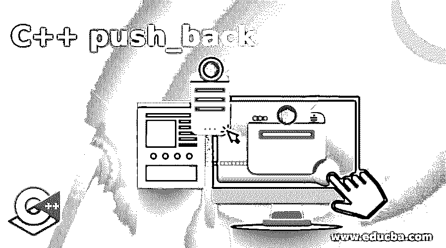

# C++推回

> 原文：<https://www.educba.com/c-plus-plus-push_back/>




## 什么是 C++ push_back？

C++中的 push_back method()是 C++中作为数据结构的 vector 的一部分的方法。它用于从向量的后面推送元素。在最后一个或当前元素被插入到向量中之后，任何新元素从向量的末尾被插入到向量中，从而将向量的大小增加 1。Push_back 方法在没有 vector 的情况下是不可避免的，它主要由 vector 作为数据结构和标准库来支持，以对数组中的元素进行操作。

**语法:**

<small>网页开发、编程语言、软件测试&其他</small>

```
Name_Of_Vector.push_back(argument)
```

语法流程如下所示:

*   **向量名:**顾名思义，向量名是 C++的首字母。
*   **Push_back:** 这将 Push_back 表示为一个函数。
*   **参数:**表示传递给 vector 末尾函数的参数。

push_back 函数没有返回类型，因为它不执行任何更复杂的主要功能。

### push_back 方法在 C++中是如何工作的？

push_back()方法是 C++中的一个方法，它是支持 vector 的标准库的一部分，其主要任务是在被定义或声明的 vector 的末尾插入任何新元素。使用 push_back 函数在向量的末尾插入一个新元素，将整个向量的大小增加一。除了新插入的元素从一端插入到向量中，然后使整个向量对最终用户有用之外，这并不复杂。程序员可以轻松有效地利用这一功能，因为它是标准库的内置功能。不需要向函数传递参数，因为它只是描述和给出将被插入到向量中的元素的类型。C++的 push_back 方法中没有返回类型。C++中成员函数从来不会抛出 push_back()方法的这个函数的异常。此外，时间复杂度是恒定的，因为数据结构(即向量)不需要对内部组件进行太多的操作，也不需要对元素进行指针操作，除了只从整个向量的一端插入和删除元素的任务。在发送任何外部函数或参数之前，函数本身不会传递任何参数，这也只是从向量后面添加和插入元素，与外部参数操作无关，而这种方法将始终保持用户友好。插入后，在 vector 后面添加一个元素会使整个 vector 的大小增加一。因为除了添加和删除元素之外没有复杂的功能，所以 push_back 函数不拥有任何返回类型。这个函数还有一个更好的优点，就是它不会抛出任何异常，这样程序员就可以直接使用标准库中的函数无缝地工作，并且由于函数的时间复杂度也是恒定的，因此提供了足够的简单性。

还有一个区别是，C++中的向量就像一个容器，因此通过比较可以看出，数组大小和声明必须在编译时进行，而向量的情况则不同，因为在向量的情况下，内存分配已经预先声明，只是为了确保多个对象可以放在不同的内存位置。如前所述，容器是 C++中的抽象数据类型，这为程序员提供了利用存储的多个对象并遵循特定规范从向量中访问所有元素的愿景。有很多方法可以操作这些向量，包括创建对象、删除对象和访问向量中的元素。Vector 支持 push_back()方法，这是与 vector 相关联的标准库的内置函数。在 C++ 11 的后续版本中，使用 vector 实现 push_back 函数的方式发生了变化，方法被简化为在编译时分配数据类型，同时从 vector 的后面插入元素。Push_back 支持向量可以用于不同的数据类型，包括 int、string、float 和 2D 向量。使用 push_back 函数是一个非常便宜的任务，因为除了操作之外，它不包含太多的任务。

### C++ push_back 示例

以下是 c++ push_back 的示例，如下所示:

#### 示例#1

这个程序演示了 C++中的 push_back 方法，该方法用于从 vector 的后面插入新元素，从而将 vector 的大小增加 1，如输出所示。

**代码:**

```
#include <iostream>
#include <vector>
using namespace std;
int main()
{
vector<int> m_vctr{ 5,6,7,8,9 };
m_vctr.push_back(7);
for (auto ptu = m_vctr.begin(); ptu != m_vctr.end(); ++ptu)
cout << ' ' << *ptu;
}
```

**输出:**


#### 实施例 2

这个程序演示了 C++中的 push_back 方法，该方法用于从列表后面插入新元素作为数据结构，从而将列表的大小增加 1，如输出所示。

**代码:**

```
#include <bits/stdc++.h>
using namespace std;
int main()
{
list<int> dm_lst;
cout << "Actual_Size: "
<< dm_lst.size() << endl;
dm_lst.push_back(8);
dm_lst.push_back(6);
dm_lst.push_back(9);
cout << "After_Adding_elements "
<< "All_elements: " << dm_lst.size();
return 0;
}
```

**输出:**


### 优势

C++的 push_back 函数有许多优点，如下所示:

*   程序员可以灵活方便地在向量或列表的后面插入元素作为数据结构。
*   所有的函数都是内置函数，从可访问性的角度来看，这使它变得简单和容易。
*   push_back 函数的复杂度是恒定的，这是程序员在实现方面非常需要的复杂度。

### 结论

C++中的 Push_back()方法是一种非常通用和简单的方法，它通过将元素作为数据结构插入到 vector 或 list 中来操纵元素。它被许多不同的数据类型所支持，这是 C++中 push_back 函数的一个非常有趣的特性，也是许多程序员所希望的。

### 推荐文章

这是一个 C++ push_back 的指南。这里我们也讨论一下 push_back 方法在 c++中的定义和工作原理？以及示例及其代码实现。您也可以看看以下文章，了解更多信息–

1.  [C++列表](https://www.educba.com/c-plus-plus-list/)
2.  [c++中的类型转换](https://www.educba.com/type-casting-in-c-plus-plus/)
3.  [C++ any()](https://www.educba.com/c-plus-plus-any/)
4.  [C++ begin()](https://www.educba.com/c-plus-plus-begin/)


