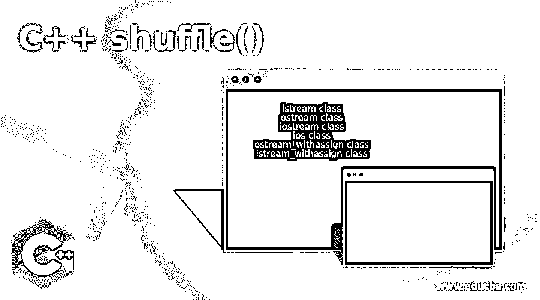

# C++洗牌()

> 原文：<https://www.educba.com/c-plus-plus-shuffle/>




## C++洗牌()的定义

C++中的 shuffle()函数是向量库中的一个函数。这是一个通过将元素放置在随机位置来重新排列任意范围的元素的函数。为了洗牌，它使用一个统一的随机发生器，帮助洗牌的元素。它将交换向量中的位置，并创建一个新的位置向量。这个函数的特点是我们可以创建自己的函数来随机放置元素。如果我们不提供一个随机发生器函数，这个函数将有自己的随机发生器。让我们检查语法，工作，和几个例子。

**语法:**

<small>网页开发、编程语言、软件测试&其他</small>

```
template <class RandomAccessIterator, class URNG>
void shuffle (RandomAccessIterator first, RandomAccessIterator last, URNG&& g);
```

让我们检查一下这个函数中每个关键字和参数的含义

*   我们称之为随机存取记录器。第一个参数指向将被重新排列的范围中第一个元素的位置。
*   第二个参数指向将被重新排列的范围中的最后一个元素。为此，它也将指向随机访问迭代器。
*   最后一个参数 g 是一个特殊的函数对象，它帮助我们生成随机数。它被称为均匀随机数发生器。
*   这个函数的返回值将是 none。

### C++ shuffle 是如何工作的？

使用 C++ shuffle 函数很容易。让我们来看看它是如何工作的。

**代码:**

```
#include <iostream>
#include <vector>
#include <algorithm>
void shuf(std::vector<int> const &v)
{
for (int i: vec) {
std::cout << i << ' ';
}
}
int main()
{
std::vector<int> vec = { 1, 27, 38, 42, 50, 69, 72, 87, 99 };
std::shuffle(vec.begin(), vec.end());
shuf(vec);
return 0;
}
```

为了使用 shuffle()函数，我们需要导入向量库。用户定义的函数正在显示混洗的向量。在 main 函数中，我们创建了一个带有几个数字的向量。shuffle()函数有一个开始和一个结束，它接受向量元素并对它们进行混洗。一旦完成，我们就调用打印混洗数组的函数。我们没有指定随机生成函数，因此它将采用可以使用的默认函数。它将重新排列向量中的元素。该函数将每个元素的值与从同一向量中随机选取的任何其他元素交换。它与类似 rand()函数的生成器一起工作。要在没有生成器的情况下使用这个函数，我们可以使用 random_shuffle()。让我们看几个例子，这将有助于我们更好地理解这个函数。

### C++洗牌()的例子

下面是下面给出的例子:

#### 示例#1

**代码:**

```
#include <iostream>
#include <algorithm>
#include <array>
#include <random>
#include <chrono>
using namespace std;
int main () {
array<int,8> shuf {19,24,37,42,54,76,58,53};
unsigned num = chrono::system_clock::now().time_since_epoch().count();
shuffle (shuf.begin(), shuf.end(), default_random_engine(num));
cout << "The numbers after shuffling are:";
for (int& x: shuf) cout << ' ' << x;
cout << '\n';
return 0;
}
```

**输出:**


**代码解释:**上面的代码是一个 shuffle 函数的例子。我们使用了 iostream 库、array 库、random 库和 Chrono 库。这里使用了 Chrono 库来创建一个随机生成器。我们取了一个大小为 8 个整数的数组。在这里，我们已经定义了这个数组，然后我们使用了随机生成器函数。我们正在使用 epoch()和 now()函数生成一个随机数，这是时钟库的一部分。它创造了一种打乱数字的模式。然后我们调用了 shuffle 函数，其中我们定义了数组的开始和结束，第三个参数是存储随机数生成计算的变量。然后，我们在程序的末尾打印随机打乱的数组。下面将是上述程序的输出。

#### 实施例 2

**代码:**

```
// C++ program to shuffle an array using the shuffle() method
#include <bits/stdc++.h>
using namespace std;
void edu_shuffle(int arr[], int n)
{
// To create a random formula for shuffling
unsigned rnd = 0;
// Shuffling array using shuffle function
shuffle(arr, arr + n,
default_random_engine(rnd));
// Displayingthe shuffled array
for (int i = 0; i < n; ++i)
cout << arr[i] << " ";
cout << endl;
}
// Code which drives the program
int main()
{
int arr[] = { 18, 23, 30, 47, 87, 49};
int num = sizeof(arr) / sizeof(arr[0]);
edu_shuffle(arr, num);
return 0;
}
```

**输出:**


**代码解释:**在这个程序中，我们导入了一个库，并创建了一个用户自定义函数 edu _ 洗牌。这个函数首先创建一个无符号整数变量来存储随机生成计算。然后我们使用 shuffle()函数，在这里我们传递元素的开始和结束，在它们之间应该进行洗牌。在随机生成的地方，我们使用了一个内置函数 default_random_engine 来创建一个随机数。在主函数中，我们已经计算了发送给 edu 函数的元素的结尾。我们使用了 sizeof 函数。我们将这些作为参数发送给用户定义的函数，帮助执行 shuffle()函数。上述函数的输出如下所示:

### C++ shuffle()的优势

C++ shuffle 函数的优点如下:

*   随机播放功能有助于轻松生成随机数字序列。
*   这个函数可以快速交换数字和内部元素。
*   如果没有指定随机生成器函数，将采用 shuffle()函数的默认值
*   它快速高效，易于使用
*   数字的随机性可以建立，也可以用于 C++98/03 标准。

### 结论

shuffle()函数是一种重新排列向量或数组元素的简单方法。为了生成随机数的模式，可以使用随机生成器变量。它有助于定义模式，否则它将使用函数提供的默认功能。它交换给定范围内的元素。该范围可以在数组中的任何元素之间。这个函数类似于 random_shuffle()函数。唯一的区别是，shuffle()使用统一的随机数生成器。

### 推荐文章

这是一个 C++ shuffle()的指南。在这里，我们还讨论了 c++ shuffle 的定义和工作原理，并给出了例子和代码实现。您也可以看看以下文章，了解更多信息–

1.  [c++中的 swap()](https://www.educba.com/swap-in-c-plus-plus/)
2.  [c++中的类型转换](https://www.educba.com/type-casting-in-c-plus-plus/)
3.  [C++设定精度](https://www.educba.com/c-plus-plus-setprecision/)
4.  [C++ begin()](https://www.educba.com/c-plus-plus-begin/)


