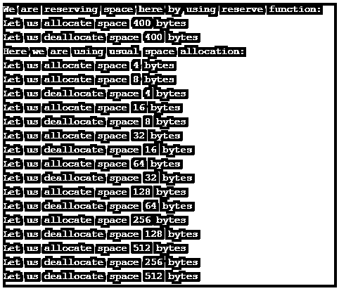

# C++保留()

> 原文：<https://www.educba.com/c-plus-plus-reserve/>


## C++ reserve 介绍()

C ++ reserve()函数帮助我们保留向量容量。这个容量必须足够大，以便它可以包含 n 个元素。该函数可以帮助我们增加任何给定向量的容量，该向量的值大于或等于我们将在保留函数中指定的新容量。保留功能将只为向量保留空间，但不会增加其大小。如果在 vector 中保留的大小大于 size，那么所有这些更改都将无效。

**语法**

<small>网页开发、编程语言、软件测试&其他</small>

```
void reserve (size_type n)
```

这里 n 表示存储在向量中的元素数量。它不会返回任何值，但会保留内存中的空间。结果容量可以等于或大于 n。size _ type 是一种无符号整数类型。这也可以称为 size_t。

### reserve()函数在 C ++中是如何工作的？

让我们检查一下 C ++中 reserve()函数的工作情况。

```
// vector::reserve
#include <iostream>
#include <vector>
int main ()
{
std::vector<int> example;
szc = example.capacity();
example.reserve(100);
std::cout << " Let us change the size of sample:\n:\n";
for (int i=0; i<100; ++i) {
example.push_back(i);
if (szc!=example.capacity()) {
szc = example.capacity();
std::cout << "Capacity of example is changed to: " << szc << '\n';
}
}
}
```

这里的保留功能是保留 100 个字节。一旦调用预留功能，就会在系统中进行分配。这个变量的容量在内部变化。然后，您可以继续为该变量赋值，直到该大小已满。该功能将预先分配上述内存。我们将通过下面更多的例子来检查这个函数的工作情况。

### 例子

下面举几个例子

#### 示例#1

**代码:**

```
#include <iostream>
#include <vector>
using namespace std;
int main(void) {
vector<int> vec1;
vector<int> vec2;
ssize_t size;
size = vec1.capacity();
for (int i = 0; i < 25; ++i) {
vec1.push_back(i);
if (size != vec1.capacity()) {
size = vec1.capacity();
cout << "Increasing the size limit of vector 1 so that it holds" << size
<< " elements" << endl;
}
}
cout << endl << endl;
//Here  we will reserve space for 35 elements using reserve() function
vec2.reserve(35);
for (int i = 0; i < 25; ++i) {
vec2.push_back(i);
if (size != vec2.capacity()) {
size = vec2.capacity();
cout << "Increasing the size limit of vector 2 so that it holds " << size
<< " elements" << endl;
}
}
return 0;
}
```

上面的代码是我们分别比较 reserve()和分配空间的一个例子。我们最初使用了库 iostream 和 vector。这个库应该作为属于向量库的保留库导入。在主函数中，我们取了两个向量。

这些是整数向量，我们已经定义了一个大小变量，如上所述。capacity()和 push_back()是这个类的函数。在第一个例子中，我们使用了一个 for 循环来分配容量，直到容量达到 35。我们在循环中使用后增量。由于我们在第一种情况下没有使用 reserve()函数，因此 capacity 函数可以分配大于 35 的空间。

而在第二种情况下，我们再次利用 for 循环，直到它达到容量。您在这里观察到的区别是，我们利用了向量函数 reserve()。在这种情况下，你会看到由于空间已经被保留，因此它不会像第一种情况那样一次又一次地分配空间吗？由于空间已经分配，因此不会有多次分配。观察输出，以便更好地理解该功能。

**输出:**


您将看到，在第一种情况下，这里的空间增加了，而在第二种情况下，空间是一次性分配的。

#### 实施例 2

**代码:**

```
#include <cstddef>
#include <new>
#include <vector>
#include <iostream>
// minimal C++11 allocator with debug output
template <class spc>
struct LetAlloc {
typedef spc value_type;
LetAlloc() = default;
template <class Ed> LetAlloc(const LetAlloc<Ed>&) {}
spc* allocate(std::size_t n)
{
n *= sizeof(spc);
std::cout << "Let us allocate space " << n << " bytes\n";
return static_cast<spc*>(::operator new(n));
}
void deallocate(spc* p, std::size_t n)
{
std::cout << "Let us deallocate space " << n*sizeof*p << " bytes\n";
::operator delete(p);
}
};
template <class Ed, class Up>
bool operator==(const LetAlloc<Ed>&, const LetAlloc<Up>&) { return true; }
template <class Ed, class Up>
bool operator!=(const LetAlloc<Ed>&, const LetAlloc<Up>&) { return false; }
int main()
{
int spsz = 100;
std::cout << "We are reserving space here by using reserve function: \n";
{
std::vector<int, LetAlloc<int>> vec1;
vec1.reserve(spsz);
for(int n = 0; n < spsz; ++n)
vec1.push_back(n);
}
std::cout << "Here we are using usual space allocation: \n";
{
std::vector<int, LetAlloc<int>> vec1;
for(int n = 0; n < spsz; ++n)
vec1.push_back(n);
}
}
```

在上面的函数中，我们创建了一个结构，它使用结构和模板格式分配和释放空间。我们使用了 sizeof 操作符，它存储所需操作符的大小，并分配空间，直到满足 n。类似地，我们也通过使用 delete 函数来释放空间。其次，我们使用了预留功能，该功能可以非常轻松地按照指定的方式分配空间。我们定义了一个名为 spsz 的变量，它的大小分配为 100。它将分配空间，直到满足条件，并且空间将被保留用于运行。观察下面的输出可以更好地理解。

**输出:**




### 结论

CPP 中的 reserve()函数是向量库非常有用的函数。它有助于分配和保留空间。我们可以使用两个变量 size 和 capacity，这两个变量将表示元素的数量以及可以存储在该向量中的元素的最大数量。这些充当矢量，可以存储而无需任何进一步的重新分配。一旦保留空间已满，库将分配新的内存，并且它将复制所有现有的元素。这是预留空间并在需要时使用它的一种更快、更有效的方式。由于矢量是动态的，这是一种你可以预先存储空间的方式。

### 推荐文章

这是一个 C++ reserve()的指南。这里我们讨论如何在 C ++中使用 reserve()函数，并分别举例说明，以便更好地理解。您也可以看看以下文章，了解更多信息–

1.  [c++中的 size()](https://www.educba.com/size-in-c-plus-plus/)
2.  [c++中的运算符优先级](https://www.educba.com/operator-precedence-in-c-plus-plus/)
3.  [C++头文件](https://www.educba.com/c-plus-plus-header-files/)
4.  [C++ any()](https://www.educba.com/c-plus-plus-any/)


