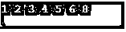
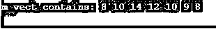

# C++唯一()

> 原文：<https://www.educba.com/c-plus-plus-unique/>


## C++ unique 简介()

在 C unique()中，unique 函数是一个标准的库函数，专门用于删除在某个范围[first，last 中找到或连续出现的任何元素的重复项。如果该范围中的所有元素都是相同的格式和相同的序列，那么出现重复元素的可能性非常小。并不是所有存在的重复元素都被移除，但是它通过替换序列中存在的被替换的下一个元素而将重复元素移除到某种程度，这些元素处于未指定的状态。

### 句法

语法流程按以下方式进行:

<small>网页开发、编程语言、软件测试&其他</small>

```
Equality_1st
template <class ForwardIterator>
ForwardIterator unique (ForwardIterator frst, ForwardIterator lst);
Predicate_2nd
template <class ForwardIterator, class BinaryPredicate>
ForwardIterator unique (ForwardIterator frst, ForwardIterator lst,
BinaryPredicate prd);
```

**解释:** first 是一个前向迭代器，它指向从第一个到最后一个范围内的第一个元素的位置，以进行元素的重复删除扫描。Last 是最后一个迭代器，它指向的元素位置是用于扫描去重的范围中最后一个元素之后的位置。第三种是一种用户定义的函数对象，它定义了一个满意条件的满足条件，其中一个范围内的两个元素被认为是等价的。任何二元谓词都不止一次返回参数，如果满足则返回 true，如果不满足则返回 false。前向迭代器从第一个到最后一个指向范围的新末端，返回没有任何重复元素的连续元素。

### unique()函数在 C++中是如何工作的？

让我们了解一下这个函数是如何工作的:

C++中的 unique()函数有很多额外的优点，可以帮助程序员从给定范围的第一个到最后一个消除特定范围内元素的微妙性。有一些特别添加的标准库负责迭代器遍历，然后它帮助程序员了解如何移动和遍历范围内的元素。有一些前向迭代器同时涉及等式和谓词条件。相等条件检查并指向从第一个到最后一个指定范围中第一个元素的位置，以扫描和检查重复元素。

使用该函数的主要目的是移除并获得所有不重复的元素和纯元素。返回值不包含重复元素，前向迭代器指定并指向位于从第一个到最后一个范围内的元素。另一个值还包括一个谓词，该谓词的迭代器指向前向迭代器，前向迭代器指向从第一个到最后一个范围的新末端，这又依次返回元素，然后这将有助于将元素放在所需的位置，而不会出现任何重复的元素。复杂性在于复杂性本质上是线性的，然后它比较并检查从第一个到最后一个范围内的所有元素。

复杂性因素涉及序列中所有元素的比较，然后执行一些赋值或一般操作。数据中存在的对象执行竞争条件，可以被访问，或者最终可以修改它以供以后更改。unique 函数还有一个更特殊的特性，即如果 pred、元素比较、元素赋值或任何操作中的任何一个在迭代器执行进一步操作时抛出异常，该函数就会抛出异常。

### 实现 C++ unique()的示例

让我们理解提到的例子:

#### 示例#1

这个程序通过声明一个带有指定元素的 vector，然后从函数的第一个和最后一个中删除所有元素，演示了独特功能的使用。

**代码:**

```
#include <iostream>
#include <algorithm>
#include <vector>
#include <string>
#include <cctype>
using namespace std;
int main()
{
vector<int> vctr{1,5,5,4,3,2,8,6,6,6,2,2,2,1};
sort(vctr.begin(), vctr.end());
auto lst = unique(vctr.begin(), vctr.end());
vctr.erase(lst, vctr.end());
for (int m : vctr)
cout << m << " ";
cout << "\n";
return 0;
}
```

**输出:**




#### 实施例 2

这个程序展示了一个独特的例子，其中默认的比较是通过谓词比较进行的，并在控制台中打印值，如图所示，它不包括数组中的任何重复元素，也不包括具有迭代器和遍历器的元素函数，包括一些标准库作为功能。

**代码:**

```
#include <iostream>
#include <algorithm>
#include <vector>
using namespace std;
bool m_func(int a, int b) {
return (a==b);
}
int main () {
int m_int[] = {8,10,14,12,12,10,9,8,8,7};
vector<int> m_vect (m_int,m_int+9);
vector<int>::iterator tr;
tr = unique (m_vect.begin(), m_vect.end());
m_vect.resize( distance(m_vect.begin(),tr) );
unique (m_vect.begin(), m_vect.end(), m_func);
std::cout << "m_vect contains:";
for (tr=m_vect.begin(); tr!=m_vect.end(); ++tr)
cout << ' ' << *tr;
cout << '\n';
return 0;
}
```

**输出:**




#### 实施例 3

这个程序演示了一个独特的函数，通过删除所有重复的元素来计算 vector 中元素的数量。

**代码:**

```
#include <iostream>
#include <iterator>
#include <vector>
#include <algorithm>
using namespace std;
int main()
{
vector<int> vctr = { 2,2,4,5,8,9,1,3,4,6};
vector<int>::iterator _ip;
int count;
sort(vctr.begin(), vctr.end());
count = std::distance(vctr.begin(),
std::unique(vctr.begin(), vctr.begin() + 12));
cout << "Total_unique_elements = " << count;
return 0;
}
```

**输出:**


### C++的独特优势()

C++中的每个函数都有一些优点，这个函数也是如此，如下所示:

这是一个无缝的功能，用于从容器中删除重复的元素，因此搜索和内存使用保持正常。

它有预定义的模板，用于比较元素，然后逐个删除所有元素，尤其是重复的元素，以获取序列中正确的元素。

### 结论

在基于搜索和排序元素的代码片段的执行和实现方面，这对于程序员来说是一个优势，这些搜索和排序元素不包含任何用于操作的重复元素。尽管容器没有重复元素，但由于 C++独特的功能，它能够容易地执行往返遍历。

### 推荐文章

这是 C++ unique()的一个指南。这里我们讨论 C++ unique()的介绍，它是如何工作的，编程例子的优点。您也可以浏览我们的其他相关文章，了解更多信息——

1.  [C++ any()](https://www.educba.com/c-plus-plus-any/)
2.  [C++位集](https://www.educba.com/c-plus-plus-bitset/)
3.  [C++ begin()](https://www.educba.com/c-plus-plus-begin/)
4.  [c++中的 size()](https://www.educba.com/size-in-c-plus-plus/)


