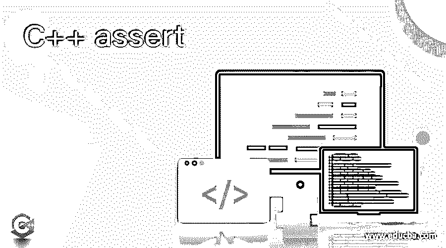
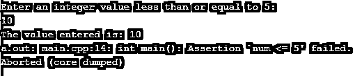
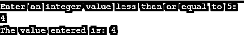
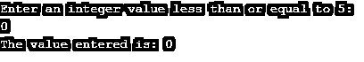

# C++断言

> 原文：<https://www.educba.com/c-plus-plus-assert/>




## C++ assert 简介

C++中用来测试程序中程序员所做的假设的语句在 C++中称为断言像数组索引大于零就是断言的例子之一，当这些假设在程序中为真时， 生成这些断言的程序的结束是正常的，否则生成这些断言的程序会异常结束，并显示一条错误消息，该错误消息包含失败的条件、由代码和行号组成的文件名以及一个名为 assert 的预处理宏，该宏用于在程序中声明一个断言，该断言将待评估的条件作为参数。

**语法:**

<small>网页开发、编程语言、软件测试&其他</small>

```
assert(condtion)
```

其中 condition 表示程序中要评估的条件。

### C++中断言函数的使用

*   C++中用来测试程序中程序员已经做出的假设的语句在 C++中称为断言，像数组索引大于零就是断言的例子之一。
*   当程序中作出的假设为真时，作出这些断言的程序的结局是正常的；否则，做出这些断言的程序会异常结束。
*   当生成断言的程序异常结束时，会显示一条错误消息，其中包含失败的条件、由代码组成的文件名以及行号。
*   一个名为 assert 的预处理宏用于在程序中声明一个断言，它将待评估的条件作为参数。

### C++断言示例

下面是 C++ assert 的例子:

#### 示例#1

演示 assert 函数的 C++程序，该函数评估程序员做出的假设是真还是假，并相应地显示输出:

**代码:**

```
//the two headers iostream and cassert are included to be able to make use of cin, cout and assert functions
#include <iostream>
#include <cassert>
using namespace std;
//main method is called
int main()
{
//an integer variable called num is defined and the user is prompted to enter a value less than or equal to 5
int num;
cout << "Enter an integer value less than or equal to 5: " << endl;
cin >> num;
cout << "The value entered is: " << num << endl;
//assert function is used to check if the assumption made by the user that the user enters a value less than or equal to 5 is true or false
assert(num <= 5);
return 0;
}
```

**输出:**




在上面的程序中，包含了两个头文件 iostream 和 cassert，以便能够使用 cin、cout 和 assert 函数。然后调用 main 方法，在该方法中定义了一个名为 num 的整数变量，该变量存储用户输入的输入值。然后调用 assert 函数来检查用户所做的假设，即用户输入一个小于或等于 5 的值是真还是假。如果为真，程序正常结束；否则以错误消息结束，如上面的快照所示。

#### 实施例 2

演示 assert 函数的 C++程序，该函数评估程序员做出的假设是真还是假，并相应地显示输出:

**代码:**

```
//the two headers iostream and cassert are included to be able to make use of cin, cout and assert functions
#include <iostream>
#include <cassert>
using namespace std;
//main method is called
int main()
{
//an integer variable called num is defined and the user is prompted to enter a value less than or equal to 5
int num;
cout << "Enter an integer value less than or equal to 5: " << endl;
cin >> num;
cout << "The value entered is: " << num << endl;
//assert function is used to check if the assumption made by the user that the user enters a value less than or equal to 5 is true or false
assert(num <= 5);
return 0;
}
```

**输出:**




在上面的程序中，包含了两个头文件 iostream 和 cassert，以便能够使用 cin、cout 和 assert 函数。然后调用 main 方法，在该方法中定义了一个名为 num 的整数变量，该变量存储用户输入的输入值。然后调用 assert 函数来检查用户所做的假设，即用户输入一个小于或等于 5 的值是真还是假。如果为真，程序正常结束，如上面的快照所示，否则会以错误消息结束。

#### 实施例 3

演示 assert 函数的 C++程序，该函数评估程序员做出的假设是真还是假，并相应地显示输出:

**代码:**

```
//the two headers iostream and cassert are included to be able to make use of cin, cout and assert functions
#include <iostream>
#include <cassert>
using namespace std;
//main method is called
int main()
{
//an integer variable called num is defined and the user is prompted to enter a value less than or equal to 5
int num;
cout << "Enter an integer value less than or equal to 5: " << endl;
cin >> num;
cout << "The value entered is: " << num << endl;
//assert function is used to check if the assumption made by the user that the user enters a value less than or equal to 5 is true or false
assert(num <= 5);
return 0;
}
```

**输出:**




在上面的程序中，包含了两个头文件 iostream 和 cassert，以便能够使用 cin、cout 和 assert 函数。然后调用 main 方法，在该方法中定义了一个名为 num 的整数变量，该变量存储用户输入的输入值。然后调用 assert 函数来检查用户所做的假设，即用户输入一个小于或等于 5 的值是真还是假。如果为真，程序正常结束，如上面的快照所示，否则会以错误消息结束。

### 推荐文章

这是一个 C++断言指南。在这里，我们通过定义、语法、通过编程实例断言函数的工作及其输出来讨论 C++中断言函数的概念。您也可以看看以下文章，了解更多信息–

1.  [C++保留()](https://www.educba.com/c-plus-plus-reserve/)
2.  [C++格式化程序](https://www.educba.com/c-plus-plus-formatter/)
3.  [C++多集](https://www.educba.com/c-plus-plus-multiset/)
4.  [C++ find()](https://www.educba.com/c-plus-plus-find/)


