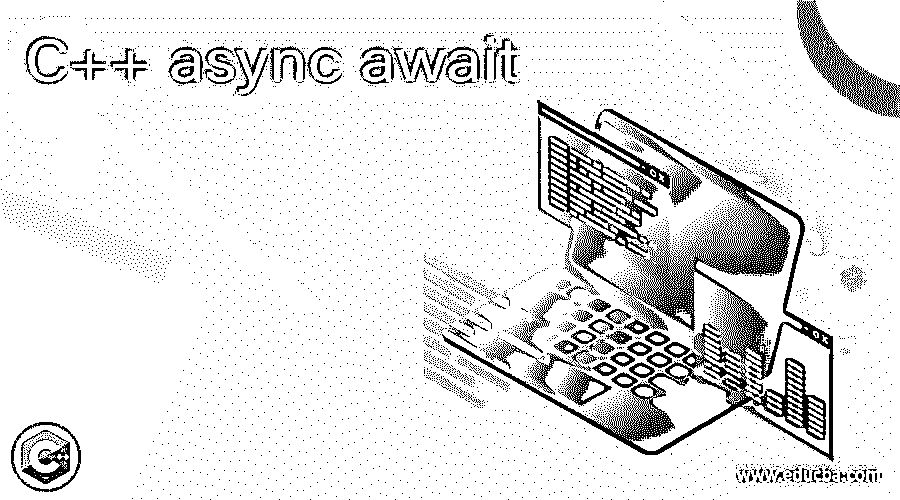

# C++异步等待

> 原文：<https://www.educba.com/c-plus-plus-async-await/>




## C++异步等待简介

计算机程序中的 Async/await 是许多编程语言的语法特征，它允许异步和非阻塞方法以类似于普通同步方法的方式排列。Async 和 await 有助于简单地编写异步代码。例如，在从 I/O 获得一些信息的同时执行一些计算。异步代码提高了响应能力，并被解释为在多线程应用程序上编写应用程序的一种接近的方式。在这个主题中，我们将学习 C++ async-await。

### 句法

下面是 async 的语法。

<small>网页开发、编程语言、软件测试&其他</small>

```
std::async()
```

**参数**为:

**1。Policy:** 表示启动策略的位掩码值。

*   **launch::async-** 这是异步的，它启动一个新的线程来调用函数，就好像线程的对象是用函数和自变量创建的一样，并访问从返回的 future 共享的状态。
*   **launch::deferred-** 这个被延迟，对函数的调用被延迟到用 get 或 wait 访问返回的 future 的共享状态。在这种情况下，函数被调用，它不再被认为是延迟的。当这个特定的调用被返回时，返回的期货的共享状态就准备好了。
*   **launch::async | launch::deferred-**这是自动的，函数会在特定的点自动选择策略。这取决于系统和库实现，库实现通常针对系统中当前的并发可用性进行优化

**2。fn:** 它是一个指针，指向函数、成员或任何类型的可移动构造的函数对象，其类定义了由闭包和函数对象组成的操作符()。这里，该函数使用参数的衰减副本。fn 返回值被保存为共享状态，以成为 async 返回的未来对象。在 fn 抛出的情况下，它将在共享状态中设置一个异常，该异常将由 future 对象获得。

**3。Args:** 这些是传递给函数调用的参数(如果有的话)。这里，类型也将是可移动构造的。如果 fn 被认为是一个成员指针，那么参数一将是一个定义成员的对象，或者是一个指针或引用。此外，该函数还利用了参数的衰减副本。

在这种情况下，fn 和 args 被视为模板参数。也就是说，如果它是隐式推导的，这些将是参数的适当左值/右值引用类型。

返回值是:

这里，当 *fn* 执行结束时，返回值将是具有准备就绪的共享状态的未来对象。future:: get 成员获得的值将是函数 *fn* 返回的值(如果有的话)。在选择 launch::async 的情况下，返回的 future 连接到创建的线程的末端，即使共享状态从未被访问过。在这种情况下，fn 的返回与 fn 返回同步。因此，在函数 fn 返回 void 时，返回值不会因为其异步行为而被忽略。
用 Args 中的类型参数调用 Fn 时，返回类型 result_of::type。

### C++异步 await 的例子

下面给出了 C++异步 await 的例子:

#### 示例#1

**代码:**

```
// c++ program that demonstrates async
// library for std::cout
#include <iostream>
//library for std::async and std::future
#include <future>
// check whether it is prime number or not
//parameter is the number that has to be checked
bool fnprime (int num)
{
std::cout << "Process started. . . Just wait. . . \n";
//loop starts here
for ( int i = 2 ; i<num ; ++i )
//if the mod is 0, return false, else return zero
if (num%i==0)
{
return false ;
}
return true ;
}
//main method
int main ()
{
// call the function fnprime() asynchronously to check whether the number is prime or not:
std::future<bool> fobj = std::async (fnprime,4);
//print the line to show the status
std::cout << "check whether the number 4 is prime or not . . \n";
//waits for the the function fnprime to return
bool bobj = fobj.get();
//prints the result
if (bobj) std::cout << "The number given is prime . . .  ! \n";
else std::cout << "The number given is not prime . . .  ! \n\n";
return 0;
}
```

**输出:**


#### 实施例 2

在这个例子中，给出了一个数来检验它是否是质数。为此，函数 fnprime()是可用的，它将被异步调用。这里要检查的数字是 4。在执行代码时，结果将如上所示打印出来。

假设给出的数字是 3，如下所述。那么结果将是质数，因为 3 是质数。

```
std::future<bool> fobj = std::async (fnprime,3);
.
```


**代码:**

```
// c++ program that demonstrates async
// library for std::cout
#include <iostream>
//library for std::async and std::future
#include <future>
//library for std::string
#include <string>
std::string samplefunction(const std::string& st)
{
return "This is the output of " + st ;
}
class SamplefunctionObject
{
public:
std::string operator()( const std::string& st) const
{
return "This is the output of " + st ;
}
};
int main()
{
std::cout << std::endl;
// future with the help of function
auto ff = std::async(samplefunction,"sample function");
// future with the help of function object
SamplefunctionObject samplefunctionObject;
auto ffo= std::async(samplefunctionObject,"sample function object");
// future with the help of lambda function
auto fl= std::async([]( const std::string& st )
{
return "This is the output of " + st ;} , " lambda function" );
std::cout << ff.get() << "\n"
<< ffo.get() << "\n"
<< fl.get() << std::endl;
std::cout << std::endl;
}
```

**输出:**


在这个程序中，首先导入所有必需的库。然后，在执行代码时，在函数、函数对象和 lambda 函数的帮助下显示消息。

### 结论

C++中的 Async 和 await 有助于简单地编写异步代码。计算和从 I/O 获取数据是异步/等待操作的一个例子。在这篇文章中，不同的方面，如语法和例子，进行了详细的解释。

### 推荐文章

这是一个 C++异步等待的指南。在这里，我们讨论不同的方面，如语法和 C++异步等待详细解释的例子。您也可以看看以下文章，了解更多信息–

1.  [C++保留()](https://www.educba.com/c-plus-plus-reserve/)
2.  [C++多集](https://www.educba.com/c-plus-plus-multiset/)
3.  [C++字符串追加](https://www.educba.com/c-plus-plus-string-append/)
4.  [C++ setw()](https://www.educba.com/c-plus-plus-setw/)


