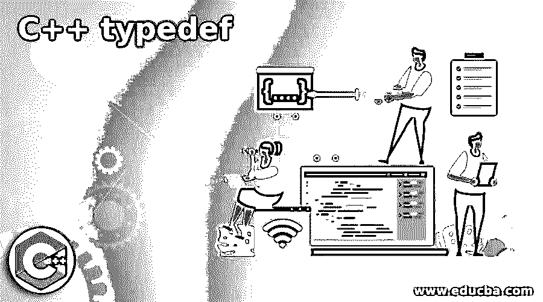
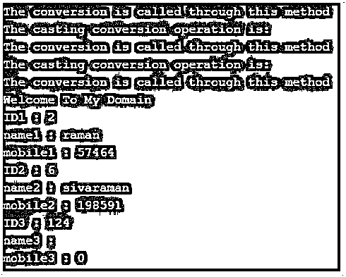
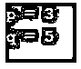

# C++ typedef

> 原文:# t0]https://www . educba . com/c-plus-typedef/




## C++ typedef 简介

以下文章提供了 C++ typedef 的概要。typedef 是一个关键字，它允许开发人员使用它来为默认数据类型(如 int、float、long、short 等)创建新的附加名称。它只创建数据类型，但不创建任何其他类型的值。当我们使用 typedef 关键字时，它会返回用户必须知道的值，如果我们想要更改代码中的任何内容，可以轻松地拖动定义，并清楚地给出旧代码和新更改代码，但我们将使用数据类型的底层选项来突出显示代码。

**语法:**

<small>网页开发、编程语言、软件测试&其他</small>

在 C++中，每个对象、变量和关键字都有自己的语法和属性，用于在编程代码中声明。根据需求，我们将利用编程库中的特殊关键字或保留关键字。

```
#include <iostream>
datatype main()
{
typedef **old datatype name** **new datatype name**;
typedef struct structure name;
{
datatype initialization;
}
---coding logics---
}
```

以上代码是在编程逻辑中使用 typedef 关键字的基本语法。我们可以使用 typedef 作为使用 struct 关键字 type 的结构；通过使用这种类型，我们可以创建 n 个数据类型声明，并在单个过程中更改名称。

### typedef 在 C++中是如何工作的？

*   通常，typedef 是保留关键字之一；它提供了与实际数据类型相同的抽象层次，并改变了程序员使用的数据类型，使其更专注于编码概念。这也使得编写编程代码和使用 destroy()或任何其他默认方法清理它们变得更加容易，因为垃圾收集器是销毁不需要的代码和清理内存空间区域的主要区域。根据数据类型，必须计算大小，并为大存储数据类型变量和小存储变量分配内存空间。
*   通常，typedef 声明与两种不同的类型一起使用，如 typedef 类型声明和 typedef 类型定义标识符；这两个标准的 typedef 声明包含在新的名称类型别名中，并为语言标识符提供了一些语法声明，而另一个类型包含在一些标准库和其他 POSIX 规范中，包含在 typedef 定义中，它更经常出现在前缀和后缀中，并且它包含代码中包含的更多时间计算的公共大小。此外，typedef 关键字经常与一些文档一起使用，同时指示包含在编程上下文中的特定变量的数量，该编程上下文可以包含在具有可变数量的单位度量和计数的表达式中。
*   该关键字还用于简化一些复合类型(如 struct、union 等)的变量声明。或者，即使我们在语法中包含了一些指针类型，同时在 typedef 关键字中使用了指针，它也会在编译器中创建特定的内存存储，并且变量的地址也会在新旧数据类型中发生变化。我们还可以在包含多个相同类型变量的 typedef 关键字中使用结构指针，并使用单级语句进行声明，即使指针包含在结构类型中或不包含在结构类型中。用 typedef 指定的函数指针前面的代码行数将被用 typedef 关键字重写，这减少了程序的长度和复杂性。函数声明会更隐晦，它清楚地显示了参数或类型的接受，它将返回变量。

### C++ typedef 的示例

下面给出了 C++ typedef 的例子:

#### 示例#1

**代码:**

```
#include <iostream>
#include <string>
#include <cstring>
using namespace std;
typedef struct example
{
int id;
char name[14];
int mobile;
}s;
class demo {
int a;
public:
demo(int a_i = 1)
: a{a_i }
{
cout << "The conversion is called through this method" << endl;
}
operator string()
{
cout << "The casting conversion operation is:" << endl;
return to_string(a);
}
};
int main()
{
s j, k, l;
demo b(4)
string s = b;
b = 32;
string s1 = static_cast<string>(b);
b = static_cast<demo>(34);
j.id = 2;
strcpy(j.name,"siva");
j.mobile = 82202;
k.id = 4;
strcpy(j.name,"raman");
j.mobile = 57464;
k.id = 6;
strcpy(k.name,"sivaraman");
k.mobile = 198591;
cout << "Welcome To My Domain" << endl;
cout << "ID1 : " << j.id << endl;
cout << "name1 : " << j.name << endl;
cout << "mobile1 : " << j.mobile << endl;
cout << "ID2 : " << k.id << endl;
cout << "name2 : " << k.name << endl;
cout << "mobile2 : " << k.mobile << endl;
cout << "ID3 : " << l.id << endl;
cout << "name3 : " << l.name << endl;
cout << "mobile3 : " << l.mobile << endl;
return 0;
}
```

**输出:**




#### 实施例 2

**代码:**

```
#include <iostream>
int main(){
typedef unsigned int a;
a p = 3, q = 5;
std::cout << "p = " << p << std::endl;
std::cout << "q = " << q << std::endl;
return 1;
}
```

**输出:**




#### 实施例 3

**代码:**

```
#include<iostream>
using namespace std;
struct example
{
char *domain;
int id;
};
typedef int *pr;
int main()
{
struct example eg;
eg.domain = "Welcome To My Domain";
eg.id = 7879;
cout << "Have a Nice day user for chhosing the domain: " << eg.domain << '\n';
cout << "Your User id is: " << eg.id;
pr pvar;
return 0;
}
```

**输出:**


在上面的三个例子中，我们在不同的类别中使用了 typedef，使用了指针概念和变量来处理新旧类别。

### 结论

在 typedef 中是 C++的特定保留关键字区域。它有许多预定义的关键字，用于实现应用程序中的编程逻辑。在这里，我们使用这个关键字来减少代码行和内存区域；我们可以非常清楚地使用和编辑代码，所以在代码的基础上，它是这个关键字的必选项。

### 推荐文章

这是一个 C++ typedef 的指南。这里我们讨论一下导论，typedef 在 C++中是如何工作的？并分别举例说明。您也可以看看以下文章，了解更多信息–

1.  [C++ find_if()](https://www.educba.com/c-plus-plus-find_if/)
2.  [c++中的反射](https://www.educba.com/reflection-in-c-plus-plus/)
3.  [C++线程池](https://www.educba.com/c-plus-plus-thread-pool/)
4.  [C++格式化程序](https://www.educba.com/c-plus-plus-formatter/)


