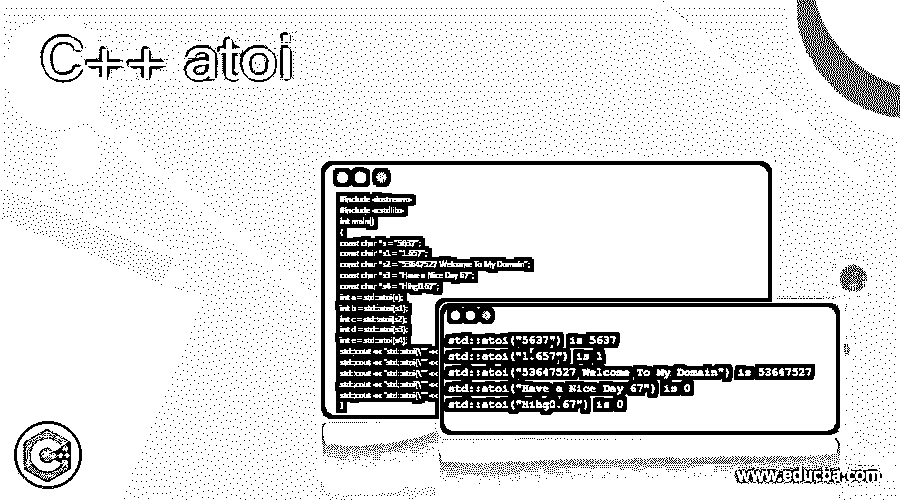
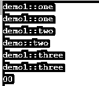
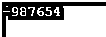
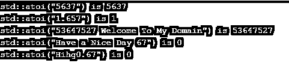

# C++ atoi

> 原文：<https://www.educba.com/c-plus-plus-atoi/>




## C++ atoi 简介

在 C++中，atoi 被定义为默认函数，它将用于声明和返回值为整数数据类型，并将字符串作为参数传递，因此它将字符串转换为整数参数；此外，该函数将只接受一个参数，因此我们将在函数中连续传递数据类型，如字符串到整数。如果字符串类型是用户输入的有效类型，则该函数也为传递的字符串值返回相同数量的整数值。否则，如果没有值传递到数据类型，则返回值也为零。

**语法**

<small>网页开发、编程语言、软件测试&其他</small>

在 C++中，每个对象、变量、关键字和函数都有自己的语法和属性，用于在编程代码中声明。根据要求，我们将利用特殊的关键字和函数从编程库使用。例如，atoi 是内置函数之一，它将用于通过使用函数 atoi()将字符串数据类型值转换为整数数据类型。

```
#include <iostream>
#include <string>
data type main()
{
data type variable name;
data type var name;
variable name=atoi(var name);
---some c++ code logics---
}
```

上面的代码是 atoi()函数的基本语法，它将用于两种不同的类型，如果需要的话，也可以用另一个函数调用。

### atoi()方法在 C++中是如何工作的？

C++有 n 个方法，它们将从实际的父方法和新的子方法中提供一些抽象，这已经被程序员使用了。它还允许 It 更多地关注编码概念。它使得编写编程代码和使用 destroy()或任何其他属于垃圾收集的默认方法来清理它们变得更加容易，并且它是销毁不需要的代码和清理内存空间区域的主要区域。它取决于数据类型，并且必须计算对象创建大小，它为大存储数据类型变量和小存储变量分配内存空间。通常情况下，C++声明指令用于不同类型的内存空间，如堆内存和堆栈内存。

对象存储在堆内存中，方法存储在堆栈内存中；我们也可以创建默认的内存函数，如 calloc()、malloc()等。但是在这里，atoi()函数会将 string、char 数据类型值转换为 integer 数据类型，该函数会执行并首先忽略不需要的空格字符，直到它需要找到非白色字符为止。它还可以尽可能多地搜索后跟 0 到 9 位数字的运算符，如+、-、*来解释数值集。该字符串还包含一些额外的字符；之后，对于整数，必须忽略它们，因为它们已经被忽略了，并且没有影响 C++的功能行为。

如果假设函数 atoi()传递了参数，那么它必须是非空白字符，它将是一个有效的整数，它将返回有效的整数，否则序列不会出现，此时，要么字符串为空，要么它必须只包含空白字符。因此，函数中没有发生或处理任何转换，也没有返回值。此外，转换的整数值超出范围意味着表示的值是 int 数据类型，它会导致一些未定义的行为；它抛出异常。

### C++ atoi 的例子

下面是 C++ atoi 的例子:

#### 示例#1

**代码:**

```
#include <iostream>
#include<string>
struct demo {
virtual void one(int) { std::cout << "demo::one\n"; }
void two(char)        { std::cout << "demo::two\n"; }
void three(int)         { std::cout << "demo::three\n"; }
protected:
int a;
typedef int val;
};
struct demo1 : demo {
using demo::a;
using demo::val;
using demo::one;
void one(int) { std::cout << "demo1::one\n"; }
using demo::two;
void two(int) { std::cout << "demo1::two\n"; }
using demo::three;
void three(int) { std::cout << "demo1::three\n"; }
};
int main()
{
demo1 i;
demo& d = i;
i.a = 3;
i.one(3);
i.one(3);
i.two(2);
i.two('k');
i.three(3);
i.three(3);
int u,v;
char ch[] = "siva";
u = atoi(ch);
std::cout << u;
char ch1[] = "raman";
v = atoi(ch1);
std::cout << v;
return (0);
}
```

**输出:**




#### 实施例 2

**代码:**

```
#include <iostream>
#include <string>
#include <cstring>
using namespace std;
bool demo(char a)
{
return (a >= '0' && a <= '9')
? true
: false;
}
int demo1(char* s)
{
if (*s == '\0')
return 0;
int b = 0;
int s1 = 1;
int p = 0;
if (s[0] == '-') {
s1 = -1;
p++;
}
for (; s[p] != '\0'; ++p) {
if (demo(s[p]) == false)
return 0;
b = b * 10 + s[p] - '0';
}
return s1 * b;
}
int main()
{
char c[] = "-987654";
int output = demo1(c);
printf("%d ", output);
return 0;
}
```

**输出:**




#### 实施例 3

**代码:**

```
#include <iostream>
#include <cstdlib>
int main()
{
const char *s = "5637";
const char *s1 = "1.657";
const char *s2 = "53647527 Welcome To My Domain";
const char *s3 = "Have a Nice Day 67";
const char *s4 = "Hihg0.67";
int a = std::atoi(s);
int b = std::atoi(s1);
int c = std::atoi(s2);
int d = std::atoi(s3);
int e = std::atoi(s4);
std::cout << "std::atoi(\"" << s << "\") is " << a << '\n';
std::cout << "std::atoi(\"" << s1 << "\") is " << b << '\n';
std::cout << "std::atoi(\"" << s2 << "\") is " << c << '\n';
std::cout << "std::atoi(\"" << s3 << "\") is " << d << '\n';
std::cout << "std::atoi(\"" << s4 << "\") is " << e << '\n';
}
```

**输出:**




### 结论

C++有很多预定义和用户自定义的函数；它包括许多特性和图书馆中的特殊关键字。实现逻辑的功能取决于项目需求。这里我们使用这些函数来减少代码行和内存区域；此外，由于 main 方法中的数据类型值转换，将调用该函数。

### 推荐文章

这是一个 C++ atoi 的指南。在这里，我们讨论 atoi()方法在 C++中是如何工作的，以及代码和输出的例子。您也可以看看以下文章，了解更多信息–

1.  [C++ find_if()](https://www.educba.com/c-plus-plus-find_if/)
2.  [C++流](https://www.educba.com/c-plus-plus-stream/)
3.  [C++多集](https://www.educba.com/c-plus-plus-multiset/)
4.  [C++ shuffle()](https://www.educba.com/c-plus-plus-shuffle/)


