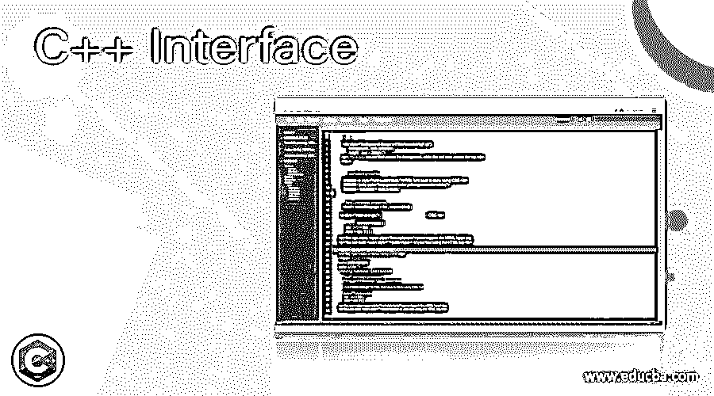
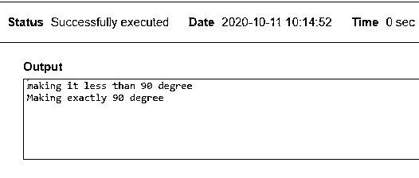
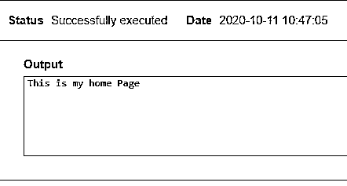
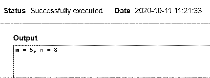
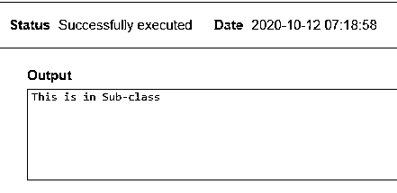

# C++接口

> 原文：<https://www.educba.com/c-plus-plus-interface/>




## C++接口介绍

C++接口被定义为一种描述一个类的行为的方式，而不用那个类的实现或者用外行的术语；我们说 C++接口是一个纯虚函数。接口或抽象类也是如此。接口的能力是它们从任何基接口继承函数，只要它们是公共成员函数。所有接口都是抽象的，所以我们不能创建一个对象的实例。

**语法**

<small>网页开发、编程语言、软件测试&其他</small>

一个好的界面风格如下:

```
Interface IAddition
{
void display ();
void Add ();
}
```

**在 C++中使用抽象类**

```
class Interface name
{
public:
virtual type function name () =0;
virtual type function name(type)=0;
~Interface name ();
}
```

接口只包含公共函数和构造函数定义。例如，一个纯虚函数是用关键字 Virtual 定义的，has =0。

### C++中接口是如何工作的？

借助于抽象类(模拟它们)，我们可以在 C++中实现接口，所以它们被命名为抽象基。该接口使用类和对象，它们不包含任何方法或变量；在需要这些的代码中，它们必须通过实现类来声明。任何包含接口的类都被假定为只有一个纯虚函数，没有其他成员。因此，我们将在本文中使用的关键词是方法和函数。

*   **方法():**它执行程序中的例行任务。
*   **function ():** 代码中指定的这个函数可能是也可能不是一个类的成员。

### 操作惯例

我要在这里去掉三点

*   接口只能声明不能定义。
*   我们可以创建一个引用基本抽象类的指针。
*   无法完成类的实例。

接口类纯粹是一个定义部分，在那个类中没有提供任何实现。当我们需要定义派生类必须实现的功能时，接口是很重要的，但是忽略了派生类是如何实现的。让我们来看看与之配套的示例接口类部分。

```
class ITCP
{
public:
virtual bool openConnection(const char *filename) = 0;
virtual bool closeConnection() = 0;
virtual bool readMessage(const char *read) = 0;
virtual ~ITCP() {}
```

在上面的代码中，我们使用了具有三个定义函数的接口 ITCP，任何继承该接口的类都应该提供所有三个声明函数的实现。因此，一旦建立了连接，我们就可以读取内容。让我们通过下一节中的几个例子来理解这一点。

### C++接口的例子

下面给出的是 C++接口的例子:

#### 示例#1

具有类抽象的简单示例

**代码:**

```
#include <iostream>
using namespace std;
class Geo
{
public:
virtual void angle()=0;
};
class Acute: Geo
{
public:
void angle ()
{
cout <<"making it less than 90 degree" <<endl;
}
};
class Right: Geo
{
public:
void angle ()
{
cout <<"Making exactly 90 degree" <<endl;
}
};
int main () {
Acute r;
Right rir;
r.angle();
rir.angle();
return 0;
}
```

**说明:**

这个例子有一个抽象方法角度()。这个方法的实现在 Acute 和 right 类中指定，这两个类有不同的实现过程。因此，输出显示为:

**输出:**




#### 实施例 2

拿结构概念来说，让我们用接口概念来说明

**代码:**

```
#include <iostream>
using namespace std;
struct A{
virtual void indemo() = 0;
};
struct B: public A
{
void indemo()
{ std::cout << "Hi welcome";
};
};
struct D: public B
{
void indemo()
{
std::cout <<"This is my home Page";
};
};
main() {
D de;
B& x = de;
A& y = x;
y.indemo();
};
```

**说明:**

让我们考虑一个提供方法的类 A，B，D，第一步是在方法实现中使用一个公共接口。

**输出:**




#### 实施例 3

使用构造函数

**代码:**

```
#include<iostream>
using namespace std;
class store
{
protected:
int m;
public:
virtual void item() = 0;
store(int a) { m = a; }
};
class sub: public store
{
int n;
public:
sub(int a, int b):store(a)
{ n = b; }
void item() { cout << "m = " << m << ", n = " << n; }
};
int main(void)
{
sub e(6, 8);
e.item();
return 0;
}
```

**说明:**

使用构造函数和它们自动创建的对象，我们得到了如下结果:

**输出:**




#### 实施例 4

**代码:**

```
#include <iostream>
struct Apple {
virtual ~Apple() {};
virtual float ae(float) = 0;
};
struct Bag {
virtual ~Bag() {};
virtual float be(float) = 0;
};
struct Call {
~Call() {}
float ce;
virtual float getc(float) { return ce; }
};
struct Div : public Apple {
~Div() {}
float de;
float ae(float) { return de; }
};
struct Eat : public Apple, public Bag{
~Eat() {}
float ef;
float ae(float) { return ef; }
float be(float) { return ef; }
};
int main() {
Eat ef; Div de; Call ce;
std::cout << "A : " << sizeof(Apple) << "\n";
std::cout << "B : " << sizeof(Bag) << "\n";
std::cout << "C : " << sizeof(Call) << "\n";
std::cout << "D : " << sizeof(Div) << "\n";
std::cout << "E : " << sizeof(Eat) << "\n";
}
```

**说明:**

在上面的代码中，我们使用了四个接口来确定在函数下声明的类型的值。类调用不是一个接口，但是有一个虚函数。

**输出:**


#### 实施例 5

使用带有指针的接口虚函数

**代码:**

```
#include<iostream>
using namespace std;
class Super
{
public:
virtual void view() = 0;
};
class Sub: public Super
{
public:
void view() { cout << "This is in Sub-class \n"; }
};
int main(void)
{
Super *sp = new Sub();
sp->view();
return 0;
}
```

**说明:**

代码通过指针和它们对我们创建的接口类的引用工作得很好。

**输出:**




### 结论

但是接口类已经变得广泛受益，因为它们易于使用，并且许多新技术利用这些接口类来不产生抽象函数。interface 关键字在 Java 和 C#编程中被大量使用。因此，在本文中总结一下，我们已经看到了接口如何在 C++中作为抽象交互工作，以及它们的工作和例子。

### 推荐文章

这是一个 C++接口指南。在这里，我们讨论接口如何在 C++中工作，包括代码和输出。您也可以看看以下文章，了解更多信息–

1.  [C++ find_if()](https://www.educba.com/c-plus-plus-find_if/)
2.  [C++ shuffle()](https://www.educba.com/c-plus-plus-shuffle/)
3.  [C++聚合](https://www.educba.com/c-plus-plus-aggregation/)
4.  [C++ sort()](https://www.educba.com/c-plus-plus-sort/)


