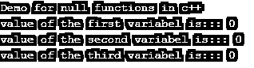
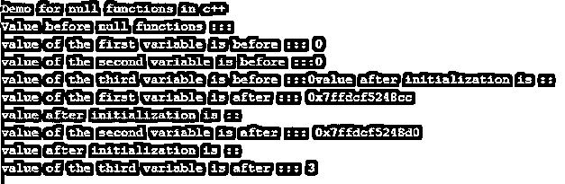

# C++ null

> 原文：<https://www.educba.com/c-plus-plus-null/>


## C++ null 简介

null 函数用于给变量赋值；这可以作为许多编程语言中定义的变量的默认值。空函数可以用来给一个指针赋值，这个指针不指向任何地址并且包含任何垃圾值，所以空函数会给它们赋一个特殊的值叫做' Null '，这意味着它们现在是空指针。在这个主题中，我们将学习 C++ null。

**语法**

<small>网页开发、编程语言、软件测试&其他</small>

在 C++中给变量赋一个空值是非常简单的；我们只需要在初始化的时候这样做。然后，这个变量被视为空指针。下面的语法可以更好地理解这一点，并在编程时使用。

```
int main () {
int  *your_ptr_name = NULL;
}
```

在上面的语法中，我们在这里使用空值来赋值给一个指针。首先，我们必须定义指针，然后我们可以用 NULL 初始化它。示例练习语法更多理解见下文；

```
int main () {
int  *myptr = NULL;
// logic goes here .
}
```

### C++中的 null 函数是如何工作的？

到目前为止，我们知道我们使用空函数给指针变量赋值。利用这一点，当它们不指向内存中的任何地址时，我们可以给它们一个逻辑值。这就是为什么它也被称为指针的特殊值。此外，我们知道指针保存内存地址，所以如果我们想让它们指向其他值，在这种情况下，我们可以在这里使用 NULL。但是我们必须在初始化指针的时候使用它。现在我们将看到一个例子，并理解它的工作原理。更多细节见下文；

**举例:**

```
#include <iostream>
using namespace std;
int main () {
int  *myptr1 = NULL;
int  *myptr2= NULL;
int  *myptr3 = NULL;
if(!myptr1) {
cout << "demo value for myptr " << myptr1 ;
}
return 0;
}
```

在这个例子中，我们创建了三个不同的指针，它们都指向这里的空值。如我们所见，我们已经在声明变量的时候初始化了变量的值。之后，我们在这里做一次检查，检查并打印指针的值。如果语句出来是正确的，那么打印语句将被执行；否则，它将返回。如果我们看到它将分配一个默认值' 0 '给指针。因此，当 null 不指向内存地址时，它也可以是一个整数值。在上面的 if 语句中，你可以看到指针指向 null，但在这里它被转换为布尔值 false，如果任何指针的值不为 null，那么它将转换为布尔值 true。

这样，我们也可以测试我们的指针。在 c++中，空函数只不过是给指针变量赋值的一种方式。我们也可以在 c++中取消对空指针的引用，但是这会导致程序的异常行为。这是因为取消引用意味着返回到初始化前它所指向的状态，但是如果我们在代码中尝试这样做，空指针仍然不指向任何地方，因为它没有内存地址。

在 c++中使用空函数时要记住的几点见下文；

1)我们必须仅在初始化时将空值赋给指针。

2)如果指针不指向 C++中的任何内存地址，则不指向 null 我们将使用空函数给它们赋值。

3)如果我们使用空函数给一个指针赋值，那么它们将根据它们保存的值转换为布尔值 true 或 false。这是因为空指针也可以是整数。

### C++ null 的例子

下面给出了 C++ null 的例子:

#### 示例#1

在这个例子中，我们将看到如何在 C++中使用 null 函数将 NULL 值初始化为指针；这只是我们可以在初始化时分配的特殊值。没有特定的语法来做到这一点。

**代码:**

```
#include <iostream>
using namespace std;
int main () {
cout<<"Demo for null functions in c++";
cout<<"\n";
// assiging null values heree ..
int  *myptr1 = NULL;
int  *myptr2= NULL;
int  *myptr3 = NULL;
//printing values here
cout << "value of the first variabel is::: " << myptr1 ;
cout<<"\n";
cout << "value of the second variabel is::: " << myptr2 ;
cout<<"\n";
cout << "value of the third variabel is::: " << myptr3 ;
return 0;
}
```

**输出:**




#### 实施例 2

在这个例子中，我们将会看到如何在你的程序中使用一个空指针来创建一个条件语句，以及如何在检查它们的时候改变它们的值。在语句之后，我们给它们赋一个新的值。

**代码:**

```
#include <iostream>
using namespace std;
int main () {
int var1 =20;
int var2 =30;
int var3 =40;
cout<<"Demo for null functions in c++";
cout<<"\n";
// assigning null values here.
int  *myptr1 = NULL;
int  *myptr2= NULL;
int  *myptr3 = NULL;
//printing values here
cout<<"Value before null functions :::";
cout<<"\n";
cout << "value of the first variable is before ::: " << myptr1 ;
cout<<"\n";
cout << "value of the second variable is before :::" << myptr2 ;
cout<<"\n";
cout << "value of the third variable is before :::" << myptr3 ;
if(!myptr1){
myptr1 = &var1;
cout << "value after initialization is ::" ;
cout<<"\n";
cout << "value of the first variable is after ::: " << myptr1 ;
cout<<"\n";
}
if(!myptr2){
myptr2 = &var2;
cout << "value after initialization is ::" ;
cout<<"\n";
cout << "value of the second variable is after ::: " << myptr2 ;
cout<<"\n";
}
if(!myptr3){
myptr3 = &var3;
cout << "value after initialization is ::" ;
cout<<"\n";
cout << "value of the third variable is after ::: " << 3 ;
cout<<"\n";
}
return 0;
}
```

**输出:**




### 结论

因此，我们可以使用空函数给变量赋值；当我们的指针没有指向任何内存地址时，空值是很重要的，以避免编程时的异常行为，所以当指针没有指向内存地址中的任何地方时，空函数或空赋值被用来给指针赋值。

### 推荐文章

这是一个 C++ null 的指南。在这里，我们讨论了空函数在 C++中是如何工作的，以及代码和输出的例子。您也可以看看以下文章，了解更多信息–

1.  [C++静态转换](https://www.educba.com/c-plus-plus-static_cast/)
2.  [C++读取文件](https://www.educba.com/c-plus-plus-read-file/)
3.  [C++ Lambda 表达式](https://www.educba.com/c-plus-plus-lambda-expressions/)
4.  [C++聚合](https://www.educba.com/c-plus-plus-aggregation/)


