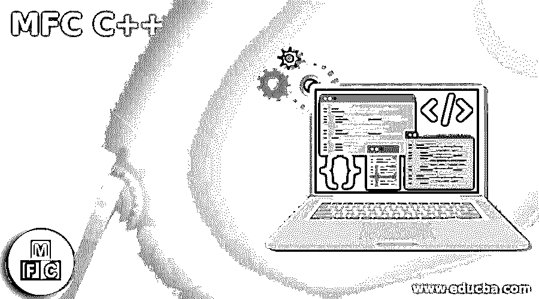
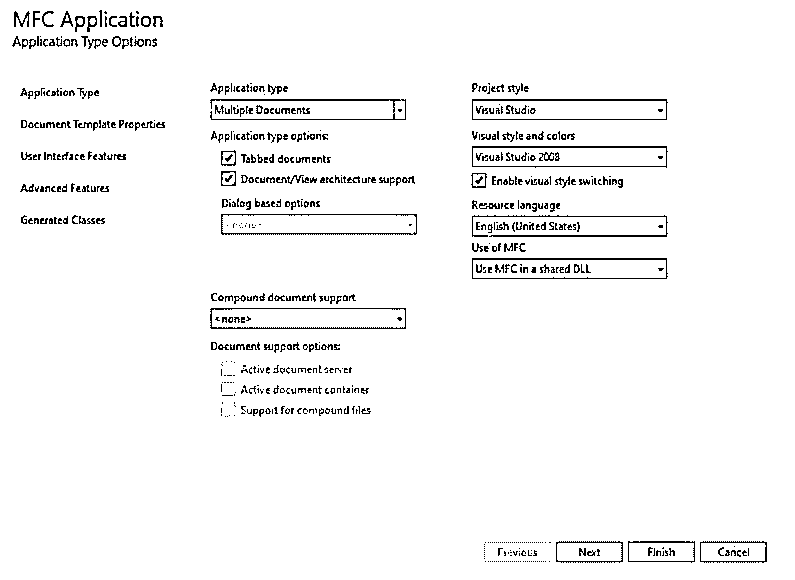
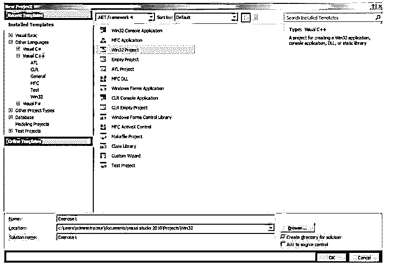
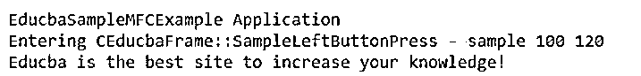

# MFC C++

> 原文：<https://www.educba.com/mfc-c-plus-plus/>




## MFC C++简介

MFC C++代表 Microsoft Foundation Library，它是基于面向对象方法的库，用于创建和开发在 Windows 操作系统上运行的应用程序。它于 1992 年由微软组织发起，并很快变得非常流行。尽管微软开发了许多其他的应用程序，MFC 仍然是开发人员的首选。

### 什么是 MFC C++？

*   MFC 是代表 Microsoft 基础类的库，它附带了许多常量、函数、类和数据类型，使得为 Microsoft Windows 系列的操作系统创建应用程序变得简单。在 MFC 应用程序中，各种类被组织在树的层次结构中，以实现必要的操作和功能。例如，CObject 类是您在 MFC 应用程序中编写的所有 C++类的祖先。所有其他类都是 CObject 的直接或间接子类。
*   MFC 与大多数应用程序兼容，如 C++ 11、Boost 和许多其他应用程序。然而，它具有不可移植的特点，因为它使用图形用户界面作为起源。此外，C++和 MFC 之间有很多不同之处，其中一些是 lambda 函数的使用、用户定义的文字、日期和时间的操作、字符串的操作、移动的语义、基于迭代器的循环和 lambda 函数。MFC 架构因此被绑定到具有这种模式的旧的编码方法上。这就是为什么应用程序在质量上的任何改进都会影响 DX 开发人员的体验，因为它会变慢。

### MFC C++未来

MFC C++ future 在实时场景的应用程序中有广泛的实现和使用，如自动化管道部署的实现、云计算、作为代码的基础设施和不可变容器。我们需要注意的唯一额外工作是删除 MFC C++的图形用户界面 GUI，以便它也可以在 Linux 等其他操作系统上运行，并且您必须将配置中的编码实现为代码，以便我们将来可以从中获得以下好处。

<small>网页开发、编程语言、软件测试&其他</small>

*   通过简单地将提供窗口消息处理循环的 MFC 替换为简单的 while 循环，可以将信号和业务逻辑从循环中移除，在 while 循环中，我们可以放置更新后的主函数并实现我们的业务逻辑。
*   本质上是标准的 C++库可以用来代替 MFC 容器。
*   我们可以使我们的系统成为跨平台使用的工具。因此，例如，vcxproj 文件可以替换为 CMake，它是由 windows 操作系统上的 visual studio 以及许多其他操作系统和开发环境(如 VSCode)提供和支持的。
*   我们可以选择我们将用于开发的版本和编译器。请注意，C++编程语言的最新功能仅受最新版本的 Windows 操作系统支持。该版本通常比系统中安装的应用程序默认设置的版本更新。

为了实现上述更改，您可以使用下面的代码，并将其与系统上现有的代码进行比较。此后，我们可以迭代 MFC 中的映射代码。

**代码:**

```
CMap<CString, LPCSTR, cSampleBar *, cSampleBar *> educbaSampleMap;
cSampleBar sampleFoo(3.1415);
educbaSampleMap.SetAt("LongBar"), &sampleFoo);
POSITION educbaSamplePosition = educbaSampleMap.GetStartPosition();
while (educbaSamplePosition != NULL)
{
cSampleBar * educbaPointerBar;
CString string;
// Retrieve value and key of string (educbaPointerBar)
educbaSampleMap.GetNextAssoc(educbaSamplePosition, string, educbaPointerBar);
// Code to write for iterating using loop statements
}
In case of C++ 17 version the constructs can be compared to following code snippet –
std::educbaUnorderedMap<std::string, CBar> educbaSampleMap;
educbaSampleMap.emplace(“educbaLongBar”, 3.1415);
for(auto & [string, bar] : educbaSampleMap)
{
// Code to write for iterating using loop statements
}
```

### 创建 MFC 应用程序

为了创建一个新的 MFC 应用程序，如果你想创建一个基于对话框的 MFC 应用程序，你可以遵循下面提供的步骤。

*   点击主菜单，然后选择文件选项，然后点击新建。接下来，继续选择项目选项。
*   此外，您可以通过简单地在搜索框中搜索 MFC，然后从结果列表中选择 MFC 应用程序选项来搜索 MFC。
*   您可以根据需要更改默认设置，然后单击 Create，这样您就可以访问 MFC 应用程序向导。
*   在此屏幕上，您可以根据需要对配置进行修改，然后单击 Finish。

配置屏幕如下所示。

**输出:**




### 创建新的 MFC 项目

为了创建一个新的 MFC C++项目，你需要遵循下面提到的步骤:

*   单击顶部提供的菜单，然后单击文件选项；此外，你将不得不点击新项目。
*   此后，您必须单击项目类型并选择 Visual C++。
*   然后，您必须从提供的模板列表中单击 Win32 项目。
*   您可以为您的项目指定任何名称，然后单击底部的 OK 按钮。

界面将如下所示。

**输出:**




### MFC C++的示例

下面是提到的例子:

可以参考微软的官方文档，Github 上提供了各种示例。

为此，您可以访问以下链接—[https://docs . Microsoft . com/en-us/CPP/overview/visual-CPP-samples？view=msvc-160](https://docs.microsoft.com/en-us/cpp/overview/visual-cpp-samples?view=msvc-160) 。

让我们考虑一个例子，我们将创建一个 MFC C++应用程序。

**代码:**

```
// EducbaSampleMFC.h
// Class for application
class CEducbaSampleMFC : public CEducbaWinApplication
{
public:
virtual BOOL InitInstance();
};
// class for implementing frame in windows
class CEducbaFrame : public CEducbaWindows
{
public:
CEducbaFrame();
protected:
// Further two messages will be the part of MFC dispatch system of library
afx_msg void SampleLeftButtonPress(UINT sampleFlags, CPoint point);
afx_msg void OccurrenceOfPaint();
MSG_MAP_DECLARATION()
};
EducbaSampleMFC.cpp implementation file for the EducbaSampleMFCExample application:
#include <afxwin.h>
#include "educba_sample_app.h"
CEducbaSampleMFC sampleObj; // object of CEducbaSampleMFC class
BOOL CEducbaSampleMFC::InitInstance()
{
MFCMainWindow = new CEducbaFrame();
MFCMainWindow->ShowWindow(m_nCmdShow);
MFCMainWindow->UpdateWindow();
return TRUE;
}
BEGIN_MESSAGE_MAP(CEducbaFrame, CEducbaWindows)
ON_WM_LBUTTONDOWN()
ON_WM_PAINT()
END_MESSAGE_MAP()
CEducbaFrame::CEducbaFrame()
{
Create(NULL, "EducbaSampleMFCExample Application");
}
void CEducbaFrame::SampleLeftButtonPress(UINT sampleFlags, CPoint point)
{
TRACE("Entering CEducbaFrame::SampleLeftButtonPress - %lx, %d, %d\n", (long) sampleFlags, point.x, point.y);
}
void CEducbaFrame::OccurrenceOfPaint()
{
CPaintDC dc(this);
dc.TextOut(0, 0, "Educba is the best site to increase your knowledge!");
}
```

**输出:**




### 结论

MFC C++代表 Microsoft Foundation Library，这是一个基于面向对象方法的库，由微软组织于 1992 年发起，并很快变得非常流行。它用于创建和开发在 Windows 操作系统上运行的应用程序。

### 推荐文章

这是一个 MFC C++的指南。在这里，我们讨论了 MFC 应用程序的简介、未来、创建和创建新项目，以及示例。您也可以看看以下文章，了解更多信息–

1.  [C++异或运算符](https://www.educba.com/c-plus-plus-xor-operator/)
2.  [C++矢量插入](https://www.educba.com/c-plus-plus-vector-insert/)
3.  [C++ weak_ptr](https://www.educba.com/c-plus-plus-weak_ptr/)
4.  [C++向量大小](https://www.educba.com/c-plus-plus-vector-size/)


