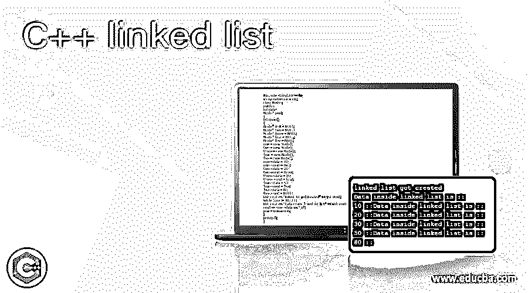
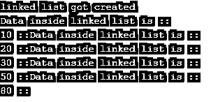

# C++链表

> 原文：<https://www.educba.com/c-plus-plus-linked-list/>




## C++链表简介

链表是数据结构的一部分，也是最重要的部分。在 C++中，链表是通过使用结构和指针来实现的。链接的基本工作在所有编程语言中都是一样的，就像它是许多节点的集合，节点包含下一个节点的数据和地址。这里我们使用指针来实现这一点。

**语法**

<small>网页开发、编程语言、软件测试&其他</small>

我们使用结构来创建一个链表。这个结构包含数据和指向下一个节点的指针。我们在这里使用 struct 关键字创建一个结构；数据可以是任何东西，我们使用' * '符号来表示指针。为了更好地理解，请参见下面的语法；

```
struct node // structure name
{
int data; // your data
node *next; // your pointer
};
```

通过上面的语法，现在我们对如何使用 structure 在 C++中创建一个简单的链表有了一些了解。

### C++中链表是如何工作的？

到目前为止，我们知道链表是一种数据结构，用于存储数据。我们可以使用一个链表，其中的数据是动态的，我们不知道数据或记录的数量，因为它们可以根据输入而改变。所以，在这种情况下，我们可以这样做，因为我们不能断言数据。如果我们谈得更详细，链表包含许多节点。该节点还包含指向下一个节点的数据和指针；所有节点都已连接。我们有不同类型的链表可用。链表数据结构通常用于操作数据，如删除操作、更新特定记录等。不太建议将它们用于搜索操作，因为它们不像数组中那样包含索引映射。所以它们需要一些时间，因为它必须遍历整个链表来搜索任意数量的节点中的输入。现在我们将讨论链表的类型，如下所示:

#### 1.单向链表

单链表也是不同节点的集合。节点被进一步分成两部分:数据和另一部分是到下一个节点的地址。我们还有链表的头和尾。单向链表也是使用 C++中的结构创建的，它将数据和指针保存在同一个结构中。Head 是链表中的第一个节点，访问我们的完整链表需要它的地址。尾部代表最后一个节点，如果链表没有存储地址，因为它是最后一个，所以它将指向 NULL。为了更好地理解它，我们可以看下面的图表。

#### 2.循环链表

顾名思义，这个链表数据结构形成了一个圈。这意味着所有节点都已连接；没有空引用，它形成了一个圈。通过使用循环链表，我们可以从任何节点开始遍历。在循环链表中，最后一个节点指针将指向第一个节点。这个链表提供了像删除、插入和搜索这样的基本操作。

*   **插入:**如果你想在循环链表中插入一行，那么我们可以把它插入到链表的末尾、开头，或者我们也可以把它添加到节点之间。
*   **删除:**当从循环链表数据结构中删除任何数据时，首先我们删除它，然后我们试图从中释放分配的内存。对于这个操作，我们在程序中维护当前和先前的指针。
*   **搜索或遍历:**我们遍历链表中的每个节点，直到到达空引用，但这是单链表的情况。但是在循环链表中，我们遍历直到到达第一个节点。

#### 3.双向链表

双向链表也是一种数据结构，由连接的节点集合组成。但是在这里，这个节点被分成三个部分一个是数据，指向下一个节点的指针，还有一个额外的指针，是指向前一个指针的地址。在这里，我们有一个头和一个尾巴。我们只需要让第一个节点的指针遍历整个链表。尾部仍然指向 NULL，但是我们可以双向遍历，因为它也包含了前一个节点指针。

需要记住的要点；

*   它维护连接它们的节点的数据和地址。只有这样，我们才能轻松地访问它们。

### C++链表的例子

在这个例子中，我们创建了一个有五个节点的单链表，并在末尾打印出值。

**代码:**

```
#include <bits/stdc++.h>
using namespace std;
class Node {
public:
int data;
Node* next;
};
int main()
{
Node* one = NULL;
Node* two = NULL;
Node* three = NULL;
Node* four = NULL;
Node* five = NULL;
one = new Node();
two = new Node();
three = new Node();
four = new Node();
five = new Node();
one->data = 10;
one->next = two;
two->data = 20;
two->next = three;
three->data = 30;
three->next = four;
four->data = 50;
four->next = five;
five->data = 80;
five->next = NULL;
std::cout << "linked list got created" << std::endl;
while (one != NULL) {
std::cout << "Data inside linked list is ::" << std::endl;
cout << one->data << " ::";
one = one->next;
}
return 0;
}
```

**输出:**




### 结论

通过使用链表数据结构，我们可以很容易地处理动态数据。此外，通过使用链表数据结构，我们可以使操作非常快，因为它基于节点的概念。但有时，用数据搜索操作是不可行的。我们有不同类型的链表，可以根据需要使用。

### 推荐文章

这是一个 C++链表指南。这里我们讨论 C++中链表是如何工作的，并给出代码和输出的例子。您也可以看看以下文章，了解更多信息–

1.  [C++保留()](https://www.educba.com/c-plus-plus-reserve/)
2.  [C++可变](https://www.educba.com/c-plus-plus-mutable/)
3.  [C++读取文件](https://www.educba.com/c-plus-plus-read-file/)
4.  [C++ end()](https://www.educba.com/c-plus-plus-end/)


