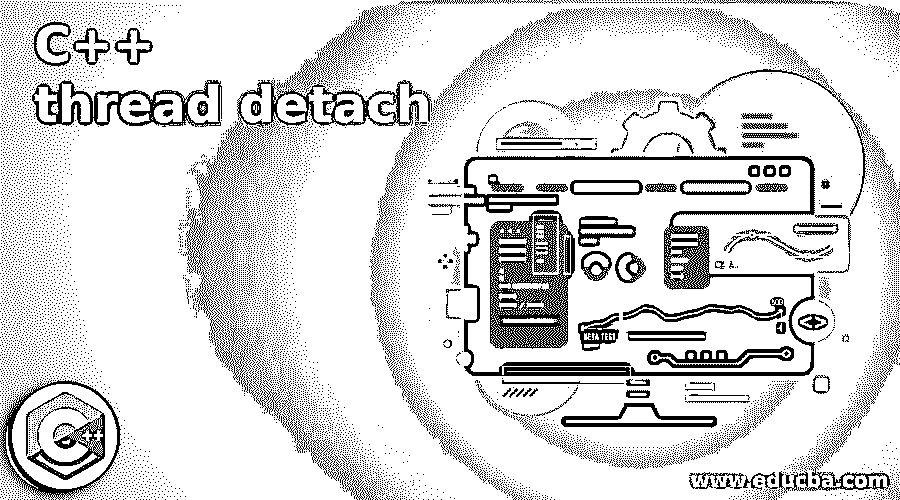
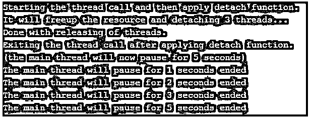

# C++线程分离

> 原文：<https://www.educba.com/c-plus-plus-thread-detach/>




## C++线程分离简介

在 C++中，线程分离被定义为在不中断执行的情况下将线程从其对象中分离出来，换句话说，正如其名称所定义的，在调用 detach()函数之前，通过释放线程分配的资源，已经使用 detach()函数声明的线程将从其自己的对象中分离或分开，这意味着当线程结束执行或退出时，执行也将独立地继续。这种脱离或分离的线程也称为后台线程或恶魔线程。我们还应该注意，我们不应该在没有执行的线程对象或与线程执行无关的对象上调用 detach()函数。

### C++中线程分离()函数的使用实例

在本文中，我们将看到一个在 C++中称为 detach()的函数，用于在不影响线程执行的情况下将线程从其线程对象中分离出来，这样它就可以在不依赖线程分离过程的情况下继续运行，同时该函数还可以在线程退出后释放与之相关的线程资源。一般来说，我们可以说当一个线程被创建时，假设如果我们想要从子线程分离，那么如果我们在父线程上运行 detach()函数来分离子线程，那么父线程没有办法处理子线程，因为子线程已经离开了父线程，因此，在使用 detach()函数之前，我们应该三思而后行，并声明或使子线程的变量成为全局变量，或者在全局范围内写入这些子线程的变量，这是一个安全规则。但是尽管我们已经分离了，线程并没有被破坏，但是它仍然继续执行。

<small>网页开发、编程语言、软件测试&其他</small>

因此，如果我们希望父线程与子线程分离，那么我们可以使用这个分离函数。在 C++中，一旦线程被分离或使用 detach()函数，我们就不能停止这样的线程，而且，如果需要停止这样的线程，那么只有一种方法是通过在 main()函数中实例化线程来从初始线程函数中返回线程，添加布尔值，但是在退出 main()函数之前，我们必须锁定互斥体，这意味着布尔值被设置为 true，然后加入线程。因此，这不是关闭分离的螺纹的直接或干净的过程，并且只有当螺纹可接合时才能这样做；因此，最好避免关闭分离的线程。

有可能发生异常，成员函数可以通过使线程的对象处于有效状态来引发异常。所以有必要总是为新创建的线程调用这个 detach()函数，以避免有时很难解决的程序崩溃，如果在调用程序终止时没有调用这个函数。线程对象可以容易且安全地被销毁，同时当调用该函数时，该线程对象变得不可连接。

现在让我们看看如何在 C++程序中编写 detach()函数或语法。

它可以定义为:

**std::thread::detach**

**void detach()**

上面的函数不带任何参数，也不返回任何东西，但是当我们调用 detach *this 时，这个函数不能有自己的线程。如果 joinable()函数为 false，则有可能发生错误，这是 std::system:: error，因此会产生一个我们在全局范围内分离的子线程。

**举例:**

现在让我们看一个使用 C++编程语言演示 detach()函数的例子。

**代码:**

```
#include <iostream>
#include <thread>
#include <chrono>
void thread_waiting(int n)
{
std::this_thread::sleep_for (std::chrono::seconds(n));
std::cout << "The main thread will pause for " << n << " seconds ended\n";
}
void detach_func()
{
std::cout << "It will freeup the resource and detaching 3 threads...\n";
std::thread (thread_waiting,1).detach();
std::thread (thread_waiting,2).detach();
std::thread (thread_waiting,3).detach();
std::cout << "Done with releasing of threads.\n";
}
void thread_call()
{
std::cout << "Starting the thread call and then apply detach function.\n";
detach_func();
std::cout << "Exiting the thread call after applying detach function.\n";
}
int main()
{
thread_call();
std::cout << "(the main thread will now pause for 5 seconds)\n";
thread_waiting(5);
return 0;
}
```

**输出:**




在上面的程序中，我们可以看到；首先，我们必须定义头文件或库，如用于输入/输出的<iostream>和用于处理线程的<thread>库，以及用于声明日期和时间的<chrono>库。然后我们定义一个函数让主线程暂停几秒钟，这里我们不能直接声明 time 或者我们必须使用的<chrono>库，或者在 std::chrono:: namespace 下定义它。</chrono></chrono></thread></iostream>

我们必须创建或调用线程，以便可以在创建的线程上应用分离功能。然后，我们将定义一个函数，通过应用 detach()函数来分离线程。这个分离操作是在 detach_func()中单独完成的，它将释放资源并分离 3 个线程，因为我们只为 3 个线程定义了，所以一个接一个的线程被分离，这意味着我们将线程从父线程中分离出来。然后线程退出，但是这里主线程会等待 5 秒，如上图截图所示。

### 结论

在本文中，我们得出结论，在 C++中，我们在<thread>库中有 detach()函数，用于将线程从其线程对象中分离，当线程完成执行时，它将释放分配的资源；也就是说，它可以独立运行线程执行，因此这些分离的线程也被称为后台线程或恶魔线程。在本文中，我们还看到了如何定义和声明 detach()函数，我们还演示了一个示例，其中我们调用一个线程并应用 detach()函数，我们可以看到主线程在退出线程执行后如何暂停几秒钟。</thread>

### 推荐文章

这是一个 C++线程分离的指南。这里我们结合实例讨论 C++中线程分离()函数的介绍和使用。您也可以看看以下文章，了解更多信息–

1.  [C++ fstream](https://www.educba.com/c-plus-plus-fstream/)
2.  [C++可变](https://www.educba.com/c-plus-plus-mutable/)
3.  [C++读取文件](https://www.educba.com/c-plus-plus-read-file/)
4.  [c++中的反射](https://www.educba.com/reflection-in-c-plus-plus/)


