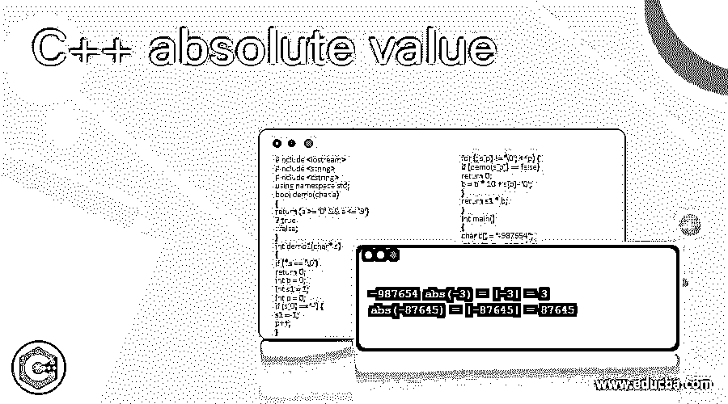
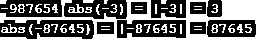
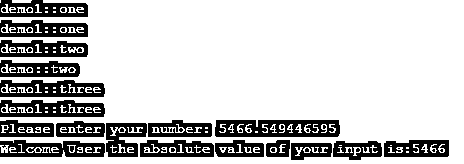
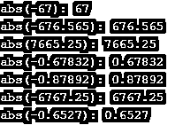

# C++绝对值

> 原文：<https://www.educba.com/c-plus-plus-absolute-value/>




## **c++绝对值介绍**

C++ absolute 是默认函数之一，abs()将返回整数数值，因为它需要舍入值。所以绝对值是整数数据类型。这个函数是通过使用<cstdlib>头文件定义的，它也重载了<cmath>指令。它不接受浮点值。该函数用于查找绝对值，并将返回输入数字的绝对值。它返回数据类型转换的绝对值，并且与其他数据类型的值兼容。</cmath></cstdlib>

**语法:**

<small>网页开发、编程语言、软件测试&其他</small>

在 C++中，每个对象、变量、关键字和函数都有自己的语法和属性，用于在编程代码中声明。根据需求，我们将利用编程库中的特殊关键字、变量、数据类型和函数。abs()是数学库中的一个函数，用于计算输入数字的绝对值。

**代码:**

```
#include<iostream>
#include<cmath>
using namespace std;
data type main()
{
data type variable name;
abs(variable name);
----some C++ code logics---
}
```

上述代码是计算用户输入绝对值的基本语法。这些函数不会抛出异常。

### 绝对值在 C++中是如何工作的？

C++有 n 个保留的关键字、函数，这些函数将提供对实际名称空间的某种程度的抽象，以及新的库，这些库已经被程序员使用，以允许它更多地关注编码概念。它还使编写编程代码和使用 destroy()或任何其他属于垃圾收集的默认方法清理代码变得更加容易，它是销毁不需要的代码和清理内存空间区域的主要区域。它取决于数据类型，必须计算对象创建大小，并且它为大存储数据类型变量和小存储变量分配内存空间。通常情况下，C++声明和指令是与某种内存空间一起使用的，这些内存空间是为函数分配的，用于将它存储在 RAM 中。函数声明和定义将成为协议的标准类型，它将所有类型的成员和函数都计算在当前和未来的范围内。

根据 abs()函数，它将计算用户输入的绝对值，它可以是任何数据类型的范围。有时双精度浮点数是一些不可接受的数据类型值，在输出中被舍入的值表示为绝对值。abs()函数将接受并作为单级参数传递，它将返回 int、long int 或 long long int。有效的整数将返回有效的整数，否则此时序列不会出现，或者数据类型具有空值或 null 值，它必须只包含空白字符。函数中不会发生转换，如果变量没有在函数中初始化，也不会找到返回值。此外，计算的整数值超出范围意味着表示的值是 int 数据类型，这会导致一些未定义的行为并引发异常。用户输入需要进行科学和数学计算，执行的值类型和返回的绝对有效整数值越准确和有效。

### 例子

让我们讨论 C++绝对值的例子。

#### 示例#1

**代码:**

```
#include <iostream>
#include <string>
#include <cstring>
using namespace std;
bool demo(char a)
{
return (a >= '0' && a <= '9')
? true
: false;
}
int demo1(char* s)
{
if (*s == '\0')
return 0;
int b = 0;
int s1 = 1;
int p = 0;
if (s[0] == '-') {
s1 = -1;
p++;
}
for (; s[p] != '\0'; ++p) {
if (demo(s[p]) == false)
return 0;
b = b * 10 + s[p] - '0';
}
return s1 * b;
}
int main()
{
char c[] = "-987654";
int output = demo1(c);
printf("%d ", output);
int m = -3;
long n = -87645;
int l = abs(m);
long w = abs(n);
cout << "abs(" << m << ") = |" << m << "| = " << l << endl;
cout << "abs(" << n << ") = |" << n << "| = " << w << endl;
return 0;
}
```

**输出:**




#### 实施例 2

**代码:**

```
#include <iostream>
using namespace std;
struct demo {
virtual void one(int) { std::cout << "demo::one\n"; }
void two(char)        { std::cout << "demo::two\n"; }
void three(int)         { std::cout << "demo::three\n"; }
protected:
int a;
typedef int val;
};
struct demo1 : demo {
using demo::a;
using demo::val;
using demo::one;
void one(int) { std::cout << "demo1::one\n"; }
using demo::two;
void two(int) { std::cout << "demo1::two\n"; }
using demo::three;
void three(int) { std::cout << "demo1::three\n"; }
};
int main()
{
demo1 i;
demo& d = i;
int m;
i.a = 3;
i.one(3);
i.one(3);
i.two(2);
i.two('k');
i.three(3);
i.three(3);
cout<<"Please enter your number:";
cin>>m;
if(m>=0)
cout<<"Welcome User the absolute value of your input is:"<<m;
else
cout<<"Thank you User your absolute value of the input is"<<-(m);
return 0;
}
```

**输出:**




#### 实施例 3

**代码:**

```
#include <iostream>
#include <cmath>
using namespace std;
int main()
{
float m;
m = -67;
cout<<"abs("<<m<<"): "<<abs(m)<<endl;
m = -676.5645;
cout<<"abs("<<m<<"): "<<abs(m)<<endl;
m = 7665.2456;
cout<<"abs("<<m<<"): "<<abs(m)<<endl;
m = -.67832;
cout<<"abs("<<m<<"): "<<abs(m)<<endl;
m = -.87892;
cout<<"abs("<<m<<"): "<<abs(m)<<endl;
m = -6767.25245;
cout<<"abs("<<m<<"): "<<abs(m)<<endl;
m = -.6527;
cout<<"abs("<<m<<"): "<<abs(m)<<endl;
return 0;
}
```

**输出:**




### 结论

absolute()函数是计算用户输入值的绝对集合的最重要的函数之一，它将返回与输出相同的值。它支持所有类型的整数数据类型值，如果输入是一些其他数据类型，它也执行并转换为整数值。

### 推荐文章

这是一个 C++绝对值指南。这里我们讨论一下 C++绝对值在 C++中是如何工作的入门和？并分别给出了几个例子。您也可以看看以下文章，了解更多信息–

1.  [C++静态](https://www.educba.com/c-plus-plus-static/)
2.  [C++静态转换](https://www.educba.com/c-plus-plus-static_cast/)
3.  [C++线程()](https://www.educba.com/c-plus-plus-thread/)
4.  [C++线程池](https://www.educba.com/c-plus-plus-thread-pool/)


