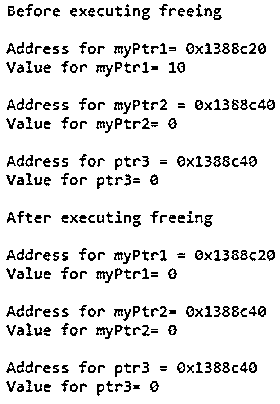

# C++免费()

> 原文：<https://www.educba.com/c-plus-plus-free/>


## 免费 C++简介()

C++中的 free()函数<cstdlib>在 C++中用来释放一个内存块。每当我们在 C++中调用 malloc、calloc 或 realloc 函数来动态分配一个内存块时，编译器会分配一个大小为字节的内存块，并返回一个指向该内存块开头的指针。新分配的内存块未初始化，但具有中间值。free()方法用于释放这样的内存块。如果提到的指针没有指向任何内存块，那么它可能会导致一个未定义的行为，但在空指针的情况下没有任何作用。同样，在存储块变得可用之后，指针仍然指向相同的存储位置。</cstdlib>

**语法:**

<small>网页开发、编程语言、软件测试&其他</small>

```
void free(void *ptr)
```

*   这里 ptr 指的是一个指针，指向 C++中先前由 malloc、calloc 或 realloc 分配的内存块。这里的指针类型是 void，因为它能够保存任何类型的指针，并且在取消引用时可以转换为任何类型。
*   如果 free 函数中提到的指针是一个空指针，那么函数什么也不做，因为有内存块要释放，并且不返回任何东西。
*   并且在指针指向还没有使用 malloc、calloc 或 realloc 方法中的任何一个分配的存储块的情况下，则不能预测自由函数的行为。

**返回类型:**

free()函数的返回类型是 void，这意味着该函数不返回任何内容。它所做的只是释放被引用指针指向的内存块。

### free()函数在 C++中是如何工作的？

*   Free 方法是动态内存管理的一个很好的工具。它存在于<cstdlib>头文件中。</cstdlib>
*   当使用 std::malloc、std::calloc 或 std::alloc .分配内存块时，会返回一个指针。这个指针被传递给 free 函数，用于释放。这有助于编译器动态管理内存。
*   如果指针是空指针，那么函数什么也不做，因为指针没有引用任何内存。
*   因为指针的数据类型是空的，所以它能够解引用任何类型的指针。
*   如果提到的指针值不是使用这三种方法分配的，那么自由函数的行为是未定义的。此外，如果指针所引用的内存块已经使用 std::free 或 std::realloc 方法释放，那么它也是未定义的。
*   这个方法对指针没有影响，它只是释放了内存块，指针一直指向内存块。
*   所有的动态内存分配和释放方法都以同步的方式工作，因此指针所指的用于分配的内存块在那时必须是空闲的。

### C++免费示例()

下面是提到的例子:

#### 示例#1

在这个例子中，我们使用 usecalloc 方法来动态地为一个值分配内存。然后我们使用 free 方法释放内存，看看指针和被引用的值会发生什么。

**代码:**

```
#include <iostream>
#include <cstdlib>
#include <cstring>
using namespace std;
int main()
{           int *myPtr;
myPtr = (int*) calloc(1,sizeof(int));
*myPtr = 10;
int* myPtr2 = (int*)std::calloc(10, sizeof *myPtr);
int *ptr3 = new int;
cout<< "Before executing freeing" <<endl<<endl;;
cout<< "Address for myPtr1= " <<myPtr<<endl;
cout<< "Value for myPtr1= " << *myPtr<<endl<<endl;
cout<< "Address for myPtr2 = " << myPtr2 <<endl;
cout<< "Value for myPtr2= " << *myPtr2 <<endl<<endl;
cout<< "Address for ptr3 = " << myPtr2 <<endl;
cout<< "Value for ptr3= " << *myPtr2 <<endl<<endl;
free(myPtr);
free(myPtr2);
free(ptr3);
cout<< "After executing freeing" <<endl<<endl;;
/* ptr remains same, *ptr changes*/
cout<< "Address for myPtr1 = " <<myPtr<<endl;
cout<< "Value for myPtr1= " << *myPtr<<endl<<endl;
cout<< "Address for myPtr2= " << myPtr2 <<endl;
cout<< "Value for myPtr2= " << *myPtr2 <<endl<<endl;
cout<< "Address for ptr3 = " << myPtr2 <<endl;
cout<< "Value for ptr3= " << *myPtr2 <<endl<<endl;
return 0;
}
```

**输出:**




#### 实施例 2

在这个例子中，我们使用 std::malloc 分配内存，然后使用 std::realloc 方法重新分配。在此存储块被解除分配之后，然后观察其指针和存储在该指针所引用的存储块中的值。

**代码:**

```
#include <iostream>
#include <cstdlib>
#include <cstring>
using namespace std;
int main()
{           int *ptr;
ptr = (int*) malloc(sizeof(int));
cin>> *(ptr);
cout<< "Value in memory block before executing free function is "<< *(ptr) <<endl;
free(ptr);
cout<< "Value in memory block before executing free function is " ;
cout<< *(ptr) <<endl;
char *ptr1;
ptr1 = (char*) malloc(10*sizeof(char));
strcpy(ptr1,"Lets see how free works");
cout<< "Value in char pointer is : " << ptr1 <<endl;
ptr1 = (char*) realloc(ptr1,20);
strcpy(ptr1,"free functon  is terrific");
cout<< "After reallocating value in char pointer is : " <<ptr1 <<endl;
free(ptr1);
cout<<endl<< "After executing free on char pointer : " << ptr1;
return 0;
}
```

**输出:**


### C++ free()的优势

下面给出了一些优点:

*   这种方法有助于动态内存管理。
*   这有助于重用不再使用的内存块。因为只有被提到的指针引用的存储被修改，这不会影响其他的内存分配。
*   所有动态分配(malloc、calloc 或 realloc)和解除分配(free)方法都注意到，对相同内存块的内存分配发生在这些内存块的解除分配之后。

### 结论

Free 方法用于动态释放被指定指针引用的内存块。必须使用 malloc、calloc 或 realloc 方法分配被引用的内存。如果不是，那么方法行为是未定义的。如果是空指针，那么什么都不会发生。因此，它对于动态内存管理非常有用。

### 推荐文章

这是 C++免费指南()。这里我们讨论 free()函数在 C++中是如何工作的，它的优点以及相应的编程例子。您也可以看看以下文章，了解更多信息–

1.  [c++中的递归](https://www.educba.com/recursion-in-c-plus-plus/)
2.  [C 中的内存分配](https://www.educba.com/memory-allocation-in-c/)
3.  [c++中的运算符优先级](https://www.educba.com/operator-precedence-in-c-plus-plus/)
4.  [c++中的 ifstream](https://www.educba.com/ifstream-in-c-plus-plus/)


