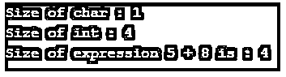
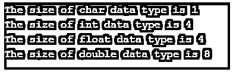

# C++ sizeof()

> 原文:# t0]https://www . educba . com/c-plus-sizeof/


## C++ sizeof()简介

sizeof()是 C 和 C++中的运算符。它是一个一元运算符，帮助程序员找到正在使用的操作数的大小。该操作符的结果是一个整型，通常用 size_t 表示。该操作符通常用于可以是整数、浮点、指针等原始数据类型的数据类型。它还可以给出复杂数据类型(如结构、联合等)的大小。这是一个编译时操作符，它将告诉任何数据类型的大小，并计算操作数的大小。

**语法:**

<small>网页开发、编程语言、软件测试&其他</small>

下面是使用 sizeof()的语法:

```
sizeof(type)
```

```
sizeof expression
```

第一种类型中的 sizeof 函数将以所发送类型的对象的字节大小给出输出。第二种类型是表达式类型的对象的字节大小。大小将是表达式求值后的大小。在这两个版本中，标准类型的常量表达式是 size_t。

### sizeof()运算符在 C++中是如何工作的？

sizeof()运算符可用于查找数据类型或表达式的大小。它们以一种非常简单的方式工作，将这些作为参数，并通过返回以字节为单位的大小来处理它们。

**代码:**

```
#include <iostream>
using namespace std;
int main() {
cout << "Size of char : " << sizeof(char) << endl;
cout << "Size of int : " << sizeof(int) << endl;
cout << "Size of expression 5 + 8 is : " << sizeof(5 + 8) << endl;
return 0;
}
```

上面的代码帮助我们获得不同数据类型的大小。我们首先使用了标准库<iostream>。它帮助我们使用所有内置的功能。sizeof 函数是 iostream 库中内置函数的一部分。然后，通过使用 cout，我们打印 sizeof()函数的输出。当调用这个函数时，我们发现有四种数据类型正在被使用。它们是 char、int、float 和 double。</iostream>

如前所述，sizeof 函数将帮助我们获得每个数据类型的大小。因此，它使用这些数据类型作为参数，并返回每种数据类型的数据大小。我们还计算了两个整数相加的表达式的大小。它会计算这些，结果也是一个整数。因此，其输出也将是 4。上述函数和代码的输出将是每个变量使用的字节数。为了检查一些，char 的输出如下所示。

**输出:**




### C++ sizeof()的示例

下面是提到的例子:

#### 示例#1

作为数据类型的操作数。

**代码:**

```
#include <iostream>
using namespace std;
int main()
{
cout << "The size of char data type is " << sizeof(char)<<"\n";
cout << "The size of int data type is " << sizeof(int)<<"\n";
cout << "The size of float data type is "<< sizeof(float)<<"\n";
cout << "The size of double data type is " << sizeof(double)<<"\n";
return 0;
}
```

上面的代码将给出每种数据类型的数据大小(以字节为单位),作为参数发送。所有的大小都以字节为单位。

**输出:**




#### 实施例 2

作为表达式的操作数。

**代码:**

```
#include <iostream>
using namespace std;
int main()
{
int a = 7;
float d = 15.21;
cout << "The addition of int and float is a float as follows: " << a + d;
cout << "\nThe size of the expression is " << sizeof(a + d);
return 0;
}
```

上面的代码用返回结果表达式的数据类型的大小。这里我们声明了两个变量。一个变量是整数，第二个变量是浮点数。我们现在把这两个变量加到表达式中，就可以求出。这个表达式的结果将是一个浮点数。因此，sizeof 将是 float 数据类型的大小。

**输出:**


你可以看到加法的结果是一个浮点数。表达式的大小也是数据类型 float 的大小，即 4。

#### 实施例 3

查找数组中元素的数量。

**代码:**

```
#include <iostream>
using namespace std;
int main()
{
int array1[] = { 1,5,76,89,23,06 };
cout << "The number of elements which are present in the array are : "
<<(sizeof(array1) / sizeof(array1[0]));
return 0;
}
```

除了给出表达式和数据类型的大小之外，size of 运算符还可以用于查找数组中元素的数量。这里我们定义了一个数组“array1”。我们加入了一些元素。为了得到这些元素的计数，并准确地得到其中有多少个元素，我们可以简单地使用 sizeof 操作符。

我们指定数组名和第一个索引 array1[0]，这有助于我们从头开始计数。它将从索引 0 开始计数，直到结束。一旦到达终点，它将显示元素的数量。它将由这个 sizeof()函数返回。

**输出:**


### 结论

sizeof()运算符是一个函数，它返回任何数据类型、表达式、数组等的大小。它将数据类型或表达式作为强制参数的一部分，并返回该数据类型的大小(以字节为单位)的结果。如果它是一个数组，它将返回数组中元素的个数。当我们必须分配内存时，这是一个非常有用的函数。我们可以根据需要计算大小和分配内存，从而节省大量空间。

### 推荐文章

这是一个 C++ sizeof()的指南。这里我们分别用例子讨论 sizeof()操作符在 C++中是如何工作的。您也可以看看以下文章，了解更多信息–

1.  [C++设定精度](https://www.educba.com/c-plus-plus-setprecision/)
2.  [c++中的一元运算符](https://www.educba.com/unary-operators-in-c-plus-plus/)
3.  [C++头文件](https://www.educba.com/c-plus-plus-header-files/)
4.  [C++向量排序](https://www.educba.com/c-plus-plus-vector-sort/)


