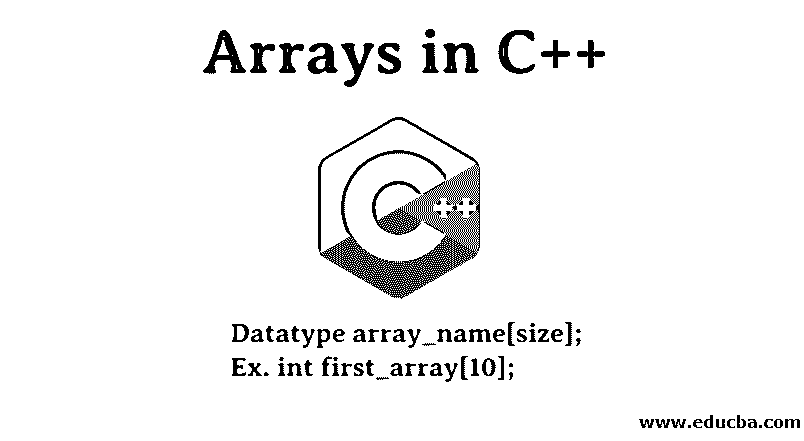
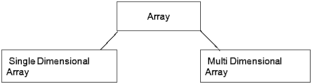
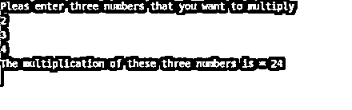
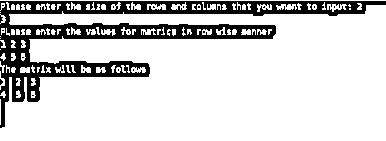

# C++中的数组

> 原文：<https://www.educba.com/arrays-in-c-plus-plus/>




## C++中的数组介绍

C++中的数组是类似数据类型的集合，如 int、char、float、double 等。使用索引值存储，并且仅通过索引值即可轻松访问。此外，它将变量的所有实例存储到一个变量中。在 C++中，可以使用三种方法声明数组:通过指定数组的大小，通过直接初始化数组元素，以及通过数组的元素指定数组的大小。

要使用任何应用程序处理数据，我们首先需要将数据引入应用程序。这意味着在程序运行之前，应用程序中应该有一些空间来存储该值。为了存储这些值，编程语言为我们提供了一个变量。变量用于存储值，以便应用程序可以使用它们来生成预期的结果。随着变量的存储，一些值会占用分配给应用程序的内存空间。所以编码的最佳[方法是确保变量的使用尽可能低。数组概念的出现是为了缓解由于创建大量变量而导致的内存分配问题。该数组可以被视为属于同一数据类型的值的列表。在本文中，我们将学习使用 C++编程语言的数组。](https://www.educba.com/encoding-vs-decoding/)

<small>网页开发、编程语言、软件测试&其他</small>

### C++中数组是如何工作的？

下面是阵列工作原理的解释:

*   该数组用于存储数据类型的值。它应该以与变量相同的方式工作。它可以保存多个值，用 C++或编程语言创建数组。我们必须声明希望在数组中存储的变量的数量。
*   必须注意，数组的大小在整个应用程序运行时保持固定，不能动态改变。一旦定义了数组的大小，我们就可以在其中存储相同数量的值。如果数组的数据类型被定义为整数，它将不接受任何非整数的值。我们需要使用索引来定位数组保存的值，并且我们需要使用索引。
*   例如，如果数组可以保存两个值，那么第二个值将存储在数组的一个索引处，因为数组的索引从零开始。在下一节中，我们将学习数组创建。

### 如何在 C++中创建数组？

下面的解释显示了如何在 c++中创建数组:

创建数组的方法与创建变量完全相似。第一步是声明数组。一旦数组被声明，我们可以同时初始化数组，也可以以后再初始化。在声明数组时，我们必须提到三件事:数组的数据类型、数组的名称和它的大小。下面是显示如何声明数组的语法。

**语法:**

```
Datatype array_name[size];
```

《出埃及记》

```
int first_array[10];
```

这里定义的数组可以有十个整数值。数组的名称是 first_array，大括号中定义的数字表示数组的大小。现在让我们看看如何同时声明和初始化变量。

**代码:**

```
int first_array[4] = { 1,2,3,4}
int first_array[]= {1,2,3,4,5,6}
```

在上面的例子中，我们看到定义大小为 4 的数组接受了 4 个值。如果有人试图提交 4 个以上的值，它将抛出一个错误。此外，如果不指定变量的大小，可以存储任意多的值。

### C++中的数组类型




在 C++编程语言中，我们主要有两种类型的变量:一维数组和多维数组。一维以列表的形式存储值，而[多维数组以矩阵的形式存储](https://www.educba.com/multidimensional-array-in-c/)值。下面我们将通过一个例子来看看每一种类型。

#### 1.一维数组

一维数组可以被定义为能够以列表的形式保存相同数据中心的值的数组类型。这是最简单的数组形式，因为它不需要太多的努力来定义和初始化这样的数组。可以定义为 int a[10]，其中 int 为数据类型，数组名，数组大小为 10。下面的例子将使事情更加清楚。

**代码:**

```
#include <iostream>
#include <conio.h>
using namespace std;
void main()
{
int val_array[3];
int int_val=1,counter;
cout<<"Please enter three numbers that you want to multiply"<<endl;
for(counter=0;counter<3;counter++)
{
cin>>val_array[counter];
int_val = int_val*val_array[counter];
}
cout<<"The multiplication of these three numbers is = "<<int_val;
getch();
}
```

上面的程序被编写为接受来自用户的三个值，然后这些值将被处理以生成所有这些值的乘积值。这里的数组用户是 name val_array，数组可以容纳三个值。循环用于获取数组中的值，该值将被相乘。乘法的结果已经存储在 int_val 变量中。因为函数是空的，所以它不会返回任何值。

**输出:**




#### 2.多维数组

[多维数组](https://www.educba.com/multidimensional-array-in-python/)可以定义为像矩阵一样保存值的数组。二维数组经常被使用，并且数组变得复杂随着维数的增加，数组变得复杂。例如，使用二维数组比使用三维数组更容易。二维数组需要为每个一维定义两个大小。二维数组在程序中可以是 int a[5][3]。该数组将以 5 行 3 列的矩阵形式保存值。让我们借助一个例子来理解这一点。

**代码:**

```
#include <iostream>
#include <conio.h>
using namespace std;
int main()
{
int val_array[5][5];
int count_rows,count_cols,counter1,counter2;
cout<<"Please enter the size of the rows and columns that you want to input: ";
cin>>count_rows>>count_cols;
cout<<"PLease enter the values for matrics in row wise manner"<<endl;
for(counter1=0;counter1<count_rows;counter1++)
for(counter2=0;counter2<count_cols;counter2++)
cin>>val_array[counter1][counter2];
cout<<"The matrix will be as follows"<<endl;
for(counter1=0;counter1<count_rows;counter1++)
{
for(counter2=0;counter2<count_cols;counter2++)
cout<<val_array[counter1][counter2]<<"  ";
cout<<endl;
}
getch();
return 0;
}
```

在这个程序中，我们使用了一个二维数组。使用两种尺寸定义数组的方式表明所使用的数组是二维的。如果有三种尺寸，那么数组就是三维的。要求用户在矩阵中输入他们想要的行数和列数。一旦用户指定了数字，就要求他们在矩阵的行和列中输入他们想要的值。这里用户提交了 2 ^ 3，这意味着他们希望矩阵中有两行三列。他们必须提供六个值作为具有两行三列六个值的矩阵。当所有的值都被提交后，它们会以矩阵的形式显示出来。整个程序是使用二维数组实现的。

**输出:**




### 传递数组的方法

方法如下所示:

要在任何方法中将变量作为参数传递，需要接受调用它的数据类型的值和保存该值的变量的名称。将数组传递给方法的方式类似于传递任何普通变量的方式。唯一的区别是，我们将需要使用具有特定大小的数组来代替数组，而不是提到单个变量。让我们用语法来理解这一点。

**语法:**

```
//defining method that accepts an array as a parameter.
int handle_array(int a[6]);
```

这里的方法名是 handle_array，它有一个数组作为参数。数组的名称是，数组可以容纳六个值。现在让我们看看如何将参数传递给方法 handle_array。

**语法:**

```
int arrr[6] = {1,2,3,4,5,6};
handle_array(arr) ;
```

首先，我们必须将值赋给必须传递给 handle_array 方法的其他变量。赋值后，我们需要在调用 handle_array 函数时将数组作为参数传递。在上面的代码片段中，可以清楚地看到数组是如何被赋值并作为参数传递 handle_array 函数定义的值的。

### 结论

C++中的数组是内存管理的一个重要特性，可以提高程序的效率。它可用于多种算法中，以提供多维数据存储。当需要存储相同数据类型的值时，使用数组总是最佳的。它不仅有助于节省资源，还减少了程序执行时间。

### 推荐文章

这是一本关于 C++中数组的指南。这里我们讨论了 C++中数组的工作原理，如何创建，数组的类型，传递，代码，语法，输出等等。你也可以浏览我们的文章来了解更多-

1.  [什么是 C++](https://www.educba.com/what-is-c-plus-plus/)
2.  [C++运算符](https://www.educba.com/c-plus-plus-operators/)
3.  [c#中的数组](https://www.educba.com/arrays-in-c-sharp/)
4.  PHP 中的[数组](https://www.educba.com/arrays-in-php/)


