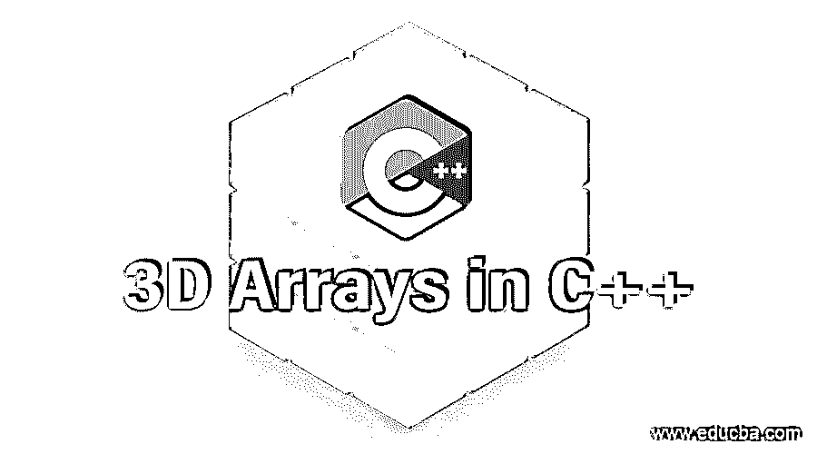
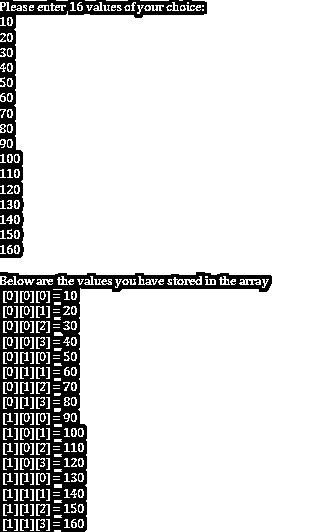

# C++中的 3D 数组

> 原文：<https://www.educba.com/3d-arrays-in-c-plus-plus/>




## C++中的 3D 数组简介

C++数组用于以表格的行和列的形式存储数据。在这里，我们可以创建单个或[多维数组来保存不同场景中的](https://www.educba.com/c-sharp-multidimensional-arrays/)值。在 C++中，3d 数组是一个[多维数组，用于](https://www.educba.com/multidimensional-array-in-php/)存储三维信息。简单来说，三维数组就是数组的数组。在三维数组中，我们有三行三列。在本文中，我们将看到什么是三维数组，三维数组的使用，如何访问它们以及如何在我们的代码中有效地使用三维数组。

### 在 C++中使用 3D 数组

1.以在书中搜索单词为例，可以理解 3d 数组的用法。我们需要三条信息来查找书中的一个单词。

<small>网页开发、编程语言、软件测试&其他</small>

*   页码。
*   行号。
*   Word 索引或 word 所属的列。

2.在多维数组中，数据以表格的形式出现，即以行为主的顺序排列。三维数组的一般语法如下。

**语法:**

```
data_type array_name[size1][size2][size3];
```

3.请记住，大小始终是一个正整数，下面是一个三维数组的例子。

*   **示例:**这里 3DArray 是一个三维数组，最多有 24 个元素。

```
int 3DArray[2][3][4];
```

4.数组中包含的最大元素数是通过乘以所有维度的大小获得的。

*   **举例:**在 3DArray[2][3][4]中，最大元素是 2，3，4 相乘得到的，即 24。

5.类似地，3DArray[10][10][10]可以容纳 1000 个元素。我们可以把它想象成 10 个元素中的每一个都可以容纳 10 个元素，这样总共有 100 个元素。每 100 个元素可以容纳另外 10 个元素，这使得最终计数为 1000。

6.我们可以创建一个三维数组，首先创建一个 2D 数组，然后将其扩展到所需的维度。

#### **3D 阵列的初始化**

 **我们可以用很多方法初始化一个三维数组。以下是供参考的例子。

```
int 3DArray[2][2][4] = {1, 3, 6, 5, 8, 9, -2, 4, 5, 10, 34, 56, 23, -56, 10, 37};
```

花括号中从左到右的值作为一个从左到右的表存储在数组中。这些值将按以下顺序填充到数组中。第一行左起的前 4 个元素，第二行的后 4 个元素，依此类推。

上面的初始化不会给我们一个清晰的数组图像。为了更好的可视化，我们可以如下初始化同一个数组。

```
int 3DArray[2][2][4] =
{
{     {1, 3, 6, 5}, {8, 9, -2, 4}    },
{     {5, 10, 34, 56}, {23, -56, 10, 37}   }
};
```

*   通过使用元素的索引，访问 [3D 数组中的元素与访问任何其他数组类似。我们必须使用三个循环来访问数组 x[2][1][0]中的所有元素。](https://www.educba.com/3d-arrays-in-c/)
*   对于更高维的数组，如 4、5、6 等。，概念很相似，但是处理事情的复杂性增加了。例如，使用的循环次数、元素搜索次数、访问特定元素等。
*   三维或更高维数组的元素可以以不同的方式移动。这个操作类似于向量和矩阵。不同的技术，如整形、置换和压缩，用于重新排列数组中的元素。这些是复杂的技术，我们现在不必担心。

### 步骤示例

现在，我们将使用这些 3D 阵列来了解阵列的工作原理。

我们将[编写一个 C++代码](https://www.educba.com/what-is-c-plus-plus/)，它将接受用户的输入并显示三维数组中的元素。

1.首先，我们将编写执行的主程序。

```
#include <iostream>
using namespace std;
int main( )
{
}
```

2.在 main 函数中，我们将声明一个最多可以存储 16 个元素的三维数组。

```
int Array[2][2][4];
```

3.现在，我们将要求用户输入他希望存储在数组中的 16 个值。

```
cout << "Please enter 16 values of your choice: \n";
```

4.为了将值存储到数组中，我们需要三个循环，即每个维度使用一个循环来遍历。我们将三个指数，I，j 和 k，用于三维空间。为了更好地理解代码，我们将使用 For 循环。第一个 for 循环表示第一维，第二个 for 循环表示第二维，第三个 for 循环表示第三维。在第三个 for 循环中，我们接受用户的输入。

```
for(int i = 0; i < 2; i++)
{
for (int j = 0; j < 2; j++)
{
for(int k = 0; k < 4; k++ )
{
cin >> Array[i][j][k];
}
}
}
```

5.现在，由于值存储在数组中，是时候向用户显示存储的值了。

6.为此，我们再次使用三个 For 循环进行遍历，这次使用 cout 来打印值。

```
cout<<"\n Below are the values you have stored in the array"<< endl;
for(int i = 0; i < 2; i++)
{
for (int j = 0; j < 2; j++)
{
for(int k = 0; k < 4; k++)
{
cout << "[" << i << "][" << j << "][" << k << "] =" <<
Array[i][j][k] << endl;
}
}
}
```

**输出:**




### 结论–c++中的 3D 数组

在这篇文章中，我们学习了什么是数组，什么是单维数组和多维数组，多维数组的意义，如何初始化数组和[在程序中根据我们的需要使用多维数组](https://www.educba.com/multidimensional-array-in-python/)。

### 推荐文章

这是一个 C++中 3D 数组的指南。在这里，我们讨论 C++中 3D 数组的引入和工作，以及示例和步骤。您也可以阅读以下文章，了解更多信息——

1.  [C++数组函数](https://www.educba.com/c-plus-plus-array-functions/)
2.  [在 C++中覆盖](https://www.educba.com/overriding-in-c-plus-plus/)
3.  [c++中的构造函数和析构函数](https://www.educba.com/constructor-and-destructor-in-c-plus-plus/)
4.  [在 C++中覆盖](https://www.educba.com/overriding-in-c-plus-plus/)


**