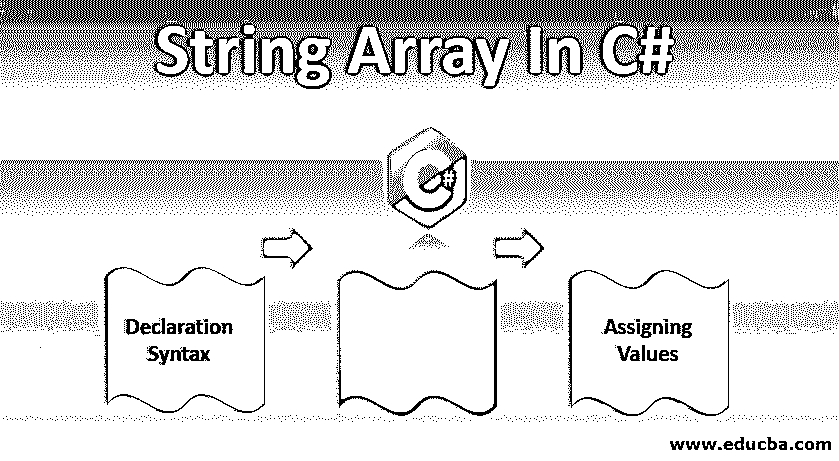
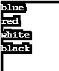
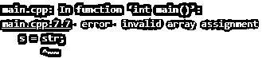
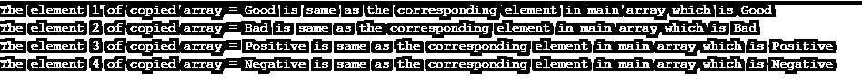

# C++中的字符串数组

> 原文：<https://www.educba.com/string-array-in-c-plus-plus/>




## C++中的字符串数组介绍

C++中有很多数据类型，比如整型、浮点型、字符型、字符串型。字符串数据类型是以空字符(' \0 ')结尾的字符数组，表示数组或字符串的结尾。c 语言没有字符串这样的数据类型，因此我们必须形成一个字符数组来形成一个字符串。在 C++中，我们有内置的数据类型字符串。

**字符示例:**‘a’或‘a’

<small>网页开发、编程语言、软件测试&其他</small>

**字符串(C++)示例:**“英语。”

**String:** 字符数组:String[0] = 'E '

String[1] = 'n '

String[2] = 'g '

String[3] = 'l '

String[4] = 'i '

字符串[5] = 's '

String[6] = 'h '

String[7] = '\0 '

字符串可以直接在 C++中声明、编写和打印。此外，字符串中的每个字符都可以使用类似于数组中索引的索引来访问。在字符串的情况下，当我们使用 scanf()以字符数组的形式读取时，它会在找到第一个空格时停止字符串或读取函数。为了避免这种情况，可以使用 gets()函数。这将读取一整行，只有当用户点击“回车”时才会停止读取。

### C++中的字符串数组多个字符串的数组

字符串数组或字符串数组是多个字符串的数组。这可以声明如下:

```
string Animals[4] = {"Elephant", "Fox", "Lion", "Tiger"};
for(int i = 0; i<4; i++) {
cout << Animals[i] << endl;}
```

**输出:**


### 如何访问字符串数组中的元素？

字符串数组类似于二维数组。第一维度或索引指定了来自类似数组的第 1 个<sup>第 1 个</sup>字/串或第 2 个<sup>第 3 个</sup>字/串的串的索引，依此类推。而第二维度或索引指定该特定单词/字符串中的哪个字符。

用一个清晰的例子来解释它:

```
Animals[2][1] = 'i'
```

在上面的例子中，第一个索引“2”指定它是来自数组“Tiger”的第 2 个<sup>和第 1 个</sup>字符串。第二个索引‘1’，指定它是单词“Tiger”的第二个<sup>和第三个</sup>字母或索引 1。使用二维索引，可以很容易地访问每个字符串中的每个字符。

### 分配或定义字符串数组

分配字符串数组有不同的方法:

#### 1.Char 的 2D 数组(在 C #中也可以使用)

char Name[最大元素数][每个元素的最大大小]

char color[4][8] = { "蓝色"、"红色"、"白色"、"黑色" }

**代码:**

```
int main() {
char color[4][8] = {"blue", "red", "white", "black"};
for(int i = 0; i<4; i++) {
cout << color[i] << endl;
}
}
```

**输出**:


这里，数组颜色是固定大小的；也就是说，元素的数量是固定的，并且元素的字符数量或大小也是固定的。可以定义的元素的最大数量是 4，每个元素最多可以有 8 个字符，不能超过 8 个字符。这是 2d 字符数组中的主要障碍。

#### 2.带有关键字字符串的数组(仅在 C++中可能)

字符串名称[最大元素数]

string color[4] = { "蓝色"、"红色"、"白色"、"黑色" }

**代码:**

```
int main() {
string color[4]  = {"blue", "red", "white", "black"};
for(int i = 0; i<4; i++) {
cout << color[i] << endl;
}
}
```

**输出**:


这里只有一维是固定的，当我们[将它声明为一个字符串数组](https://www.educba.com/strings-array-in-c/)时。只有元素的数量是固定的。元素的大小可以变化。但是指定第二维，我们可以访问或显示相应字符串中的特定字符。

#### 3.在 C++中使用向量

向量名称

矢量颜色

**代码:**

```
#include <iostream>
#include<vector>
using namespace std;
int main()
{
vector <string> color;
color.push_back("blue");
color.push_back("red");
color.push_back("white");
color.push_back("black");
for(int i = 0; i<color.size(); i++) {
cout << color[i] << endl;
}
return 0;}
```

**输出:**




这里它是动态分配的，内存是从堆中分配的。大小不固定。它可以根据元素的数量增加或减少。在使用命令“new”动态分配[字符串数组的情况下，我们需要手动释放分配的内存。但是在矢量的情况下，这是不必要的。在 vector 中重新分配是可能的，而在动态分配的数组中是不可能的。](https://www.educba.com/string-array-in-javascript/)

#### 4.在函数中传递字符串数组

字符串数组可以像传递数组一样传递给函数。

**代码:**

```
#include <iostream>
#include<string>
using namespace std;
void display(string s[5]){
cout << s[2] ;
}
int main() {
string str[5] = {"Good", "Bad", "Positive", "Negative"};
display(str);
}
```

**输出**:


这里，我们将字符串数组 str 作为参数传递给函数“display”，该函数打印字符串数组的第 3 个 <sup>rd</sup> 元素(“正数”)。

#### 5.从字符串数组复制到另一个字符串数组

要从一个字符串数组复制到另一个数组，我们应该单独复制每个元素，但是不能一次复制整个数组。

**代码:**

```
int main() {
string str[4] = {"Good", "Bad", "Positive", "Negative"};
string s[4];
// s = str; -à  This line gives error as the whole array cannot be copied at a single go
// It can be copied as shown below
for( int i=0; i<4; i++) {
s[i] = str[i];
}
for(int i=0; i<4; i++) {
cout << "The element " << i+1 << " of copied array = "  << s[i] << " is same as
the corresponding element in main array which is " << str[i] << endl;
}
}
```

**错误输出:**




**输出:**




这里，当我们试图将整个主字符串数组(str)复制到另一个字符串数组(s)时，我们得到了一个错误(如屏幕截图 1 所示)，而当我们逐个元素地复制它时，str 被复制到 s，我们可以通过查看第二个输出屏幕截图来验证这一点。

### 结论

因此，字符串是字符数组的数据类型，它只出现在 C++中。在 C 语言中，我们通常将声明为字符数组。字符串数组是由许多字符串组成的数组。当静态或动态声明时，它的大小是固定的，当以向量的形式声明时，大小是不固定的。使用字符串数组的索引可以很容易地访问每个元素和特定元素中的字符。

### 推荐文章

这是一个 C++中字符串数组的指南。这里我们讨论如何在 C++中超额处理字符串数组中的元素，以及如何在 C++中分配字符串数组。您也可以浏览我们的其他相关文章，了解更多信息-

1.  [Python 中的字符串数组](https://www.educba.com/string-array-in-python/)
2.  [Java 中的 string buffer](https://www.educba.com/stringbuffer-in-java/)
3.  [c++中的数组](https://www.educba.com/arrays-in-c-plus-plus/)
4.  [c#中的字符串数组](https://www.educba.com/string-array-in-c-sharp/)


