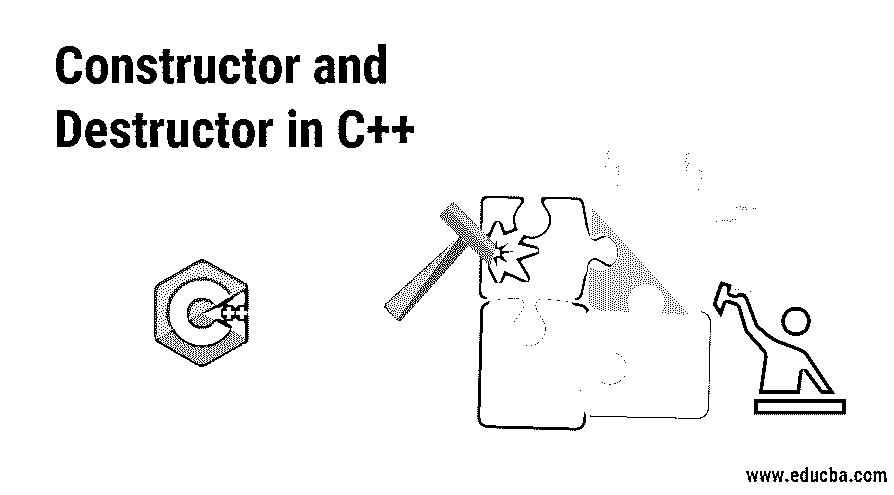

# C++中的构造函数和析构函数

> 原文：<https://www.educba.com/constructor-and-destructor-in-c-plus-plus/>




## C++中构造函数和析构函数的介绍

构造函数和析构函数都是类的成员函数。构造函数是一个函数，它初始化类的对象，并为对象分配内存位置，函数的名字是类名，以创建对象而闻名，当类的实例创建时调用。析构函数也有与类名相同的名字，用倾斜的~符号表示，以破坏构造函数著称，为构造函数创建的释放内存位置。一个类可以有多个构造函数，但只有一个析构函数。

当我们在 C++中创建一个类的对象时，我们可能希望用一些默认值或某些值来初始化类的字段。一个类有它的字段和方法。字段大多是变量或对象。通过为这些字段分配默认值，我们可以简化编程。构造函数就像类中的普通函数，当我们创建一个类的新对象时，编译器会自动调用它。

<small>网页开发、编程语言、软件测试&其他</small>

在创建对象时，我们实际上将所需的值作为参数传递给对象，这些参数被传递给类的构造函数。参数值现在可以分配给相应的字段，这些字段在类中可用。此外，我们可以为不传递参数的字段分配默认值。在 C++ 中，我们初始化[构造函数有不同的类型和方式。](https://www.educba.com/constructor-in-c-plus-plus/)

构造函数就像一个类的特殊成员函数。每当我们创建一个新对象时，构造函数就会被执行。构造函数的语法非常简单，函数将与定义它的类同名，并且它没有任何返回类型，甚至没有 void。构造函数在将特定值赋给类的某些成员时非常有用。构造函数可用于在实例化时执行与类相关的逻辑。

### 构造函数的语法

下面是提到的语法:

```
class Box {
public:
int height;
//constructor
Box () {
// member initialization
}
}
```

C++中的析构函数也是类中一个特殊的成员函数。析构函数由编译器自动调用，并在特定类的对象超出范围时执行，或者使用指向该对象指针的 delete 表达式将其删除。每当编译器销毁对象时，就会调用析构函数。在析构函数中，当对象超出作用域时，我们可以执行任何我们想执行的语句。像关闭连接、关闭文件等后期操作是我们可以在析构函数中执行的一些例子。

### 析构函数的语法

下面是提到的语法:

```
class Box {
public:
int height;
//destructor
~Box () {
// post statements
}
}
```

析构函数的语法与构造函数非常相似。它将与定义它的类同名，并且没有返回类型。然而，它只是在析构函数名称前有一个~(波浪号)符号。通常，析构函数用于为类及其成员释放动态分配的内存。析构函数对于执行 post 操作非常有用，可以在业务逻辑之后执行。

### C++中为什么需要构造函数和析构函数？

C++是一种面向对象的编程语言。在任何面向对象的编程语言中，我们用类和对象来映射原始的真实实体。

让我们通过现实生活中的例子来理解 C++中为什么需要构造函数和析构函数。假设我们有一个实体框，我们为它创建了一个类，它也有可以在其他部分使用的对象。现在这个盒子将会有一些参数，比如高度，长度，宽度等等。每当我们创建一个 class Box 对象时，我们都希望它采用一些默认值。比方说对于 height，这个目标可以通过在那个类的构造函数中给 height 赋一个特定的默认值来实现。类似地，对于其他参数也可以赋值。在使用了 Box 的对象之后，让我们假设我们想要立即执行某个特定的操作或者调用某个函数。这可以通过在 C++中使用析构函数来实现。所需的语句将被添加到该类的析构函数中。这些是 C++中有构造函数和析构函数的实时好处。

### C++中构造函数和析构函数是如何工作的？

如前所述，每当创建对象时，编译器都会调用构造函数。如果我们没有定义构造函数，C++编译器会自动为我们生成一个默认的构造函数。构造函数用于在需要时分配内存并构造类的对象，而析构函数用于在对象被销毁时执行所需的清理。当对象被销毁时，编译器会自动调用析构函数。如果我们没有定义自己的析构函数，[c++编译器](https://www.educba.com/best-c-plus-plus-compiler/)会创建一个默认的析构函数。

#### 在 C++中创建构造函数和析构函数？(示例)

**1。构造器示例**

让我们以 class Box 的同一个例子来声明构造函数。让我们为盒子的高度和重量指定一些默认值。

**代码**

```
class Box {
public:
int height;
int weight;
// constructor
Box () {
// member initialization
height = 10;
weight = 20;
}
}
```

因此，每当这个类的对象被创建时，它将返回 Box 类型的对象，并带有上面定义的默认值。

**2。析构函数示例**

在我们的例子中，每当 Box 的对象超出范围时，我们将在控制台上打印出一些文本。在实际编码中，可以执行任何特定的活动。

**代码**

```
class Box {
public:
int height;
int weight;
// constructor
Box () {
// member initialization
height = 10;
weight = 20;
}
//destructor
~Box () {
// post statements
cout << "Box Object is being deleted." << endl;
}
}
```

因此，只要 Box 的对象超出范围，编译器就会在控制台上打印出上面定义的文本。

### 结论–c++中的构造函数和析构函数

因此，构造函数和析构函数在面向对象编程语言中起着重要的作用。构造函数用于初始化对象，析构函数用于销毁对象。用 C++语言编程时，构造函数和析构函数都非常有用。

### 推荐文章

这是 C++中构造函数和析构函数的指南。这里我们讨论 C++中构造函数和析构函数的需求，如何使用，不同的语法，以及例子。您也可以浏览我们的其他相关文章，了解更多信息-

1.  [复制 C++中的构造函数](https://www.educba.com/copy-constructor-in-c/)
2.  [C 语言中的构造函数](https://www.educba.com/constructor-in-c/)
3.  [c#中的析构函数](https://www.educba.com/destructor-in-c-sharp/)
4.  [PHP 中的析构函数](https://www.educba.com/destructor-in-php/)


