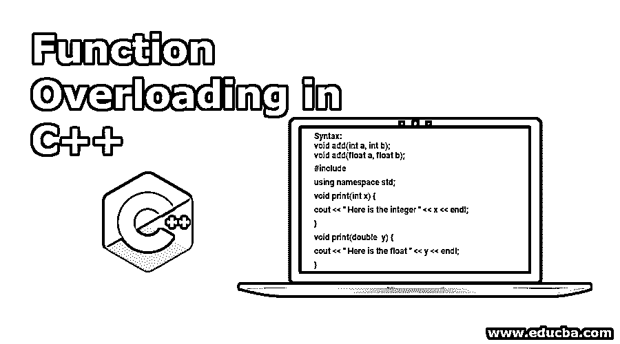
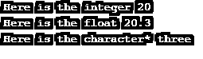

# C++中的函数重载

> 原文：<https://www.educba.com/function-overloading-in-c-plus-plus/>




## C++中的函数重载介绍

C++编程有着惊人的特性，其中最重要的特性之一就是函数重载。它意味着一个代码有不止一个同名但参数列表不同的函数。论点单意味着参数的顺序和参数的数据类型。函数重载用于执行类似的操作。它用于增强代码的可读性。重新定义了函数，因为创建两个不同的函数来反复执行相同的工作是没有意义的。

**语法**

<small>网页开发、编程语言、软件测试&其他</small>

```
void add(int a, int b);
void add(float a, float b);
```

两者功能相同，但参数不同。因此，如果你想用同一个函数对不同的数据类型进行加法运算，那么在 C++编程中可以使用函数重载特性。

下面是演示 C++编程中函数重载的 C++代码:

**代码:**

```
#include <iostream>
using namespace std;
void print(int x) {
cout << " Here is the integer " << x << endl;
}
void print(double  y) {
cout << " Here is the float " << y << endl;
}
void print(char const *v) {
cout << " Here is the character* " << v << endl;
}
int main() {
print(20);
print(20.30);
print("three");
return 0;
}
```




### 霸王的不同方式

在 C++编程语言中有几种重载函数的方法。让我们看看如何做到这一点:

#### 1.函数重载

用于提高编程中代码的可读性。它可以定义为重载两个或两个以上同名但参数不同的函数称为函数重载。

**语法:**

```
DataType  Functionname (parameter list)
{
Function body
}
```

##### 示例#1

以下是通过改变 C++编程中的参数数量来演示[函数重载](https://www.educba.com/function-overloading-in-java/)的 C++代码:

**代码:**

```
#include <iostream>
using namespace std;
class Calculate {
public:
static int addition(int a,int b){
return a + b;
}
static int addition(int a, int b, int c)
{
return a + b + c;
}
};
int main(void) {
//    Declaration class object to call function
Calculate S;
cout<<S.addition(50, 50)<<endl;
cout<<S.addition(25, 26, 27);
return 0;
}
```


##### 实施例 2

下面是通过在 C++编程中使用不同类型的参数来演示函数重载的 C++代码:

**代码:**

```
#include <iostream>
using namespace std;
class Calculate {
public:
int addition(int a,int b){
return a + b;
}
float addition(float a, float b, float c)
{
return a + b + c;
}
};
int main(void) {
//    Declaration class object to call function
Calculate S;
cout<<S.addition(50, 50)<<endl;
cout<<S.addition(25.20, 26.30, 27.60);
return 0;
}
```


#### 2.运算符重载

C++编程语言中有几个内置运算符。编码人员可以使用这些运算符重载或重新定义这些内置运算符。这是一个[编译时多态](https://www.educba.com/what-is-polymorphism/)，其中重载的操作符用于执行用户定义数据类型的任务。在 C++编程语言中，几乎很多运算符都可以重载。

**语法:**

```
ReturnType Classname :: operator OperatorSymbol (parameter list)
{
Function body
}
```

##### 示例#1

下面是演示 C++编程中运算符重载的 C++代码:

**代码:**

```
#include <iostream>
using namespace std;
class Demo
{
private:
int count;
public:
Demo(): count(5){}
void operator ++()
{
count = count+1;
}
void DisplayCount() { cout<<"The Count is : "<<count; }
};
int main()
{
Demo d;
// this calls void operator ++()" function
++d;
d.DisplayCount();
return 0;
}
```


##### 实施例 2

让我们看看函数重载实际上是如何工作的？在通过 C++编码编程的例子中:

**代码:**

```
#include <iostream>
using namespace std;
void show(int);
void show(float);
void show(int, float);
int main() {
int x = 10;
float y = 255.5;
show(x);
show(y);
show(x, y);
return 0;
}
void show(int variable) {
cout << "The Integer number is : " << variable << endl;
}
void show(float variable) {
cout << "The Float number is: " << variable << endl;
}
void show(int variable1, float variable2) {
cout << "The Integer number is: " << variable1;
cout << " And The Float number is:" << variable2;
}
```


**代码解释:**

在上面的代码中，我们创建了一个函数来显示不同数据类型的输出，但是如果您注意到函数名称相同而参数不同。然后我们初始化了一个名为 x 的变量，给它赋了一个值，还有一些值赋给了浮动变量 y。在给 x 和 y 变量赋值后，我们调用所示的函数在输出屏幕上显示输入值。

正如你所看到的，函数名和参数在三种情况下都是不同的。首先，我们调用函数只显示整数变量，然后我们调用函数只显示浮点变量的输出。最后，我们调用了 show 函数，该函数既有整型变量又有浮点型变量，以便在显示屏上将输出显示为输出。

这就是 C++编程语言中函数重载功能的实际工作方式。根据不同的数据类型，可以使用相同的函数来执行一组类似的操作。

##### 实施例 3

下面是演示 C++编程中函数重载的 C++代码:

**代码:**

```
#include <iostream>
using namespace std;
class X
{   int x;
public:
X(){}
X(int j)
{
x=j;
}
void operator+(X);
void display();
};
void X :: operator+(X a)
{
int n = x+a.x;
cout<<"The addition of two objects is : "<<n;
}
int main()
{
X a1(505);
X a2(409);
a1+a2;
return 0;
}
```


**代码解释:**

在上面的代码中，我们创建了一个类 X 并创建了一个整数变量 X，然后声明了两个构造函数，这样我们就不必创建用于调用函数的对象，因为构造函数会在分配内存后自动初始化一个新创建的类对象。创建了两个函数 operator 和 display，以显示在我们的代码中使用函数重载概念添加两个对象。

### 结论

总之，C++中的函数重载特性可以用多种方式来增加代码的可读性。在用 C++语言编程时，它有助于节省内存空间和编译时间。编译时多态性概念也是通过操作符重载概念引入的，其中几乎每个操作符都可以重载。

### 推荐文章

这是 C++中函数重载的指南。这里我们讨论了在 C++中重载函数的各种方法，以及不同的例子和代码实现。您也可以阅读以下文章，了解更多信息——

1.  [c++中的重载和重写](https://www.educba.com/overloading-and-overriding-in-c-plus-plus/)
2.  [Python 中的运算符重载](https://www.educba.com/operator-overloading-in-python/)
3.  [c++中的运算符优先级](https://www.educba.com/operator-precedence-in-c-plus-plus/)
4.  [c++中的嵌套循环](https://www.educba.com/nested-loop-in-c-plus-plus/)


