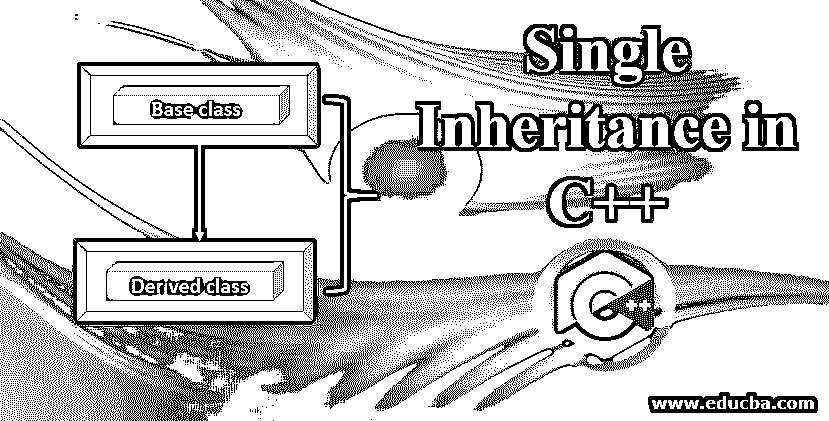
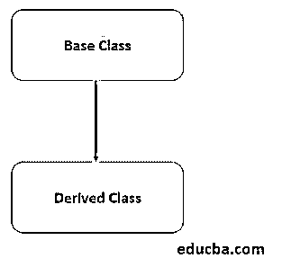
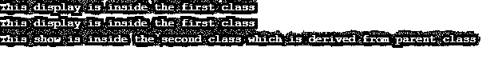
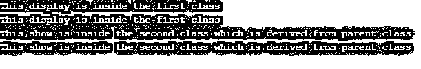

# C++中的单一继承

> 原文：<https://www.educba.com/single-inheritance-in-c-plus-plus/>




## C++中的单一继承简介

单一继承是一种继承类型，其中派生类只继承一个基类。它通过允许派生类使用对象继承基类的功能来提供可重用性。为了可重用性而继承其属性的类被称为父类、超类或基类。从这个基类或超类继承属性的类称为子类或派生类或子类。让我们进一步了解一下 C++中单一继承的概念。




<small>网页开发、编程语言、软件测试&其他</small>

**c++中单一继承的语法:**

所有的属性和方法都可以从基类继承到派生类。

```
class base_class
{
//code
};
class derived_class : public(access_modifier) base_class
{
//code
};
int main()
{
base_class object_1;
derived_class object_2;
//code
}
```

### C++中单一继承的例子

下面让我们来找不同的 C++单一继承的例子:

#### 示例#1

**代码:**

```
#include <iostream>
using namespace std;
class First
{
public :void display()
{
cout<<"This display is inside the first class" << endl;
}
};
class Second: public First
{
public: void show()
{
cout<<"This show is inside the second class which is derived from parent class" << endl;
}
};
int main()
{
First f;
f.display();
//f.show();
Second s;
s.display();
s.show();
}
```

**输出:**




如果我们取消对 f.show()方法的注释，我们将得到下面的错误。


**代码** **解释:**现在，让我们看看代码实际上是如何运行的。我们创建了两个类，即第一类和第二类。我们已经从第一类派生出第二类。我们在基类下有一个函数，在派生类中有另一个函数。在 main 函数中，我们为父类和子类都声明了对象。对于子类对象，我们试图访问基类和派生类方法，这将是绝对成功的。

但是，如果我们试图通过基类对象访问派生类方法或变量，如第二个输出所示，我们会得到错误。很明显，因为基类对象不能访问派生类方法/变量，反之亦然。

#### 实施例 2

现在，我们可以通过在两个类中给出相同的方法来检查输出。代码写在下面。

**代码:**

```
#include <iostream>
using namespace std;
class First
{
public :void display()
{
cout<<"This display is inside the first class" << endl;
}
};
class Second: public First
{
public: void display()
{
cout<<"This show is inside the second class which is derived from parent class" << endl;
}
};
int main()
{
First f;
f.display();
f.display();
Second s;
s.display();
s.display();
}
```

**输出:**




**代码** **解释:**是一样的代码，除了派生类中的方法名现在和基类中的方法名一样。所有的方法都会给出相同的输出。有了重写的概念，类和它们各自的对象将找到它们自己的方法名，并显示同一个类的内容。

### C++中的单继承是如何工作的？

让我们借助下面的例子来看看 C++中单一继承的工作原理。

#### 示例#1

**代码:**

```
#include <iostream>
using namespace std;
class Sum_and_mul
{
public:
int c=10;
public :
void sum_1(int a, int b)
{
int result;
result=a+c;
cout<<" The result for sum of a and c is: "<<result<<endl;
}
void mul_1(int a,int b)
{
int result;
result=a*c;
cout<<" The result for multiplication of a and c is: "<<result<<endl;
}
};
class Mul_and_sum : public Sum_and_mul
{
int d=20;
public:
void sum_2()
{
int result;
result=c+d;
cout<<" The result for sum of c and d is: "<<result<<endl;
}
void mul_2()
{
int result;
result=c*d;
cout<<" The result for multiplication of c and d is: "<<result<<endl;
}
};
int main()
{
int a,b;
cout<<" Enter value for a: ";
cin>>a;
cout<<" Enter value for b: ";
cin>>b;
Sum_and_mul sam;
Mul_and_sum mas;
sam.sum_1(a,b);
sam.mul_1(a,b);
mas.sum_1(a,b);
mas.mul_1(a,b);
mas.sum_2();
mas.mul_2();
}
```

**输出:**


**程序说明:**在上面给出的例子中，

*   我们有两个类，Sum_and_mul 和 Mul_and_sum，分别作为基类和派生类。
*   这两个类有两个方法和一个变量。
*   然后，我们为每个类声明这些变量和方法。
*   我们通过使用“冒号(:)”将基类的属性继承到了派生类
*   这里，可以观察到派生类方法在执行一些数学运算时具有基类的变量。
*   反之亦然，在基类中使用派生类变量是不可能的。如果您想检查错误，请尝试一下。
*   然后我们为每个类创建了我们的对象。
*   使用为派生类创建的对象，我们已经处理了基类和派生类方法，并且我们已经得到了完美的输出。

#### 实施例 2

让我们看看如何在下面的例子中处理基类和派生类之间的方法。

**代码:**

```
#include <iostream>
using namespace std;
class AB
{
int a = 10;
int b = 20;
public:
int sub()
{
int r = b-a;
return r;
}
};
class BA : public AB
{
public:
void show()
{
int s = sub();
cout <<"Subtraction of b and a is : "<<s<< endl;
}
};
int main()
{
BA b;
b.show();
return 0;
}
```

**输出:**


**程序解释:**在上面的例子中，我们已经在基类中完成了代码计算，并使用了派生类方法。这是单继承的正确[用法的简单、基本和恰当的例子。作为练习，尝试在基类和派生类之间使用参数化的方法和变量。](https://www.educba.com/single-inheritance-in-java/)

### 结论

因此，以上面讨论的方式，我们可以在其他类中拥有一个类的属性。我们已经看到了关于用法的基本理解的简单例子。确保访问修饰符在执行继承时也起着重要的作用。使用私有、公共和受保护的变量、方法、类尝试同样的方法，并通过不同的示例检查输出，以便更好地理解。

### 推荐文章

这是一个 C++中单一继承的指南。在这里，我们讨论 C++中单一继承的介绍和工作方式，以及示例和代码实现。您也可以阅读以下文章，了解更多信息——

1.  [c++中的抽象类](https://www.educba.com/abstract-class-in-c-plus-plus/)
2.  [c++中的访问修饰符](https://www.educba.com/access-modifiers-in-c-plus-plus/)
3.  [Python 中的单一继承](https://www.educba.com/single-inheritance-in-python/)
4.  [c++中的继承类型](https://www.educba.com/types-of-inheritance-in-c-plus-plus/)


