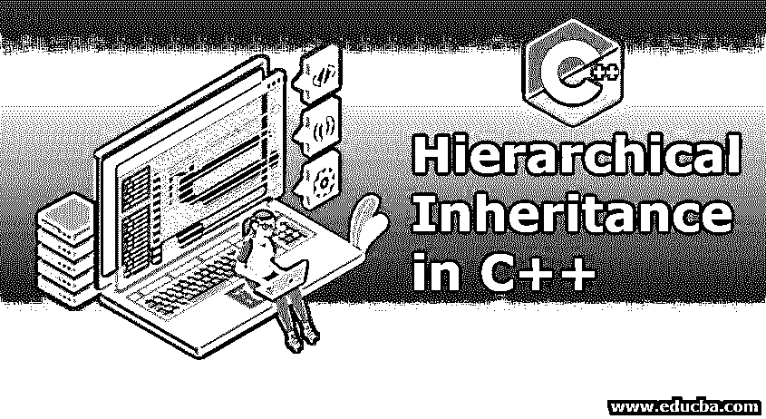
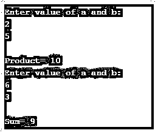
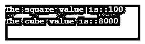

# C++中的层次继承

> 原文：<https://www.educba.com/hierarchical-inheritance-in-c-plus-plus/>




## C++中的层次继承介绍

在现实生活中，继承是将遗产的特征或特性传递或拥有给新的事物的一种方式。在 C++和面向对象概念的技术术语中，它是一种将特性从父类传递到基类、子类或子类的方法。其属性被提取的类，即特征被继承的类，被称为父类或超类。分层继承是一种从单个父类或基类继承多个类的继承。特别是那些在父类中常见的特性在基类中也是常见的。

**语法:**

<small>网页开发、编程语言、软件测试&其他</small>

```
class Parent_classname
{
Common_properties;
methods;
};
class derived_class1:visibility_mode parent_classname
{
Common_properties;
methods;
};
class derived_class2:visibility_mode parent_classname
{
Common_ properties;
methods;
};
.
.
.
.
class derived_classN:visibility_mode parent_classname
{
Common_properties;
methods;
};
```

根据语法，父类中的所有公共特性都被子类提取或继承，子类中的方法也是如此，反之亦然。因此，可以得出结论，n 个子类或基类可以继承父类的属性，反之亦然。此外，不一定只有共同的特征可以被继承。任何其他特征也可以被继承。

现实生活中的例子:

*   编程语言来源于语言。
*   智能电视，LED 电视这些电视剧都是从正常的 youtube 电视机衍生出来的。

### C++中的层次继承是如何工作的？

层次继承是继承的一部分，它有自己的特点，在某种程度上设计成类继承父类和基类的属性，或者子类也继承父类的一些公共属性。当许多类试图从父类获得属性或特性时，层次继承自动成为救世主。

### C++中分层继承的例子

下面给出了 c++中分层继承的例子:

#### 示例#1

**代码:**

```
#include <iostream>
using namespace std;
class X
{
public:
int a, b;
void getdata ()
{
cout << "\nEnter value of a and b:\n"; cin >> a >> b;
}
};
class Y : public X
{
public:
void product()
{
cout << "\nProduct= " << a * b;
}
};
class Z: public X {
public:
void sum()
{
cout << "\nSum= " << a + b;
}
};
int main()
{
Y obj1;
Z obj2;
obj1.getdata();
obj1.product();
obj2.getdata();
obj2.sum();
return 0;
}
```

**输出:**




解释:从上面的程序和输出中，我们可以推断出 C++的层次继承是如何工作的。
类 X 是唯一的基类或父类，它有自己的属性，也有一些与基类和方法相同的属性。因此，基类将超越子类的属性。类 Y 是子类，它将继承父类 X 的属性，类 Z 也将以类似的方式工作。派生类 Y 和 Z 将具有对象创建，该对象创建将继承并保存来自父类(即类 X)的属性。它们各自类的对象将使用定义的方法和变量来表现。输出显示作为输入给出的值的乘积和总和。

#### 实施例 2

**代码:**

```
#include <iostream>
using namespace std;
class Side
{
protected:
int l;
public:
void set_values (int x)
{
l=x;
}
};
class Square: public Side
{
public:
int sq()
{
return (l *l);
}
};
class Cube:public Side
{
public:
int cub()
{
return (l *l*l);
}
};
int main ()
{
Square s;
s.set_values (10);
cout << "The square value is::" << s.sq() << endl;
Cube c;
c.set_values (20);
cout << "The cube value is::" << c.cub () << endl;
return 0;
}
```

**输出:**




**说明:**

在示例 2 中，side 是所有子类或子类所共有的父类，三角形类和立方体类都将 side 作为其属性，其中三角形的方法使用 sides 来计算长度，立方体的情况也是如此，side 用于在子类的帮助下计算立方体的值，该子类的 side 来自父类。

#### 实施例 3

**代码:**

```
#include <iostream>
using namespace std;
class Sprts
{
public:
Sprts ()
{
cout << "This is a Sport" << endl;
}
};
class football: public Sprts
{
};
class cricket: public Sprts
{
};
int main ()
{
football obj1;
cricket obj2;
return 0;
}
```

**输出:**


**说明:**

在本例中，首先创建一个子类，然后创建另一个子类，同时在主类中传递构造函数，主类将调用属性并将其传递给基类的构造函数。

### 结论

与其他继承属性不同，层次继承具有在基类和父类之间处理和共享属性的能力，这些属性可以是公共属性，也可以是不常见的属性，这取决于继承所需的功能。

### 推荐文章

这是一个 C++中层次继承的指南。这里我们讨论一下入门，C++中的层次继承是如何工作的？.您也可以看看以下文章，了解更多信息–

1.  [什么是 Java 继承？](https://www.educba.com/what-is-java-inheritance/)
2.  [c#中的继承](https://www.educba.com/inheritance-in-csharp/)
3.  [c++中的继承类型](https://www.educba.com/types-of-inheritance-in-c-plus-plus/)
4.  [c++中的类型转换](https://www.educba.com/type-casting-in-c-plus-plus/)


