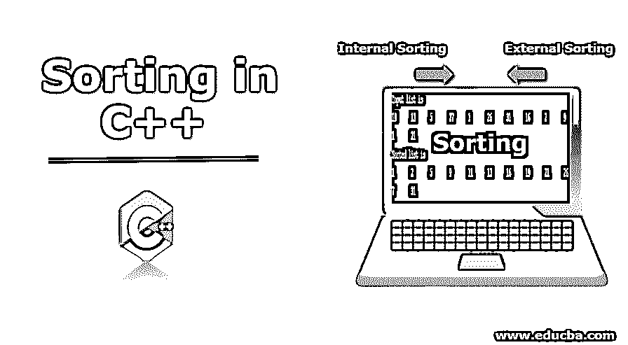
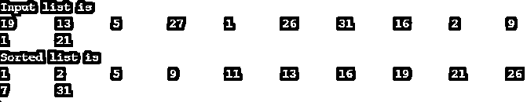

# C++中的排序

> 原文：<https://www.educba.com/sorting-in-c-plus-plus/>




## C++中排序的介绍

对元素集合进行排序有助于根据排序关系排列记录中的元素。考虑包含大量信息的文件记录。要从记录中访问列表，必须有一个关键字段指向元素的当前位置。例如，考虑数据库中的名称列表；可以按字母顺序排序。分类在计算机和技术领域发挥了重要作用。让我们在这篇文章中看到更多。

### C++中的排序是什么？

排序是程序员或研究人员用来对所需输入进行排序的基本概念。复杂度的顺序由 0(N*log(N))给出。对输入进行排序可以更容易地解决许多问题，如搜索、最大和最小元素。虽然排序是按顺序排列数据，但该过程的效率非常重要，这基于两个标准:–对给定数据执行排序所需的时间和内存。时间是通过计算使用的键的比较来测量的。有许多算法可用于排序。

<small>网页开发、编程语言、软件测试&其他</small>

通常，C++中的排序分为两种类型:

1.  内部排序
2.  外部排序

### 语法和示例

**语法:**

C++的算法使用 sort()内置函数对容器进行排序，如向量、数组。

```
Sort(array , array +size);
```

**例子:**

```
#include<iostream>
using namespace std;
int main ()
{
int ins[12] = { 19,13,5,27,1,26,31,16,2,9,11,21};
cout<<"\nInput list is \n";
for(int i=0;i<12;i++)
{
cout <<ins[i]<<"\t";
}
for(int k=1; k<12; k++)
{
int t = ins[k];
int j= k-1;
while(j>=0 && t <= ins[j])
{
ins[j+1] = ins[j];
j = j-1;
}
ins[j+1] = t;
}
cout<<"\nSorted list is \n";
for(int i=0;i<12;i++)
{
cout <<ins[i]<<"\t";
}
}
```

**输出:**




### C++中排序是如何工作的？

首先，我们将采用快速排序，它被认为是各种排序类型中的一种重要方法。数组的基本排序采用快速排序方法。有不同的方法来实现排序，这些技术的目的都是一样的，比较两个[元素并用临时变量交换](https://www.educba.com/swapping-in-c-plus-plus/)。在本文中，我们将讨论用于实现的最重要的排序。以下是:

1.  [冒泡排序](https://www.educba.com/bubble-sort-in-data-structure/)
2.  [插入排序](https://www.educba.com/insertion-sort-in-javascript/)
3.  [快速排序](https://www.educba.com/quick-sort-in-data-structure/)
4.  [选择排序](https://www.educba.com/selection-sort-in-data-structure/)

有归并排序、基数排序、磁带排序，我们可能在后面讨论。首先，我们将使用冒泡排序。

#### 1.冒泡排序

[冒泡排序是最简单的](https://www.educba.com/bubble-sort-algorithm/)排序方法之一，我们可以用它来进行应用。在这种技术中，通过要排序的记录进行连续的交换。在每一步，它都将密钥与数据进行比较，如果不符合所需的顺序，就交换元素。在交换之后，当只有一个元素被放置在排序的位置时，对相邻的元素进行排序。

**举例:**让我们考虑一个未排序的数组 A[]={ 6，2，4，7，1}

| Six | Two | Four | Seven | One |
| A[0] | A[1] | 一个 | 答[3] | 答[4] |

**步骤 1:** 比较 A [0] > A [1]，如果条件为真，交换元素(6 > 2)为真，将 2 放入 A [0]中。类似地，所有的步骤都是一样的，直到数组被排序。

现在数组是[] = {2，6，4，7，1}

**第二步:** 6 与 4 比较。因为 6 大于 4。因此，6 和 4 被交换了。

现在数组是[] = {2，4，6，7，1}

**第三步:**将元素 6 与 7 进行比较。因为 6 < 2 和元素是升序排列的，所以元素不会被交换。

排序后的数组是[] ={2，4，6，7，1}。

继续这个过程，直到数组排序完毕。

#### 2.插入排序

在这种技术中，我们从第二个数据元素开始，假设第一个元素已经排序，然后对第二个元素进行比较，并对另一个后续元素继续这一步骤。需要在 N 个元素的数组中有 N-1 次传递才能得到排序后的元素。

考虑一个数组 A[] = { 8，3，6，1}

| Eight | Three | Six | One |

**步骤 1:** 第一个元素寻找数组中最大的元素进行交换。如果它更大，它保持不变，并移动到第二个元素；这里，8 大于所有，不进行交换。

| Eight | Three | Six | One |

**步骤 2:** 与第二个元素交换

| Three | Eight | Six | One |

**第三步:**与第三个元素交换

| Three | Six | Eight | One |

**第四步:**与第四个元素交换

| One | Three | Six | Eight |

#### 3.快速排序

这种技术遵循分治算法，被认为对于大型数组非常有效和快速。它们被分成三个部分:左边、右边和中间。中间的元素只有一个值，它被命名为 pivot。其机制是这样的，左边部分的元素不应该有比中间元素更大的键，而右边的 no 元素的键应该比中间元素的键小。现在让我们从排序过程的一个例子开始。快速排序在对子零件进行排序时使用了递归概念。阵列被分成子部分，同样通过征服来划分左右段。在这个例子中，考虑到最后一个元素有一个支点，第一个元素被假定为低。考虑一个数组元素

|  49 | Twenty-two | Eleven | Sixteen | Fifty-six | Thirty |

取最右边的元素，枢轴元素= 30°

| Sixteen | Twenty-two | Eleven | Thirty | Fifty-six | Forty-nine |

大于枢轴的元素放置在左侧，较小的在右侧。

| Sixteen | Twenty-two | Eleven |  | Fifty-six | Forty-nine |

指针放置在枢轴上，并围绕枢轴进行分区。

| Eleven | Twenty-two | Sixteen |  | Fifty-six | Forty-nine |

子部分被单独排序。

| Eleven | Sixteen | Twenty-two |  30 | Forty-nine | Fifty-six |

最后，我们得到了一个排序后的数组。

#### 4.选择排序

这种技术也被称为交换[排序，执行](https://www.educba.com/sorting-in-python/)双重操作搜索[和排序](https://www.educba.com/sorting-in-c-sharp/)。实现采用如下定义的直接选择排序。这里需要标识数组中存在的最小元素，这个元素排序在第 I 个位置；接下来，识别第二小的元素，并将其排序在第二个位置。当未排序的子部分变空时，选择排序退出循环。时间复杂度给定为 O(n <sup>2</sup> )。

**考虑以下数组:**

| Sixty-three | Twenty-six | Thirteen | Twenty-three | Twelve |

1.找到最小的元素，并把它放在开始，它与位置交换。

| Twelve | Twenty-six | Thirteen | Twenty-three | Sixty-three |

2.将第二个元素 a [1]与最小元素进行比较，并将其放在第二个位置；同样，传球继续。

| Twelve | Thirteen | Twenty-six | Twenty-three | Sixty-four |

最终排序输出

| Twelve | Thirteen | Twenty-three | Twenty-six | Sixty-four |

### 结论

总之，本文主要关注排序概念及其工作机制。所有这些排序技术都使用并行处理概念。排序形成了结构化算法中的核心构建块，通过根据要求对值集进行排序来解决现实世界中的数据问题。

### 推荐文章

这是一个 C++排序指南。在这里，我们讨论介绍和语法，并举例说明它是如何工作的。您也可以浏览我们推荐的其他文章，了解更多信息——

1.  [在 Tableau 中排序](https://www.educba.com/sorting-in-tableau/)
2.  [c++中的迭代器](https://www.educba.com/iterator-in-c-plus-plus/)
3.  [C 语言中的数组函数](https://www.educba.com/array-functions-in-c/)
4.  [C 中的堆排序](https://www.educba.com/heap-sort-in-c/)
5.  [PHP 中排序是如何进行的？](https://www.educba.com/sorting-in-php/)
6.  [Python 中的堆排序](https://www.educba.com/heap-sort-in-python/)
7.  [Java 中的迭代器](https://www.educba.com/iterator-in-java/)
8.  [c++的 11 大特性和优势](https://www.educba.com/features-of-c-plus-plus/)
9.  [Python 中的迭代器| Python 的好处和例子](https://www.educba.com/iterators-in-python/)
10.  数据结构中的插入排序|如何工作？


