# C++中的堆排序

> 原文：<https://www.educba.com/heap-sort-in-c-plus-plus/>

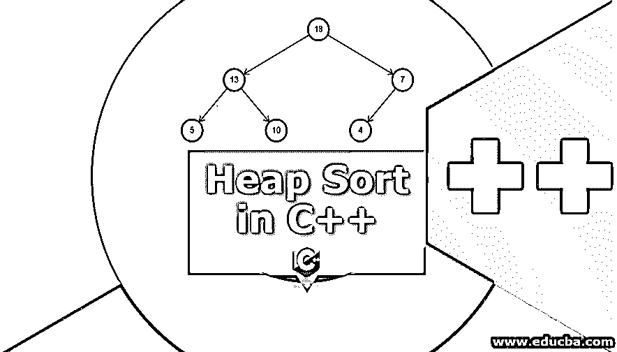


## C++中堆排序的介绍

堆排序是一种基于比较的排序技术，是选择排序的一部分。堆排序技术使用基于二进制堆数据结构的比较机制。在这种技术中，首先，选择一个最大值元素，并将该最大值元素放在末尾。对其余元素重复相同的过程。在排序中涉及到许多不同的技术，每种技术在对给定数据进行排序所花费的时间和对存储器空间的要求方面都有各自的效率。分别是冒泡排序、[插入排序](https://www.educba.com/insertion-sort-in-javascript/)、选择排序、快速排序、合并排序和堆排序。

### 什么是堆排序？

Heapsort 是一种基于二进制堆数据结构的排序方法，类似于选择排序，其中我们首先获得数据集的最大部分，并将其放在末尾，然后继续处理其余的元素。

<small>网页开发、编程语言、软件测试&其他</small>

顾名思义，堆排序。它首先从给定的未排序数组构建数据元素堆，然后检查最大的项并将其放在部分排序数组的末尾。它再次重建堆，搜索下一条最大的记录，并将其放在从记录的半排序排列的末尾开始的下一个空槽中。重复这个过程，直到堆中没有剩余的项目。这种技术需要两个数组，一个用于存储堆，另一个用于存储排序后的数组。

### C++中的堆排序算法

*   首先从给定的元素信息集中选择根元素作为提升元素来创建最大堆。
*   通过放置根元素或与最后一个元素交换根元素来重建堆。
*   堆大小现在将缩小 1。
*   然后，我们再次使用剩余的元素来创建堆，直到堆的大小减少到 1。

### C++中堆排序的例子

这种技术使用二进制堆，该二进制堆使用完整的二叉树来构造，其中根节点大于它的两个子节点。

考虑给定的数据集数组。

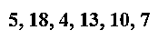


让我们按照算法走。它说选择最高的元素作为根，构造最大的堆。

#### 1.第一次迭代

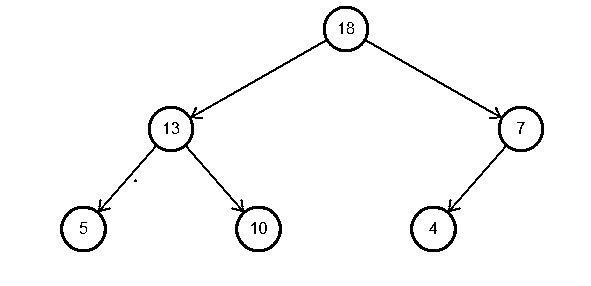


现在，该数组将采用以下形式:

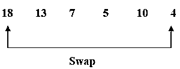


现在，排序后的数组将具有以下形式:

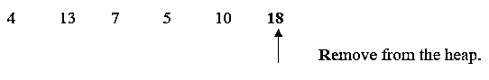


堆大小将减少 1，现在是 6-1 = 5。

#### 2.第二次迭代

所以现在堆看起来像:

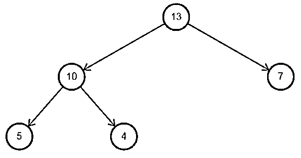


该数组的形式如下:

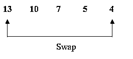


排序后的数组将是:

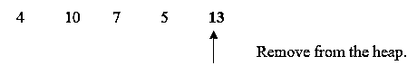


堆大小将减少 1，现在是 5-1 = 4。

#### 3.第三次迭代

新堆看起来像:

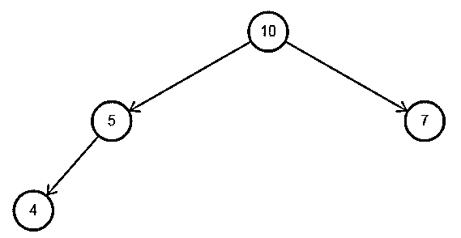


该数组的形式如下:

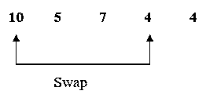


排序后的数组将是:

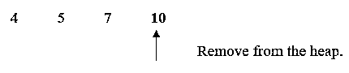


堆大小将减少 1，现在是 4-1 = 3。

#### 4.第四次迭代

新堆看起来像:

**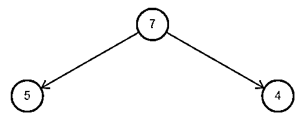

** 

该数组的形式如下:

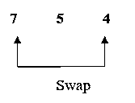


排序后的数组将是:

**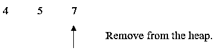

** 
堆大小会减少 1，现在 3-1 = 2。

#### 5.第五次迭代

新堆看起来像:

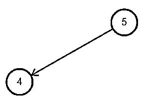


该数组的形式如下:

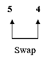


排序后的数组将是:

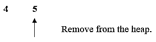


堆大小将减少 1，现在是 2-1 = 1。

#### 6.最后一次迭代

新堆看起来像:

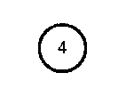


该阵列具有:

**4**

根据算法，我们已经执行了所有步骤，直到堆大小为 1。现在我们有了排序后的数组:

**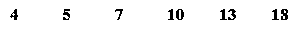

** 
因此最大堆的排序数组是升序的。如果我们需要数组按降序排序，那么就按照上面的步骤使用最小堆。

堆排序的 C++程序如下所示:

```
#include <iostream>
using namespace std;
void heapify(int arr[], int n, int i)
{
int largest = i;
int l = 2 * i + 1;
int r = 2 * i + 2;
if (l < n && arr[l] > arr[largest])
largest = l;
if (r < n && arr[r] > arr[largest])
largest = r;
if (largest != i) {
swap(arr[i], arr[largest]);
heapify(arr, n, largest);
}
}
void heapSort(int arr[], int n)
{
for (int i = n / 2 - 1; i >= 0; i--)
heapify(arr, n, i);
for (int i = n - 1; i >= 0; i--)
{
swap(arr[0], arr[i]);
heapify(arr, i, 0);
}
}
void printArray(int arr[], int n)
{
for (int i = 0; i < n; ++i)
cout << arr[i] << " ";
cout << "\n";
}
int main()
{
int arr[] = { 5,18,4,13,10,7};
int n = sizeof(arr) / sizeof(arr[0]);
heapSort(arr, n);
cout << "Sorted array is \n";
printArray(arr, n);
}
```

**输出:**

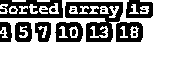


### 结论

堆排序是基于比较的技术，是选择排序的增强。[堆排序利用](https://www.educba.com/heap-sort-in-python/)选择给定数组中最高或最低的元素，分别对最大或最小的堆进行升序或降序排序。执行这个过程，直到我们得到一个堆大小。这种排序技术也用于查找数组中最大和最小的元素。堆排序技术比选择排序技术更高效、更快。

### 推荐文章

这是一个 C++中堆排序的指南。这里我们讨论什么是 c++中的堆排序，以及它的算法和例子。你也可以看看下面的文章来了解更多-

1.  [C 中的堆排序](https://www.educba.com/heap-sort-in-c/)
2.  [Java 中的堆排序](https://www.educba.com/heap-sort-in-java/)
3.  [c++中的重载](https://www.educba.com/overloading-in-c-plus-plus/)
4.  [c++中的指针](https://www.educba.com/pointers-in-c-plus-plus/)


