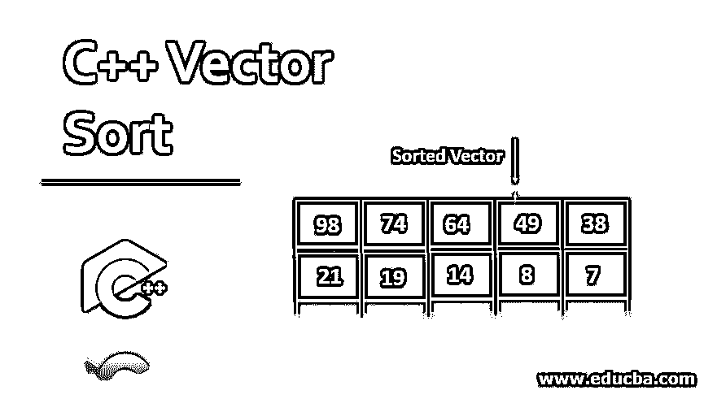
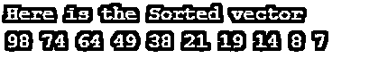
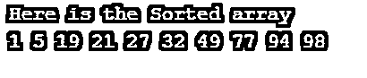
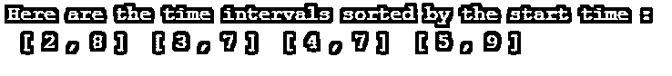

# C++向量排序

> 原文：<https://www.educba.com/c-plus-plus-vector-sort/>




## C++向量排序简介

C++编程语言中的向量被用作有序容器，帮助表示可以根据输入或需求动态改变大小的数组。在一般需求中，我们必须以顺序形式存储数据信息，这就是为什么我们使用数组来存储它们，但数组本质上是静态的，因此，它们的大小是固定的。因此，为了将数据存储在这样一个可以根据需求自动改变大小的容器中，C++引入了向量。向量数组本质上是动态的。

**语法:**

<small>网页开发、编程语言、软件测试&其他</small>

```
vector < data_type > variable_name;
```

在上面的语法中，vector 是在声明 vector 之前必须使用的强制关键字，data_type 是要存储的数据类型，可以是 int、float 等，variable_name 是要定义的变量的名称。要在编程中使用 vector，你必须在你的代码中包含 vector 库，这样你才能使用它的所有功能。

您可以通过使用下面的代码来做到这一点。

```
#include <vector>
int main ()
{
std :: vector < int > vector_user ;
}
```

### 向量排序在 C++编程中是如何工作的？

在 C++编程中，为了进行任何类型的向量排序，需要使用不同的向量迭代器。在 C++中，通常有 8 种类型的迭代器可以用来实现排序。下面提到了它们:

| **迭代器** | **功能** |
| 开始 | 它会将迭代器返回到数组的开头。 |
| cbegin | 它会将常量迭代器返回到开头。 |
| rbegin | 它将返回一个反向迭代器到数组的反向开始处。 |
| crbegin | 它会将常量反向迭代器返回到数组的反向开头。 |
| 结束 | 它会将迭代器返回到数组的末尾。 |
| Cend | 它将常量迭代器返回到数组的末尾。 |
| 分裂 | 它会将反向迭代器返回到数组的反向末端。 |
| 克伦德 | 它会将常量反向迭代器返回到数组的反向末端。 |

### C++向量排序的例子

让我们看看例子，理解在 C++中如何使用向量数组进行排序。

#### 示例#1

演示向量降序排序的 C++代码。

**代码:**

```
#include <bits/stdc++.h>
using namespace std;
int main()
{
vector < int > v { 21, 74, 98, 64, 14, 8, 7, 38,19, 49 };
sort (v.begin (), v.end (), greater < int > () );
cout << " Here is the Sorted vector \n " ;
for ( auto i : v )
cout << i << " ";
return 0;
}
```

**输出:**




在上面的代码中，你可以看到我们在整数数据类型上声明了一个向量数组，并在给定的向量中存储了一些值。此外，我们使用排序函数，通过在排序函数中使用 begin 和 end 迭代器，对向量数组进行降序排序。结果，你可以看到给定的向量数组被正确地按降序排列。

#### 实施例 2

C++代码，演示了递增顺序的向量排序。

**代码:**

```
#include <bits/stdc++.h>
using namespace std;
int main()
{
vector < int > v { 21, 98, 77, 5, 19, 49, 32, 1, 27, 94 } ;
sort (v.begin () , v.end () ) ;
cout << " Here is the Sorted array \n " ;
for ( auto i : v )
cout << i << " " ;
return 0;
}
```

**输出:**




在上面的代码中，你可以看到我们在整数数据类型上声明了一个向量数组，并在给定的向量中存储了一些值。此外，我们使用排序函数，通过在排序函数中使用 begin 和 end 迭代器，对向量数组进行升序排序。结果，你可以看到给定的向量数组被正确地按升序排序。For 循环用于遍历所有给定值。

#### 实施例 3

C++代码，演示根据开始和结束时间进行向量排序。

**代码:**

```
#include <bits/stdc++.h>
using namespace std ;
// Every interval has a start and end time.
struct TimeInterval {
int start , end ;
} ;
// Comparing 2 time intervals according to their starting times.
bool intervalCompare ( TimeInterval x1, TimeInterval x2 )
{
return ( x1.start < x2.start ) ;
}
int main ()
{
vector < TimeInterval > v { { 5, 9 }, { 2, 8 }, { 3, 7 }, { 4, 7 } } ;
// sort the intervals in increasing order of
// start time
sort ( v.begin () , v.end () , intervalCompare ) ;
cout << " Here are the time intervals sorted by the start time : \n " ;
for ( auto i : v )
cout << " [ " << i.start << " , " << i.end << " ] " ;
return 0 ;
}
```

**输出:**




在上面的代码中，您可以看到我们声明了一个时间间隔的向量数组，其中定义了 4 组值，以及它们的开始和结束时间间隔。此外，我们使用排序函数，通过在排序函数中使用 begin 和 end 迭代器，以特定的顺序对向量数组进行排序。结果，你可以看到给定的向量数组是正确排序的。如您所见，我们还使用了一个比较间隔函数，我们必须将所有 4 个时隙的值相互比较。For 循环用于遍历向量数组中的所有给定值。

### 结论

C++编程语言中的向量排序是使用最多的动态数组之一。因为它节省了大量的处理时间，并且是动态的，所以用户不必手动改变他们之前创建的数组的大小。

### 推荐文章

这是一个 C++矢量排序的指南。这里我们讨论 C++编程中向量排序的介绍和工作原理，以及不同的例子和代码实现。您也可以看看以下文章，了解更多信息–

1.  [R 中的向量](https://www.educba.com/vectors-in-r/)
2.  [在 C++中排序](https://www.educba.com/sorting-in-c-plus-plus/)
3.  [C++向量 vs 数组](https://www.educba.com/c-plus-plus-vector-vs-array/)
4.  [C++标识符](https://www.educba.com/c-identifiers-plus-plus/)


