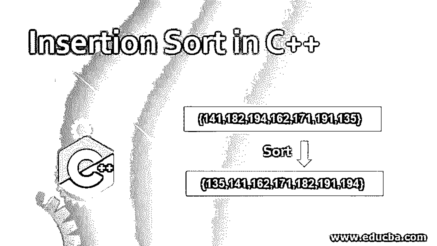
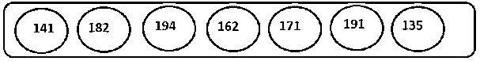
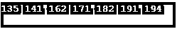
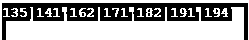
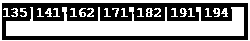

# C++中的插入排序

> 原文：<https://www.educba.com/insertion-sort-in-c-plus-plus/>




## C++中插入排序的介绍

插入排序是一种排序算法，其中使用子列表对元素进行排序，例如，数组的较低部分总是被排序。当我们向前移动时，下一个元素需要在排序的子列表中寻找它的正确位置，以插入到列表中，这就是所谓的插入排序。这是一种就地排序算法，因为它不使用太多的额外空间来对元素进行排序。由于所有元素都与列表中的其他元素进行比较，因此其复杂度为 O(n2)，其中 n 是列表中元素的数量。

### C++中插入排序背后的逻辑

插入排序背后的思想是从输入数组中选择一个元素，并把它放在正确的位置，这样元素的子数组出现在该元素被排序之前。

<small>网页开发、编程语言、软件测试&其他</small>

排序后的子数组随着每次迭代逐渐增长，其中当前元素与排序后的子数组中出现在该元素之前的最大元素进行比较。如果新元素大于该位置左侧的元素，则通过与排序数组中的下一个较大值进行比较来找到该元素的正确位置，并且在该位置左侧的所有元素小于该位置并且右侧的元素大于该位置的位置处插入元素

### 算法

让我们用伪代码来理解这个过程是如何工作的

```
InsertionSort(A,n)
1\. For i in range(0,n): Repeat Steps 2 and 3
2\. If i=0: return 1
Else for j in range(0,i) :compare A[i] and A[j]
Shift the elements greater than A[i] towards right.
3\. Insert the value at the right position.
```

由于使用插入排序的排序需要顺序搜索数组，然后将新项插入到排序后的子数组中，因此在平均和最坏的情况下，算法的复杂度为 O(n2)。因此，上述算法不适用于大量元素。

### 如何用各种方法在 C++中实现插入排序？

现在让我们实现插入排序，对 C++中身高(cms)不同的学生进行排序:




#### 示例 1–使用循环实现

**代码:**

```
#include <bits/stdc++.h>
using namespace std;
void iSort(int myarr[], int nElements)
{
int x, key, y;
for (x = 1; x < nElements; x++)
{
key = myarr[x];
y = x - 1;
while (y >= 0 && myarr[y] > key)
{
myarr[y + 1] = myarr[y];
y = y - 1;
}
myarr[y + 1] = key;
}
}
void printArray(int myarr[], int n)
{
int i;
for (i = 0; i < n; i++)
cout << myarr[i] << " ";
cout << endl;
}
int main()
{
int myarr[] = { 141,182,194,162,171,191,135};
int n = sizeof(myarr) / sizeof(myarr[0]);
iSort(myarr, n);
printArray(myarr, n);
return 0;
}
```

**解释**

myarr 是保存列表中元素的数组，sizeOf 是 C++的内置方法，用于查找元素使用的内存量。因此，数组使用的内存/一个元素使用的内存给出了数组保存的元素数量。这里，printArray 方法用于打印数组的所有元素，iSort 方法用于对作为参数传递的元素数组以及要排序的元素数量进行排序。这里，key 变量用于存储需要放置在正确位置的当前元素。

**输出**




#### 示例 2-使用标准模板库(STL)

**代码:**

```
#include <bits/stdc++.h>
void iSort(std::vector<int> &myvec)
{
for (auto it = myvec.begin(); it != myvec.end(); it++)
{
auto const insertion_point =
std::upper_bound(myvec.begin(), it, *it);
std::rotate(insertion_point, it, it+1);
}
}
void print(std::vector<int> myvec)
{
for( int i : myvec)
std::cout << i << " ";
std::cout << '\n';
}
int main()
{
std::vector<int> myarr = {141,182,194,162,171,191,135};
iSort(myarr);
print(myarr);
}
```

**输出**

#### 


#### 示例 3:使用递归实现插入排序

idea——这个实现背后的思想是，我们在每次运行中保留已处理的元素，这样我们就可以使用递归来处理它们。

1.基本条件-数组大小< =1 时返回

2.递归排序 n-1 个元素的子数组。

3.在正确的位置插入下一个元素，以保持排序顺序。

**代码:**

```
#include <iostream>
using namespace std;
void iSort(int arr[], int n)
{ if (n <= 1)
iSort( arr, n-1 );
int end = arr[n-1];
int j = n-2;
while (j >= 0 && arr[j] > end)
{
arr[j+1] = arr[j];
j--;
}
arr[j+1] = end;
}
void printArray(int myarr[], int num)
{
for (int i=0; i < num; i++)
cout << myarr[i] <<" ";
}
int main()
{
int myarr[] = {141,182,194,162,171,191,135};
int n = sizeof(myarr)/sizeof(myarr[0]);
iSort(myarr,n);
printArray(myarr,n);
}
```

**输出**




### 结论

插入排序是一种排序类型，其中元素被逐渐插入到排序元素的增长列表中，并按照降序与列表中的元素进行比较，以将新元素放在正确的位置。该算法在最坏和平均情况下以 O(n2)的时间复杂度运行，因此适用于较小元素集的情况。

### 推荐文章

这是一个 C++中插入排序的指南。在这里，我们讨论介绍以及不同的例子和它的代码实现。您也可以看看以下文章，了解更多信息–

1.  [C++结构构造函数](https://www.educba.com/c-pluse-pluse-struct-constructor/)
2.  [c++中的递归](https://www.educba.com/recursion-in-c-plus-plus/)
3.  [Python 排序列表](https://www.educba.com/python-sort-list/)
4.  [Python 中的快速排序](https://www.educba.com/quick-sort-in-python/)


