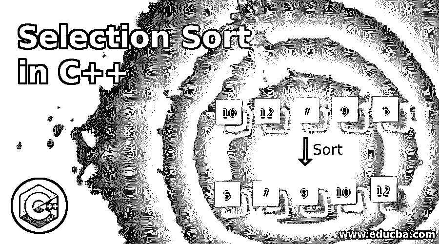
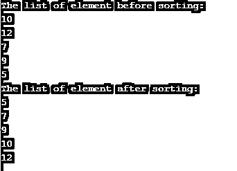

# C++中的选择排序

> 原文：<https://www.educba.com/selection-sort-in-c-plus-plus/>




## C++中选择排序的介绍

选择排序是一种排序算法，用于对 n 个元素的数组进行排序。在选择排序中，每一遍都会找到最小的元素，并将其插入到数组中的正确位置。一种算法在两个子阵列上工作。存储已排序元素第一子阵列和存储未排序元素的第二子阵列。在每一轮选择中，sort 从未排序的数组中找到最小的元素，并将其放入排序的数组中。在 simple 中，第一遍查找最小的元素并将其放在第一个位置。在第二次传递中，它找到第二小的元素并将其放在第二个位置，依此类推。重复该过程，直到一个数组的所有元素都被排序。

### 选择排序逻辑

让我们取一个数组 L，它有 n 个元素，要用选择排序来排序。因此选择排序算法在下面的过程中处理。

<small>网页开发、编程语言、软件测试&其他</small>

*   **I Pass:** 用它的索引找到一个数组中最小的元素。然后用 L[index]交换 L[0]。这一步的结果是，我们有 L[0]个已排序的子数组，n-1 个元素是未排序的子数组。

*   **II 遍:**用索引找到未排序子数组中最小的元素。然后用 L[index]交换 L[1]。这一步的结果是，我们有 L[0]和 L[1]个排序的子数组，n-1 个元素是未排序的子数组，依此类推。

*   类似地，它执行 n-1 遍，并且在 n-1 遍中，找到未排序子数组中的最小元素及其索引。然后用 L[index]交换 L[n-1]。这一步的结果是，我们将 L[0]到 L[n-1]作为已排序的子数组进行排序，并且没有更多的元素需要排序。

让我们通过一个例子来看看上面的过程是如何工作的，所以让我们以一个包含 5 个元素的数组为例，L = [ 6，2，5，3，9 ]，这些元素将使用选择排序进行排序，如下所示:

*   I Pass: [ 6，2，5，3，9 ]–>[2，6，5，3，9]，算法从找到 L[0]到 L[4]中第一个最小的数开始，并将其放在 L[0]处。
*   II Pass: [ 2，6，5，3，9 ]–>[2，3，5，6，9]，找出 L[1]到 L[4]范围内最小的数，放在 L[1]。
*   III Pass: [ 2，3，5，6，9 ]–>[2，3，5，6，9]，找出 L[2]到 L[4]范围内最小的数，放在 L[2]。
*   IV Pass: [ 2，3，5，6，9 ]–>[2，3，5，6，9]，找出 L[3]到 L[4]范围内的最小数字，并将其放在 L[3]处。

现在，在所有 n-1 次传递之后，对数组进行排序。

### 选择排序算法

假设 L 是一个有 n 个元素的数组。所以选择排序算法对给定的 L 数组进行排序的算法是:

**算法:**

```
begin Selection_Sort (L, N)
for i = 1 to N-1
call small (L, i, N, index)
swap L[i] with L[index]
end for
return L
end Selection_Sort
begin small (L, i, N, index)
initialize small = L[i]
initialize index = i
for J = i+1 to N -1
if small > L[j]
small = L[j]
index = j
end if
end for
return index
end small
```

**选择排序技术的复杂性:**

*   **最佳运行时间:**ω(n)
*   **平均案例运行时间复杂度:** θ( n2)
*   **最坏情况运行时间复杂度:** o( n2)
*   **空间复杂度:** o( 1)

### 在 C++中实现选择排序的例子

接下来，我们编写 c++代码，通过下面的例子更清楚地理解选择排序技术，在这个例子中，我们在 for 循环中使用选择排序技术应用于数组元素。

#### 示例#1

**代码:**

```
#include<iostream>
using namespace std;
int small(int L[], int n, int i);
int main ()
{
int i, j, k, index, t;
int L[10] = { 10, 12, 7, 9, 5 };
cout << "The list of element before sorting:" <<endl;
for(i = 0; i < 5; i++)
{
cout<<L[i]<<endl;
}
for( i = 0;i < 5; i++)
{
index = small(L, 5, i);
t = L[i];
L[i] = L[index];
L[index] = t;
}
cout << "The list of element after sorting:" <<endl;
for(i = 0; i < 5; i++)
{
cout<<L[i]<<endl;
}
return 0;
}
int small(int L[], int n, int i)
{
int s, index, j;
s = L[i];
index = i;
for( j = i+1; j < 5; j++)
{
if(L[j] < s )
{
s = L[j];
index = j;
}
}
return index;
}
```

**输出:**




接下来，我们编写 c++代码，并在函数中编写冒泡排序技术，我们将调用它并传递一个数组。

#### 实施例 2

**代码:**

```
#include<iostream>
using namespace std;
void disp( int *L )
{
int i;
for(i = 0; i < 5; i++)
{
cout<<L[i]<<endl;
}
}
int small(int L[], int n, int i);
void Selection_Sort(int *L, int N )
{
int t, i, index;
for( i = 0;i < N; i++)
{
index = small(L, N, i);
t = L[i];
L[i] = L[index];
L[index] = t;
}
}
int main ()
{
int i, j, N=5;
int L[10] = { 10, 12, 7, 9, 5 };
cout << "The list of element before sorting:" <<endl;
disp(L);
Selection_Sort( L, N );
cout << "The list of element after sorting:" <<endl;
disp(L);
return 0;
}
int small(int L[], int n, int i)
{
int s, index, j;
s = L[i];
index = i;
for( j = i+1; j < 5; j++)
{
if(L[j] < s )
{
s = L[j];
index = j;
}
}
return index;
}
```

**输出:**


### 结论

在选择排序算法中，每一遍都会找到最小的元素，并将其插入到数组中的正确位置。具有 n 个元素的数组需要(n-1)遍来对它们进行排序。选择排序算法的复杂度为 O( *n* 2)。

### 推荐文章

这是一个 C++中选择排序的指南。在这里，我们讨论 C++中选择排序的介绍及其示例，以及代码实现和输出。您也可以浏览我们推荐的文章，了解更多信息——

1.  [Python 排序列表](https://www.educba.com/python-sort-list/)
2.  [Python 排序数组](https://www.educba.com/python-sort-array/)
3.  [c#中的冒泡排序](https://www.educba.com/bubble-sort-in-c-sharp/)
4.  [在 C++中插入排序](https://www.educba.com/insertion-sort-in-c-plus-plus/)


