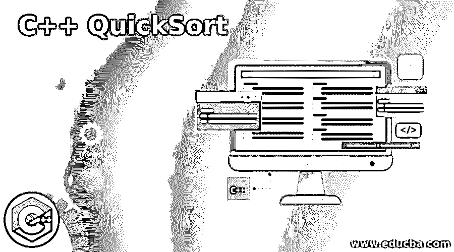
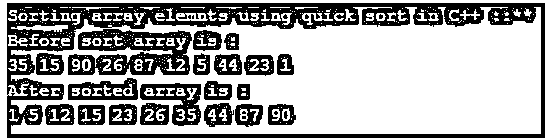

# C++快速排序

> 原文：<https://www.educba.com/c-plus-plus-quicksort/>




## C++快速排序简介

以下文章提供了 C++快速排序的概要。在编程语言中，我们总是需要算法来提高效率，快速排序就是其中之一。顾名思义，它用于对元素进行排序。它遵循一些步骤来做到这一点。该算法从列表中选择一个元素，称为“pivot ”,然后将列表分成两部分，以便有效排序。

### C++快速排序的语法

因为它是一个算法，所以它没有语法，但它定义了一些步骤，在任何语言中实现快速排序时都需要遵循这些步骤。

<small>网页开发、编程语言、软件测试&其他</small>

*   **步骤 A:** 从列表中选择一个元素作为 pivot。
*   步骤 B: 选择两个元素作为左和右。
*   步骤 C: 左边元素代表低指数。
*   **步骤 D:** 右边元素代表高索引。
*   **步骤 E:** 如果左边的值较小，则向右移动。
*   步骤 F: 如果右边的值更大，则向左移动。

我们将执行此步骤，直到较小和较大的元素相互通过。

因此，按照上述步骤，我们可以实现这是我们的代码使用 C++语言。但是这背后的基本思想对所有语言都是一样的。

### C++中快速排序算法的工作原理

正如我们现在所知道的，QuickSort 用于以有效的方式对元素进行排序。这是一种算法，它定义了一些要遵循步骤，以便在代码中实现这一点。这种算法基本上是以 pivot 元素为基础的，它以链表中的一个元素作为 pivot，将整个链表分成两个子链表并对它们进行排序。

我们可以用不同的方式选择枢轴元素，定义如下:

*   我们可以将最后一个元素作为主元素。
*   我们可以把中间元素作为中枢元素。
*   我们可以将第一个元素作为主元素。
*   我们可以将任意元素作为主元素。

我们可以采用任何一种方法，将我们的元素列表进一步分成两个不同的子列表。我们将把其他元素移到数组或列表的左边和右边，以便排序。

下面我们可以看到一个简单的算法，用来定义 C++语言中的快速排序。

**算法:**

quickSorAlgo(数组，更少，更多)

//启动算法逻辑

开始

这里我们定义了一个需要排序的数组

less =第一个元素；

more =最后一个元素；

在枢轴上转动

if(少

//开始排序逻辑

开始

pivot = partitionList (Array，less，more)；

quickSorAlgo(Array，less，pivot-1)

quickSorAlgo(Array，pivot+1，更多)

//到此结束

结束

//一些 ends

结束

我们来详细了解一下算法:

50, 25, 15, 20, 60, 30.

考虑上面的数组，其中包含各种元素。我们在这里选择 pivot 元素作为最后一个元素，因此我们将数组的第一个元素标记为 low，将数组的最后一个元素标记为 high。现在我们将迭代指向各自位置的指针，但为此我们将遵循一个规则来比较元素。

如果标记元素 high 小于我们选择的 pivot 元素，而标记元素 low 大于我们的 pivot 元素，在这种情况下，我们将互相交换元素的部分，并且我们将增加各自元素的位置以及它们应该指向的位置。我们将继续这个迭代，直到我们的低和高元素相互交叉，并且枢纽元素在它应该在的适当位置，这将把数组或列表分成两个子列表，这两个列表可以用快速排序算法独立排序。

15, 20, 25, 30, 50, 60

因此，上述排序算法的最终输出将是这样的。通过使用 C++中的快速排序算法，我们可以方便有效地对数组进行排序。

使用快速排序时要记住的几点:

*   首先，我们需要从数组中选择枢纽元素，它可以是元素数组中的第一个、最后一个、随机或中间元素。
*   它具有不同的复杂性，如下所述:

最坏情况: O (n 2)

**平均事例:** O (n log n)

**最佳情况:** O (n log n)

*   通过使用它，我们可以更快地对数组元素进行排序，这也提高了性能。

### C++快速排序示例

在本例中，我们使用快速排序对数组元素进行排序，并将 pivot 元素视为数组中的最后一个元素。

**代码:**

```
#include <iostream>
using namespace std;
void elementSwap(int* ele1, int* ele2)
{
int temp = *ele1;
*ele1 = *ele2;
*ele2 = temp;
}
int elementPartition (int array[], int less, int more)
{
int pivotelement = array[more];
int indexSmaller = (less - 1);
for (int qs = less; qs <= more - 1; qs++)
{
if (array[qs] < pivotelement)
{
indexSmaller++;
elementSwap(&array[indexSmaller], &array[qs]);
}
}
elementSwap(&array[indexSmaller + 1], &array[more]);
return (indexSmaller + 1);
}
void demoquickSort(int array[], int less, int greater)
{
if (less < greater)
{
int parInd = elementPartition(array, less, greater);
demoquickSort(array, less, parInd - 1);
demoquickSort(array, parInd + 1, greater);
}
}
int main()
{
cout << "Sorting array elemnts using quick sort in C++ ::** \n";
int array[] = {35, 15, 90, 26, 87, 12, 5, 44, 23, 1};
int arrsize = sizeof(array) / sizeof(array[0]);
cout << "Before sort array is : \n";
int z;
for (z = 0; z < arrsize; z++)
cout << array[z] << " ";
cout << endl;
demoquickSort(array, 0, arrsize - 1);
cout << "After sorted array is : \n";
int i;
for (i = 0; i < arrsize; i++)
cout << array[i] << " ";
cout << endl;
return 0;
}
```

**输出:**




### 结论

通过使用快速排序算法，我们可以有效地排序我们的数组列表元素。我们只需要选择 pivot 元素就可以继续了。这将把数组或列表分成两部分，然后我们可以递归地执行快速排序算法，以获得排序后的元素列表。

### 推荐文章

这是一个 C++快速排序的指南。这里我们分别用算法和例子来讨论 C++中 QuickSort 是如何工作的。您也可以看看以下文章，了解更多信息–

1.  [C++保留()](https://www.educba.com/c-plus-plus-reserve/)
2.  [C++可变](https://www.educba.com/c-plus-plus-mutable/)
3.  [C++ endl](https://www.educba.com/c-plus-plus-endl/)
4.  [C++字符串追加](https://www.educba.com/c-plus-plus-string-append/)


