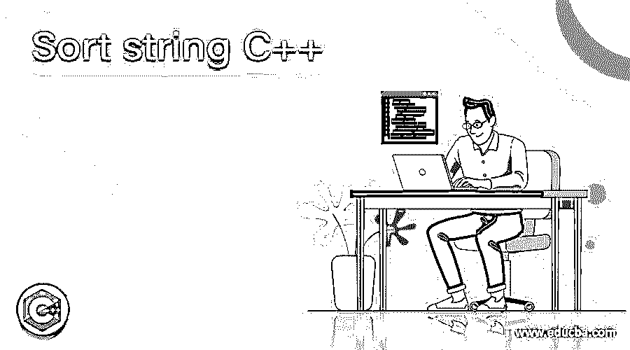
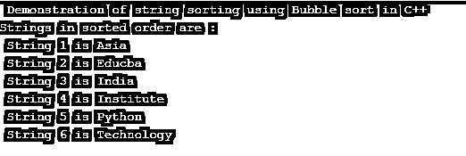
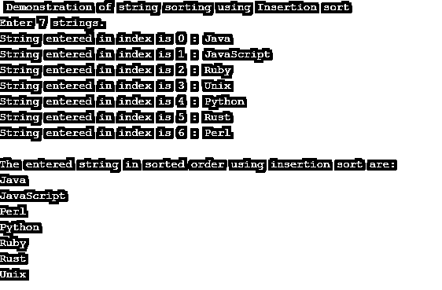
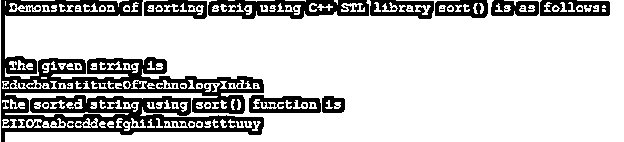
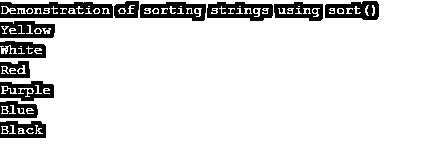

# 排序字符串 C++

> 原文：<https://www.educba.com/sort-string-c/>




## 排序字符串 C++简介

排序一个字符串被定义为字符串排列的升序或降序或任何给定的顺序是众所周知的排序在 C++中，这是什么，但得到的字符串在适当的顺序或给定的顺序可以说，因为字符串排序在给定或指定的安排。在 C++中，对字符串排序有不同的方式，如升序或升序、降序或降序，可以使用排序技术(冒泡排序、合并排序、插入排序)或使用 C++中的 STL 库来完成。

### C++中字符串排序的实现

在 C++中，使用两种方法对字符串进行排序，一种是使用一些排序技术，另一种是使用 C++提供的内置 STL 库。对字符串进行排序就像以特定的顺序排列给定的字符串，比如升序或降序。现在让我们在下面的章节中详细介绍。

<small>网页开发、编程语言、软件测试&其他</small>

### 使用一些排序技术对字符串进行排序

在 C++中，不同的排序技术可用于字符串排序。让我们在下面的部分用例子来讨论一些。

#### 1.冒泡排序

在 C++中，冒泡排序是最简单的排序技术之一。在这种排序技术中，通过比较相邻的字符串或字符串中的字符来对字符串进行排序，并根据指定的顺序交换它们，在 C++中，指定的顺序可以是字母顺序。

**举例:**

```
#include<bits/stdc++.h>
using namespace std;
#define MAX 100
void sortStrings(char arr[][MAX], int n)
{
char temp[MAX];
for (int j=0; j<n-1; j++)
{
for (int i=j+1; i<n; i++)
{
if (strcmp(arr[j], arr[i]) > 0)
{
strcpy(temp, arr[j]);
strcpy(arr[j], arr[i]);
strcpy(arr[i], temp);
}
}
}
}
int main()
{
char arr1[][MAX] = {"Educba","Institute","Technology","Python","India","Asia"};
int a = sizeof(arr1)/sizeof(arr1[0]);
sortStrings(arr1, a);
printf(" Demonstration of string sorting using Bubble sort in C++");
printf("\n");
printf("Strings in sorted order are : ");
for (int i=0; i<a; i++)
printf("\n String %d is %s", i+1, arr1[i]);
return 0;
}
```

**输出:**




在上面的程序中，我们可以看到我们已经在一个数组中声明了一组字符串，然后我们比较相邻的字符串并使用 temp 变量交换它们。然后我们按照字母顺序排列给定的数组，这是使用冒泡排序完成的。输出可以在上面的截图中看到。

#### 2.插入排序

这也是 C++中的另一种简单的排序技术，其中数组中给定的字符串按顺序相互比较，这意味着排序的数组可以通过一次比较一个字符串来获得，其中数组可以分为排序和未排序的子数组，然后未排序的数组中的字符串按正确的顺序排列。然后数组按字母顺序排序。

**举例:**

```
#include <stdio.h>
#include <string.h>
#define MAX_STRINGS 7
#define MAX_STRING_LEN 200
void StringInsertionSort(char list[MAX_STRINGS][MAX_STRING_LEN]);
int main()
{
int i;
char strings[MAX_STRINGS][MAX_STRING_LEN];
printf(" Demonstration of string sorting using Insertion sort");
printf("\n");
printf("Enter %d strings.\n", MAX_STRINGS);
for (i = 0; i < MAX_STRINGS; i++)
{
printf("String entered in index is %d : ", i);
scanf("%199s", strings[i]);     // limit the width so we don't go past the buffer
strings[i][sizeof(strings[i]) - 1] = '\0';
}
StringInsertionSort(strings);
printf("\nThe entered string in sorted order using insertion sort are:\n");
for (i = 0; i < MAX_STRINGS; i++)
{
printf("%s\n", strings[i]);
}
}
void StringInsertionSort(char list[MAX_STRINGS][MAX_STRING_LEN])
{
for (int a = 1; a < MAX_STRINGS; a++)
{
int b = a;
while (b > 0 && strcmp(list[b - 1], list[b]) > 0)
{
char tmp[MAX_STRING_LEN];
strncpy(tmp, list[b - 1], sizeof(tmp) - 1);
tmp[sizeof(tmp) - 1] = '\0';
strncpy(list[b - 1], list[b], sizeof(list[b - 1]) - 1);
list[b - 1][sizeof(list[b - 1]) - 1] = '\0';
strncpy(list[b], tmp, sizeof(list[b]));
list[b][sizeof(list[b]) - 1] = '\0';
--b;
}
}
}
```

**输出:**




在上面的程序中，我们可以看到我们使用用户输入来输入字符串，然后排列字符串。在上面的代码中，我们可以看到我们使用 temp 变量按顺序比较字符串，然后按字母顺序排列它们。输出可以在上面的截图中看到。

C++中的许多其他排序技术也可以用于排序字符串，如快速排序、合并排序，只有在插入排序中，还有不同的方法，如二进制插入排序等。

*   **使用 C++ STL sort()对字符串进行排序**

让我们看看使用 C++ STL 库排序字符串，这个库是 sort()函数，由 C++中的库提供，包含在<algorithm>头中。</algorithm>

**举例:**

```
#include<bits/stdc++.h>
using namespace std;
void StringSort(string &str1)
{
sort(str1.begin(), str1.end());
cout << "The sorted string using sort() function is " << endl;
cout << str1;
cout << endl;
}
int main()
{
cout << " Demonstration of sorting strig using C++ STL library sort() is as follows:" << endl;
cout << " \n " << endl;
string s = "EducbaInstituteOfTechnologyIndia";
cout << " The given string is " << endl;
cout << s;
cout << endl;
StringSort(s);
return 0;
}
```

**输出:**




在上面的程序中，我们可以看到，首先我们创建了一个名为 StringSort()的函数，其中我们定义了 Sort()内置函数，我们可以看到声明为 StringSort()函数的参数的字符串是 str1，然后当我们想要对给定的字符串进行排序时，我们必须从 Sort()函数中的第一个字符开始遍历，直到最后一个 so，语法为 sort(起始地址， 结束地址)我们可以看到 str1.begin()将存储第一个字母，str1.end()将存储字符串的最后一个字符，排序是通过比较给定字符串中的每个字符按字母顺序进行的。 输出可以在上面的截图中看到。

让我们看另一个例子，它将使用相同的 std: :sort()函数对字符串进行降序排序。

**举例:**

```
#include <iostream>
#include <algorithm>
using namespace std;
bool comparator(string &p, string &q){
return p > q;
}
int main() {
string arr1[] = {"Black", "Red", "Blue", "Yellow", "White", "Purple"};
int size = 6;
cout << "Demonstration of sorting strings using sort()" << endl;
std::sort(arr1, arr1 + size, comparator);
for (int a = 0; a < 6; a++){
cout<<arr1[a]<<endl;
}
return 0;
}
```

**输出:**




在上面的程序中，我们使用了由<algorithm>定义的 sort()函数，并且我们使用 sort()以降序排列给定的字符串。输出如上图所示。</algorithm>

### 结论

在本文中，我们得出结论，C++中的字符串排序是通过使用诸如冒泡排序、插入排序、合并排序、快速排序等排序技术来完成的。开发人员需要检查时间复杂度，以便对给定的字符串进行正确而快速的排序。另一种对字符串进行排序的方法是使用 C++ STL 库，如 <algorithm>header，使用内置的 sort()函数按字母顺序对字符串进行排序，可以是升序也可以是降序。</algorithm>

### 推荐文章

这是一个 C++的字符串排序指南。在这里，我们用例子讨论了在 C++中对字符串进行排序的工作，并使用一些排序技术对字符串进行排序。您也可以看看以下文章，了解更多信息–

1.  [C++哈希表](https://www.educba.com/c-plus-plus-hashset/)
2.  [C++空指针](https://www.educba.com/c-plus-plus-void-pointer/)
3.  [C++类和对象](https://www.educba.com/c-plus-plus-class-and-object/)
4.  [C++无符号整型](https://www.educba.com/c-plus-plus-unsigned-int/)


