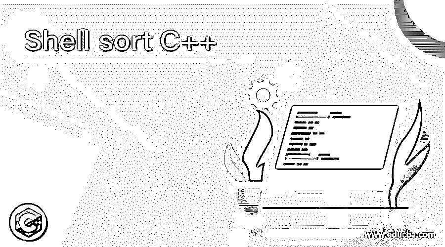
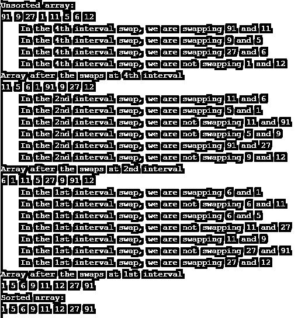

# 外壳排序 C++

> 原文：<https://www.educba.com/shell-sort-c-plus-plus/>




## 外壳排序 C++的定义

C++中的 Shell sort 被定义为一种排序算法，它允许用户对数组进行排序，并按照规定的顺序(即升序或降序以及另一维度)放置列表。这些规定的顺序也可以是数字顺序或字典顺序。高效的排序算法同样重要，因为它为优化其他相关算法的效率铺平了道路，这些算法在其用例中使用排序算法，并根据需要需要排序数据！外壳排序是一种排序算法，主要是插入排序的变体。插入排序的目的是将元素向前移动一个位置！在本文中，我们将看看 C++中 shell 排序的变化和工作方式。

### C++中 shell sort 是如何工作的？

当我们在介绍中谈到外壳排序时，我们了解到该算法是插入排序的一个一般化版本。现在让我们先看一下插入排序，因为学习算法将为了解外壳排序的本质铺平道路。在插入排序中，数组实际上被分成一个排序的部分，另一个是未排序的路径。现在，来自未排序部分的值被选取并相应地插入到数组的正确位置。未排序的部分从第一个元素开始，此时已排序的部分为零，未排序的部分为原始数组。现在，随着迭代的进行，未排序部分中的数组的每个元素被逐一查看，然后与前一个元素进行比较。如果前一个更小(或根据需要更大)，则将其与排序后的数组中的元素进行比较，然后确定正确的位置并最终插入其中。以这种方式，随着每次连续迭代，已排序部分的大小变大，未排序部分减少，最终未排序部分为零。

<small>网页开发、编程语言、软件测试&其他</small>

现在，对于壳排序，我们知道它是插入排序的一个推广版本，有一些通常遵循的序列。在本文中，我们将重点关注 Shell 的原始序列，同时考虑到文章的长度，但是我们将借此机会在表面层次上查看所有序列。每个序列中提到的数字是我们算法中的区间。当我们一步一步地理解 shell 排序的工作原理时，就会更清楚了。

壳牌公司的原始序列:N/2，N/4，…，1

增量:

*   Knuth’s: 1, 4, 13, …, (3k – 1) / 2
*   希巴德的:1，3，7，15，31，63，127，255，511…
*   帕帕诺夫&斯塔塞维奇:1，3，5，9，17，33，65…
*   塞奇威克的:1，8，23，77，281，1073，4193，16577…4j+1+ 3 2j+ 1

普拉特:1，2，3，4，6，9，8，12，18，27，16，24，36，54，81…

我们应该意识到，上面提到的顺序并不是详尽的，而是最佳的。现在，让我们假设给定了一个需要排序的数组。以下是 Shell 的原始顺序中遵循的步骤(按升序排序)。

1.间隔取为 N/2，N/4，…，1，其中 N 是数组大小。

2.在第一次迭代中，存在于 N/2 区间中的元素被比较和交换。例如，如果数组大小为 8，则将第 0 个元素与 8/2 =第 4 个元素进行比较。如果第 4 个元素更小，我们交换位置，如果不是，我们不执行任何操作。这个过程一直持续到我们到达数组的末尾。

3.在下一次迭代中，我们将取间隔为 8/4 = 2 的元素。在某些时候，人们会想象(在这个例子中)我们比较 0 和 2nd，然后再次比较 2nd 和 4nd，这就是 shell 排序的要点。

4.最后，迭代过程完成，直到我们到达要比较的间隔为 1。

5.我们得到的最后一个数组是排序后的数组！

### 例子

让我们讨论 Shell 排序 C++的例子。

#### 示例#1

带解释的外壳排序:

**语法:**

```
#include <iostream>
using namespace std;
void printArray(int arr[], int size) {
int i;
for (i = 0; i < size; i++)
cout << arr[i] << " ";
cout << endl;
}
void shellSort(int arrayToSort[], int n) {
for (int gap = n / 2; gap > 0; gap /= 2) {
for (int i = gap; i < n; i += 1) {
int swap = arrayToSort[i];
int j;
for (j = i; j >= gap && arrayToSort[j - gap] > swap; j -= gap) {
arrayToSort[j] = arrayToSort[j - gap];
}
if (arrayToSort[j] != swap){
if(gap%10 == 1){
cout<< " In the "<< gap << "st interval swap, we are swapping ";
cout<< arrayToSort[j] <<" and "<< swap;
cout<< endl;
arrayToSort[j] = swap;
}
else if(gap%10 == 2){
cout<< " In the "<< gap << "nd interval swap, we are swapping ";
cout<< arrayToSort[j] <<" and "<< swap;
cout<< endl;
arrayToSort[j] = swap;
}
else if(gap%10 == 3){
cout<< " In the "<< gap << "rd interval swap, we are swapping ";
cout<< arrayToSort[j] <<" and "<< swap;
cout<< endl;
arrayToSort[j] = swap;
}
else{
cout<< " In the "<< gap << "th interval swap, we are swapping ";
cout<< arrayToSort[j] <<" and "<< swap;
cout<< endl;
arrayToSort[j] = swap;
}
}
else{
if(gap%10 == 1){
cout<< " In the "<< gap << "st interval swap, we are not swapping ";
cout<< arrayToSort[j - gap] << " and " << arrayToSort[j];
cout<< endl;
}
else if(gap%10 == 2){
cout<< " In the "<< gap << "nd interval swap, we are not swapping ";
cout<< arrayToSort[j - gap] << " and " << arrayToSort[j];
cout<< endl;
}
else if(gap%10 == 3){
cout<< " In the "<< gap << "rd interval swap, we are not swapping ";
cout<< arrayToSort[j - gap] << " and " << arrayToSort[j];
cout<< endl;
}
else{
cout<< " In the "<< gap << "th interval swap, we are not swapping ";
cout<< arrayToSort[j - gap] << " and " << arrayToSort[j];
cout<< endl;
}
}
}
if(gap%10 == 1){
cout << "Array after the swaps at " << gap << "st interval";
}
else if(gap%10 == 2){
cout << "Array after the swaps at " << gap << "nd interval";
}
else if(gap%10 == 3){
cout << "Array after the swaps at " << gap << "rd interval";
}
else{
cout << "Array after the swaps at " << gap << "th interval";
}
cout << endl;
printArray(arrayToSort,n);
}
}
int main() {
int data[] = {91, 9, 27, 1, 11, 5, 6, 12};
int size = sizeof(data) / sizeof(data[0]);
cout << "Unsorted array: \n";
printArray(data, size);
shellSort(data, size);
cout << "Sorted array: \n";
printArray(data, size);
}
```

**输出:**




### 结论

总之，在本文中，我们已经了解了 shell 排序的工作原理，接下来是一小段代码，试图复制相同的概念。这里我们也看了一步一步的功能。到现在为止，我们确实理解了外壳排序和插入排序之间的区别，以及外壳排序一般化的基础！休息继续实验！

### 推荐文章

这是一个 Shell 排序 C++的指南。这里我们讨论定义、语法和参数，shell sort 在 C++中如何工作，以及代码实现的例子。您也可以看看以下文章，了解更多信息–

1.  [排序字符串 C++](https://www.educba.com/sort-string-c/)
2.  [C++ getline()](https://www.educba.com/c-plus-plus-getline/)
3.  [Java 中的排序字符串](https://www.educba.com/sort-string-in-java/)
4.  [C++快速排序](https://www.educba.com/c-plus-plus-quicksort/)


