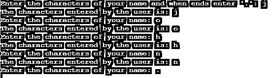
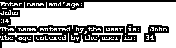

# C++用户输入

> 原文：<https://www.educba.com/c-plus-plus-user-input/>


## C++用户输入简介

下面的文章提供了 C++用户输入的概要。在 C++中，cin 对象用于接受来自标准输入设备(如键盘)的输入。C++包括允许我们以各种方式执行输入的库。在 C++中，输入采用流的形式，即字节序列。cin 对象是 istream 类的一个实例。它链接到标准 C 输入流 stdin。对于读取输入，提取操作符(>>)与对象 cin 结合使用。最后，使用提取操作符从使用键盘输入的对象 cin 中提取数据。

**c++用户输入的语法—**

<small>网页开发、编程语言、软件测试&其他</small>

```
// user input is stored to a variable
cin >> variable;
```

**注—**

提取操作符“> >”接受来自标准输入流 cin 的输入。只有变量可以用作存储数据的输入。控制台提供输入数据。名称空间 std 包括 cin。这表明如果名称空间没有被利用，您必须使用 std::cin。

### C++用户输入的工作原理

C++中的 cin 对象接受用户输入。例如，假设我们必须从用户那里接受用户的年龄。所以，首先，我们应该声明一个 int 类型的变量，叫做 age。接下来，我们可以使用 cin 对象和提取操作符作为“cin > >名称”这里的名称是存储给定名称的变量。该操作导致程序等待来自 cin 的输入；在大多数情况下，这意味着程序将等待用户键入一系列字符。请注意，键盘上键入的字符只有在按下 ENTER(或 RETURN)键时才会发送到应用程序。

### C++用户输入的例子

下面提到了不同的例子:

#### 示例#1

接受用户整数输入的 C++用户输入示例–

**代码:**

```
#include <iostream>
using namespace std;
int main() {
int age;
cout<< "Enter the age: ";
cin>> age;
cout<< "\nThe age entered by the user is: "<< age;
cout<<endl;
return 0;
}
```

上述代码的输出是–


与上面的程序一样，首先声明整数变量 age。接下来，使用 cin 对象和提取操作符作为“cin > >年龄”，这将导致程序等待用户的输入。一旦用户输入了这个值，cin 对象就会接受它并将其存储到年龄变量中。接下来，打印 age 变量的值，正如我们在输出中看到的。

#### 实施例 2

接受用户字符输入的 C++用户输入示例

**代码:**

```
#include <iostream>
using namespace std;
int main() {
char ch;
cout<< "Enter the characters of your name and when ends enter '.': ";
cin>> ch;
while(ch!='.')
{
cout<< "The characters entered by the user is: "<< ch;
cout<< endl;
cout<< "Enter the characters of your name: ";
cin>> ch;
}
cout<<endl;
return 0;
}
```

上述代码的输出是




和上面的程序一样，首先声明 char 变量 ch。接下来，使用 cin 对象和提取操作符“cin >> ch”，这将导致程序等待用户的输入。当用户输入值时，cin 对象接受它并将其存储在 ch 变量中。使用循环时接受名称中的所有字符。接下来，打印 ch 变量的值，正如我们在输出中看到的。

#### 实施例 3

接受用户字符串输入的 C++用户输入示例–

**代码:**

```
#include <iostream>
using namespace std;
int main() {
char name[20];
cout<< "Enter your name: ";
cin>> name;
cout<< "The name entered by the user is: "<< name;
cout<< endl;
return 0;
}
```

上述代码的输出是–


与上面的程序一样，首先声明字符变量名的数组。接下来，使用 cin 对象和提取操作符作为“cin > >名称”，这将导致程序等待用户的输入。当用户输入姓名时，cin 对象接受并存储在 name 变量中。接下来，name 变量的值是 printing，我们可以在输出中看到。

#### 实施例 4

接受用户多个输入的 C++用户输入示例–

**代码:**

```
#include <iostream>
using namespace std;
int main() {
string name;
int age;
cout << "Enter name and age:  " << endl;
// accept multiple input using cin object
cin >> name >> age;
// display the provided values
cout << "The name entered by the user is:  " << name << endl;
cout << "The age entered by the user is:  " << age << endl;
cout << endl;
return 0;
}
```

上述代码的输出是–




与上面的程序一样，首先声明整数和字符串变量。接下来，使用 cin 对象和提取操作符作为“cin >>姓名> >年龄”，这使得程序等待用户的两个输入。当用户输入姓名和年龄时，cin 对象接受第一个值并存储到姓名变量，接受第二个值并存储到年龄变量。接下来，打印变量的值，正如我们在输出中看到的。

### 结论

在 C++中，输入采用流的形式，即字节序列。cin 对象是 istream 类的一个实例，用于接受来自标准输入设备(如键盘)的输入。

### 推荐文章

这是一个 C++用户输入指南。这里我们讨论 C++用户输入的工作方式，以及例子和输出。您也可以看看以下文章，了解更多信息–

1.  [C++ getline()](https://www.educba.com/c-plus-plus-getline/)
2.  [C++ search()](https://www.educba.com/c-plus-plus-search/)
3.  [C++对](https://www.educba.com/c-plus-plus-pair/)
4.  [C++移动语义](https://www.educba.com/c-plus-plus-move-semantics/)


