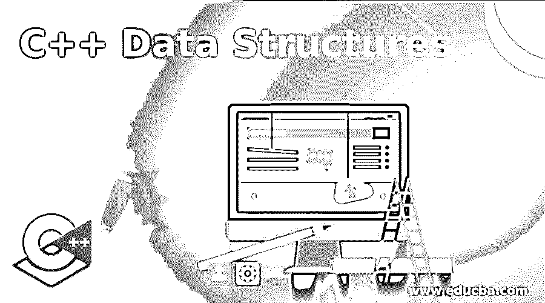
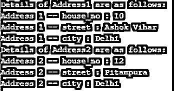

# C++数据结构

> 原文：<https://www.educba.com/c-plus-plus-data-structures/>




## C++数据结构的定义

如果我们泛泛而谈，数据结构基本上是一种数据应该如何存储在内存中以便于组织的结构。根据程序员如何保存记录的要求，使用不同类型的数据结构。众所周知，C++是一种高级语言，具有类和对象的高级特性。它提供了许多数据结构来处理各种情况，如数组、链表、堆栈、队列、二叉树等。C++允许用户创建用户定义的数据结构，该数据结构可以保存具有不同数据类型的数据成员的记录。

**语法:**

<small>网页开发、编程语言、软件测试&其他</small>

下面给出了具有不同类型数据的用户定义数据结构的基本语法:

```
structstructure_name {
member_datatype1 member_name1;
member_datatype2 member_name2;
member_datatype3 member_name3;
member_datatype4 member_name4;
..
..
..
} obj_name;
```

在哪里，

*   **struct:** 用于定义结构的关键字
*   **结构名称:**自定义结构的名称(可选)
*   **成员数据类型(n):** 结构成员的数据类型(n)
*   **成员名称(n):** 结构成员的名称(n)
*   **obj_name:** 将拥有此结构的用户定义结构的对象的名称

### 数据结构在 C++中是如何工作的？

C++中的数据结构分为两大类:基本数据结构和非基本/用户定义的数据结构。原始数据结构是 C++库中已经定义的数据结构，如 int、float、double、String 等。用户自定义是用户根据程序员的要求创建的。基本上，在现实生活中，我们需要一个结构来保存具有不同数据类型的数据成员。例如，如果我们想存储雇员的地址，我们需要门牌号(int)、街道名称(char)、城市(char)这样的数据成员。由于所有 3 个数据成员具有不同的数据类型，我们需要创建一个名为“Address”的用户定义数据结构，其中定义了所有数据成员及其数据类型。

```
structAddress{
inthouse_no;
char street[80];
char city[180];
} add1, add2;
```

在上面的代码中，我们的结构名为‘Address ’,数据成员为 house_no，street，city。“add1”和“add2”是结构类型 Address 的对象。尽管结构名“Address”是可选的，但是我们需要在结构定义的分号结束之前至少指定一个对象。

如果我们想在定义之外的地方定义结构变量/ object_name，我们需要为此使用关键字“struct ”:

```
struct Address add1;
```

**在 C++中访问用户定义的数据结构中的成员:**数据结构的数据成员被访问，以提取它们的值或给它们赋值来执行进一步的任务。结构的数据成员使用点(.)运算符，也称为成员访问变量。为了使用()运算符，我们需要在结构变量名和数据成员名之间使用它。上述数据成员“house_no .”的访问方式如下:

```
add1.house_no. = 12;
```

### C++数据结构的例子

下面是 C++代码中用户定义的数据结构的一些例子:

#### 示例#1

在 C++中定义和访问结构。**代码:**

```
// Creating a user defined structure 'Address'
#include <iostream>
#include <string>
#include <sstream>
using namespace std;
struct address {
inthouse_no;
string street;
string city;
} add1, add2;
intmain() {
//We can also declare the objects of structure here using 'struct address add1;'
// assigning the values to the add1 data members
add1.house_no = 10;
add1.street= "Ashok Vihar";
add1.city= "Delhi";
// assigning the values to the add2 data members
add2.house_no = 12;
add2.street = "Pitampura";
add2.city= "Delhi";
// Printing the above information on console
cout<< "Details of Address1 are as follows: "<<endl;
cout<< "Address 1 -- house_no : " << add1.house_no <<endl;
cout<< "Address 1 -- street : " << add1.street <<endl;
cout<< "Address 1 -- city : " << add1.city <<endl;
cout<< "Details of Address2 are as follows: "<<endl;
cout<< "Address 2 -- house_no : " << add2.house_no <<endl;
cout<< "Address 2 -- street : " << add2.street <<endl;
cout<< "Address 2 -- city : " << add2.city <<endl;
return 0;
}
```

**输出:**




**解释:**在上面的代码中，我们创建了一个名为‘address’的结构，并将 house_no、street 和 city 定义为其数据成员。我们创建了“add1”和“add2”作为它的对象。为了给数据成员赋值，我们首先通过()运算符。类似地，为了在控制台上打印这些值。)运算符用于访问它们，而“cout”用于打印它们。

#### 实施例 2

在 C++中定义结构并使用它的数组。

**代码:**

```
// Creating an array of user defined structure 'address'
#include <iostream>
#include <string>
#include <sstream>
using namespace std;
struct address {
inthouse_no;
string street;
string city;
};
intmain() {
inti;
struct address add[2];
for (i=0;i<2;i++)
{
cout<< "Address of " << i+1 << " employee"<<endl;
cout<< "enter house_no"<<endl;
cin>>add[i].house_no;
cout<< "enter street"<<endl;
cin>>add[i].street;
cout<< "enter city"<<endl;
cin>>add[i].city;
}
// Printing the above information on console
for (i=0; i<2;i++)
{
cout<< "Details of Address "<< i+1<<" are as follows: "<<endl;
cout<< "house_no : " << add[i].house_no<<endl;
cout<< "street : " << add[i].street <<endl;
cout<< "city : " << add[i].city <<endl;
}
return 0;
}
```

**输出:**


**解释:**在上面的代码中，我们创建了一个用户自定义结构‘address’的数组。实际上，我们不分配数据成员的值，它们是由用户动态输入的。结构数组的创建方式与 C++中的普通数组类似，数组大小为 2，细节由用户输入。数据成员是使用()运算符。

### 结论

上面的解释清楚地定义了 C++中的数据结构以及它们如何在 C++代码中工作。一旦创建了用户定义的数据结构，它们的工作方式类似于 C++中的原始数据结构。我们还可以将它们作为函数中的参数传递，并定义指向这些结构的指针。因此，在使用它们之前，彻底了解它们是非常重要的。

### 推荐文章

这是一本 C++数据结构指南。这里我们也讨论 c++中数据结构的介绍和工作原理？以及不同的示例及其代码实现。您也可以看看以下文章，了解更多信息–

1.  [C++ push_back](https://www.educba.com/c-plus-plus-push_back/)
2.  [C++流](https://www.educba.com/c-plus-plus-stream/)
3.  [C++ endl](https://www.educba.com/c-plus-plus-endl/)
4.  [C++列表](https://www.educba.com/c-plus-plus-list/)


