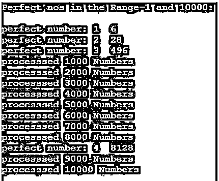

# 完全数 C++

> 原文：<https://www.educba.com/perfect-number-c-plus-plus/>


## 完全数 C++简介

C++中的完全数是那些值等于它的除数的 sigma 的数(不包括它自己的数)。除数是将分子完全除尽而不留任何余数的分母。它具有独特的特征，使它们与众不同，它们在本质上是完整和绝对的。然而，这是一个非常罕见的现象，到目前为止，数学家们只发明了 51 个数字，这些数字的范围从 1 到人们可以想象的最大极限，超级计算机可以处理。

### 完全数背后的逻辑

历史上没有谁发现了发明的完全数的痕迹。人们相信埃及人对完全数有些兴趣，但是是希腊人对完全数做了大量的研究，像毕达哥拉斯、奥康纳、罗伯逊等人对完全数产生了广泛的兴趣。

<small>网页开发、编程语言、软件测试&其他</small>

有一种信念认为每个素数都有一个关联的完全数，梅森也发现了这个公式。

公式是:

Perfect number N = 2(P-1) (2P – 1)

在哪里，

*   P-主要数字和(2P-1)是梅森素数。
*   对于素数 2，完全数是 6，梅森素数是 3，对于下一个素数 3，完全数是 28，梅森素数是 7，以此类推。

### 完全数的意义

尽管关于完全数的重要性以及它们与质数的联系有几种理论在流传。，完全数的重要性及其用法还不清楚。

关于完全数的一些确凿事实是:

*   受到比其他号码优越的待遇。
*   很容易理解，但是看不出有什么用处。
*   不能解决任何数学问题。
*   在为商业、经济和科学等其他领域提供解决方案方面，它不是一个很好的工具。

完全数的知识和背景有助于数学家提高数据分析技能，建立各种场景的 AI 模型。

### C++中如何检查完全数？

找出一个给定的数是否是一个完全数的程序步骤:

*   接受一个必须被验证为完美数字的数字。
*   将这个数除以 1，检查除法运算是否有余数。
*   因为余数是零，所以分母 1 是一个完美的除数，并在计数器中累加除数。
*   将该数除以 2 并检查余数，如果余数为零，则在计数器中累加除数。
*   从 3 开始重复上述步骤，直到接受的号码前的一个号码。
*   检查接受数和累计计数器的值。
*   如果值相同，则接受的数是完全数；否则，就不是。

从给定的数字范围中选择一个完全数的程序步骤:

*   接受范围内的第一个数字和最后一个数字。
*   从第一个数字开始。然后，使用上一段中的步骤检查它是否是一个完全数。如果是一个完美的数字，则显示该数字。
*   对编号范围中的下一个编号重复上述步骤。
*   继续上述步骤，直到最后一个数字在范围内。

### 完全数 C++的例子

下面是完全数 C++的例子:

#### 示例#1

找出一个给定的数是否是一个完全数。

**代码:**

```
#include <iostream>
using namespace std;
int main() // Main ... Program starts here
{
int gno = 6; // The number to be checked
int m = 0; // Initialize variables
int total = 0;
cout << "Check whether this number " << gno <<" is Perfect or not " << ":\n";
// Display the Header
for(m=1; m<gno; m=m+1) // For loop start
{
if(gno % m == 0) // Check Remainder = 0
total = total + m; // If so accumulate
}
// Check number and accumulated value
if(total == gno)
cout << "\n" << "YES... The given number is a perfect Number...";
if(total != gno)
cout << "\n" << "Sorry it is not perfect no.... Try some other";
}
```

**输出:**

对于给定的第 6 个，结果是:


对于给定的数字 27，结果是:

代码 int gno = 27 的变化；//要检查的数字


对于给定的数字 469，结果是:

代码 int gno = 469 的变化；//要检查的数字


对于给定的数字 496，结果是:

代码 int gno = 496 的变化；//要检查的数字


#### 实施例 2

在给定的数字范围内识别完全数。

**代码:**

```
#include <iostream>
using namespace std;
int main() // Program starts here
{
int first = 1; // First in the range
int last = 10000; // Last in Range
int pcount = 0;
int count = 0; // Initializing all the variables
int totcount = 0;
int j = 0;
int m = 0;
int total = 0;
int pfound = 0;
// Header printing
cout << "Perfect nos in the Range-" << first <<" and " << last << ":\n";
cout << "\n";
for(j=first; j<=last; j=j+1) // Outer FOR loop
{
for(m=1; m<j; m=m+1) // For a given number - inner FOR loop
{
if(j % m == 0) // Check Remainder
total = total + m; // Accumulate
}
if(total == j) // Check
{
pfound = 1; // Yes Perfect number found
pcount = pcount+1; // Display the number
cout << "perfect number: " << pcount << " " <<j <<"\n";
}
total = 0;
count = count + 1;
if (count > 999)
{
totcount = totcount + count; // Display status for every 1000 nos
cout <<"processsed "<< totcount << " Numbers" <<"\n";
count = 0;
} // inner loop ends
} // outer loop ends
if(pfound == 0)
cout << "There in no perfect number between the given range";
// display if no Perfect no found
}
```

**输出:**

一系列数字(1 到 10000)的结果:




### 结论

尽管完全数在现实世界中找不到任何应用，但其基本原理和概念帮助数学家围绕复杂的现实问题建立数据模型，并获得对数据的洞察。

### 推荐文章

这是一个完全数 C++的指南。这里我们讨论一下绪论，逻辑，意义，C++中如何检查完全数？还有例子。您也可以看看以下文章，了解更多信息–

1.  [二分搜索法 C++](https://www.educba.com/binary-search-c-plus-plus/)
2.  [外壳排序 C++](https://www.educba.com/shell-sort-c-plus-plus/)
3.  [C++本](https://www.educba.com/c-plus-plus-this/)
4.  [C++对](https://www.educba.com/c-plus-plus-pair/)


