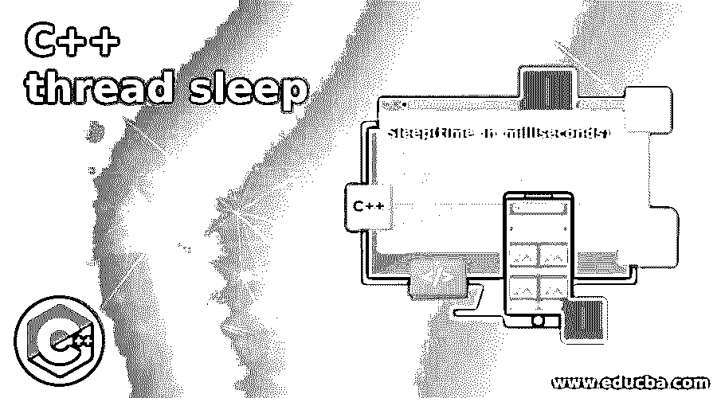

# C++线程睡眠

> 原文：<https://www.educba.com/c-plus-plus-thread-sleep/>




## C++线程睡眠简介

每当有必要将一个线程或进程的执行暂时暂停一段时间时，我们就使用 C++中称为 sleep()函数的函数，该函数以秒为参数，它是线程或进程的执行必须暂停的持续时间。 并且线程或进程的这种暂停持续到指定的时间结束，或者可以通过向函数发送任何中断来中断，并且在 windows 的情况下必须包括头文件 windows.h，在 Linux 的情况下必须包括头文件 unistd.h，以便在我们的程序中使用 sleep()函数。

**c++中 sleep()函数的语法:**

<small>网页开发、编程语言、软件测试&其他</small>

```
Sleep(time_in_milliseconds)
```

其中时间毫秒表示给定线程或进程必须暂停的持续时间。

### C++中 sleep()函数的工作原理

*   每当有必要将一个线程或进程的执行暂停一段时间时，我们就使用 C++中的 sleep()函数。
*   sleep()函数将时间(以秒为单位)作为参数，它是线程或进程的执行必须暂停的持续时间。
*   线程或进程的暂停会持续到指定的时间结束，或者可以通过向函数发送任何中断来中断。
*   为了使用我们程序中的 sleep()函数，windows 中必须包含头文件 windows.h，Linux 中必须包含头文件 unistd.h。

### C++线程睡眠示例

下面给出了 C++线程睡眠的例子:

#### 示例#1

演示 sleep()函数的 C++程序，该函数在打印下一条 cout 语句之前将第一条 cout 语句挂起一段指定的时间。

**代码:**

```
//the headers iostream and unistd are included to be able to make use of cout and cin statements and sleep() function
#include <iostream>
#include <unistd.h>
using namespace std;
int main()
{
//The first cout statement is executed
cout<<"Welcome"<<"\n";
//Then the sleep() function is called before executing the next cout statement
sleep(10);
//this cout statement is executed after the sleep function is executed for the speicifed  amount of time
cout<<"to C++";
cout<<endl;
return 0;
}
```

**输出:**


在上面的程序中，包含了标题 iostream 和 unistd，以便能够使用 cout 和 cin 语句以及 sleep()函数。然后执行第一条 cout 语句。然后在执行下一个 cout 语句之前调用 sleep()函数。然后，在睡眠功能执行指定时间后，执行下一条 cout 语句。

#### 实施例 2

演示 sleep()函数的 C++程序，该函数在打印下一条 cout 语句之前将第一条 cout 语句挂起一段指定的时间。

**代码:**

```
//the headers iostream and unistd are included to be able to make use of cout and cin statements and sleep() function
#include <iostream>
#include <unistd.h>
using namespace std;
int main()
{
//The first cout statement is executed
cout<<"Learning"<<"\n";
//Then the sleep() function is called before executing the next cout statement
sleep(10);
//this cout statement is executed after the sleep function is executed for the speicifed amount of time
cout<<"is fun";
cout<<endl;
return 0;
}
```

**输出:**


在上面的程序中，包含了标题 iostream 和 unistd，以便能够使用 cout 和 cin 语句以及 sleep()函数。然后执行第一条 cout 语句。然后在执行下一个 cout 语句之前调用 sleep()函数。然后，在睡眠功能执行指定时间后，执行下一条 cout 语句。

#### 实施例 3

演示 sleep()函数的 C++程序，该函数在打印下一条 cout 语句之前将第一条 cout 语句挂起一段指定的时间。

**代码:**

```
//the headers iostream and unistd are included to be able to make use of cout and cin statements and sleep() function
#include <iostream>
#include <unistd.h>
using namespace std;
int main()
{
//The first cout statement is executed
cout<<"Learning"<<"\n";
//Then the sleep() function is called before executing the next cout statement
sleep(10);
//this cout statement is executed after the sleep function is executed for the speicifed  amount of time
cout<<"sleep function";
cout<<endl;
return 0;
}
```

**输出:**


在上面的程序中，包含了标题 iostream 和 unistd，以便能够使用 cout 和 cin 语句以及 sleep()函数。然后执行第一条 cout 语句。然后在执行下一个 cout 语句之前调用 sleep()函数。然后，在睡眠功能执行指定时间后，执行下一条 cout 语句。

#### 实施例 4

演示 sleep()函数的 C++程序，该函数在打印下一条 cout 语句之前将第一条 cout 语句挂起一段指定的时间。

**代码:**

```
//the headers iostream and unistd are included to be able to make use of cout and cin statements and sleep() function
#include <iostream>
#include <unistd.h>
using namespace std;
int main()
{
//The first cout statement is executed
cout<<"I love"<<"\n";
//Then the sleep() function is called before executing the next cout statement
sleep(10);
//this cout statement is executed after the sleep function is executed for the speicifed  amount of time
cout<<"my India";
cout<<endl;
return 0;
}
```

**输出:**


在上面的程序中，包含了标题 iostream 和 unistd，以便能够使用 cout 和 cin 语句以及 sleep()函数。然后执行第一条 cout 语句。然后在执行下一个 cout 语句之前调用 sleep()函数。然后，在睡眠功能执行指定时间后，执行下一条 cout 语句。

### 推荐文章

这是一个 C++线程睡眠指南。这里我们分别讨论 C++中 sleep()函数的介绍、工作原理和例子。您也可以看看以下文章，了解更多信息–

1.  [C++ find_if()](https://www.educba.com/c-plus-plus-find_if/)
2.  [C++线程池](https://www.educba.com/c-plus-plus-thread-pool/)
3.  [C++保留()](https://www.educba.com/c-plus-plus-reserve/)
4.  [C++格式化程序](https://www.educba.com/c-plus-plus-formatter/)


