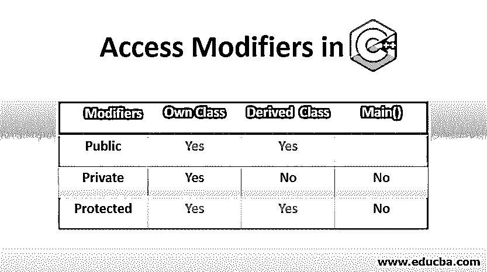
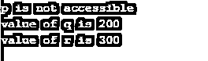

# C++中的访问修饰符

> 原文：<https://www.educba.com/access-modifiers-in-c-plus-plus/>




## C++中的访问修饰符简介

访问修饰符是应用于类成员的技术，用来限制他们对类之外的访问。在 C++中，访问修饰符可以通过使用三个关键字来实现——public、private 和 protected，public 成员可以在任何地方访问，即在类内部或外部，但只能在程序内部访问，private 成员只能在类内部访问，protected 成员类似于 private 成员，它们可以在子类/派生类中访问。

### C++中访问修饰符的类型

C++中有 3 种类型的访问修饰符

<small>网页开发、编程语言、软件测试&其他</small>

1.  公共
2.  私人的
3.  保护

让我们用例子来看看这些修饰语:

#### 1.公共

顾名思义，可供所有人使用。将类的所有成员声明为 public 后，每个人都可以使用它们。公共成员可以在类之外的任何地方访问，但是在程序内部。如果数据成员被声明为公共的，它也可以被其他类访问。由于 public 修饰符中没有限制，我们可以使用(。)点运算符来直接访问成员函数和数据。

**代码:**

```
#include <iostream>
using namespace std;
class parent
{
private:
int p;
protected:
int q;
public:
int r;
parent() //constructor to initialize data members
{
p = 100;
q = 200;
r = 300;
}
};
//Inheritance concept
class child: public parent
{
//q becomes protected and r becomes public members of class child
public:
void showdata()
{
cout << "p is not accessible" << endl;
cout << "value of q is " << q << endl;
cout << "value of r is " << r << endl;
}
};
int main()
{
child c; //object of derived class(child)
c.showdata();
//c.p = 100;   invalid : private member,no access
//c.q = 200;   invalid : q is now private member of child class
//c.r = 300;   invalid : r is also now a private member of child class
return 0;
}
```

**输出:**

#### 


2。私人的

私有修饰符是 C++中最好的访问修饰符之一。私有数据成员的范围保持在类内部，这就是为什么类内部的函数可以访问声明为私有的类成员。因为这就是私有的意思只有你自己决定谁可以用你的东西(像朋友一样)或者不可以。你不能通过类外的任何对象或函数直接访问成员。一个朋友的功能(我说过可以用你的东西)可以用来访问[类的私有数据成员](https://www.educba.com/private-in-php/)。当从类之外的任何地方访问私有数据成员时，您将得到一个编译时错误。

**代码:**

```
#include<iostream>
using namespace std;
// Defining class
class Circle
{    // private data member
private:
double radius;
// public member function
public:
void areaOfCircle(double r)
{   // member function can access private
// data member radius
radius = r;
double area = 3.14*radius*radius;
cout << "Radius is: " << radius << endl;
cout << "Area is: " << area;
} };
// Main function
int main()
{    // creating class object
Circle c;
/* trying to access private data member
directly outside the class */
c.areaOfCircle(4.5);
return 0;
}
```

**输出:**


通过使用上面的代码，我们可以间接地使用类的公共成员函数来访问类的私有数据成员。

#### 3.保护

最后一个访问说明符是 C++中最重要的访问修饰符，因为它的行为与私有访问修饰符非常相似。不能从其他类直接访问受保护的数据成员或函数。您可以使用友元函数来访问受保护的成员，因为它允许此功能。受保护的修饰符有一些限制。在 protected 中声明的成员只能被保护到下一个级别，然后成为私有。

**代码:**

```
#include <iostream>
using namespace std;
// Base class
class Parent
{    // Protected data members
protected:
int id_protect;
};
// Derived class
class Child : public Parent
{  public:
void set(int id)
{  /* Child class to access the inherited protected data
members of the Base class */
id_protect = id;
}
void display() {
cout << "id_protect is: " << id_protect << endl;
}
};
// Main function
int main() {
Child p;
/* member function(derived class) can easily
access the data members(protected) of the base class */
p.set(07);
p.display();
return 0;
}
```

**输出:**


从上面的代码中，可以看到 id_protect 被声明为 protected，可以使用派生类的成员函数来访问。这意味着您可以通过使用派生类的成员函数来访问基类的受保护数据成员。

### C++中访问修饰符的优势

下面是 C++中访问修饰符的不同优势:

*   访问修饰符为您提供了根据场景控制数据的权限。如果你在一个银行域中工作，那么你必须使用私有数据成员来保护你的数据不被其他用户看到，权限在你手中。如果你愿意，你可以将它们公开，但这不是一个好方法，因为在这种情况下，任何人都可以随时更改你的数据
*   所有基类公共成员都成为派生类的公共成员。同样，所有基类受保护的成员都成为派生类的受保护成员，这将帮助您在各个方面轻松管理数据，因为正如您所看到的，如果您在编程语言中使用公共继承，访问这些成员没有任何变化。
*   在私有继承场景中，所有基类的公共成员都成为派生类的私有成员。同样，所有基类受保护成员都成为派生类的私有成员，而在受保护继承场景中，所有基类公共成员都成为派生类的受保护成员，所有基类受保护成员都成为派生类的受保护成员。注意，在 C++中，访问规范是基于每个类的，而不是基于每个对象的。

### 结论

一些编程语言没有私有和受保护的访问权限，因此，任何用户都可以以他们想要的方式使用它。C++编码者不信任用户，所以不允许他们使用它。因为公共数据成员对于 bug 或黑客来说可能是一个严重的潜在风险。

### 推荐文章

这是 C++中访问修饰符的指南。这里我们讨论 C++中访问修饰符的类型，以及它的例子和一些优点。你也可以看看下面的文章来了解更多-

1.  [Java 中的访问修饰符](https://www.educba.com/access-modifiers-in-java/)
2.  [c++中的封装](https://www.educba.com/encapsulation-in-c-plus-plus/)
3.  [最佳 C++编译器](https://www.educba.com/best-c-plus-plus-compiler/)
4.  [c#中的访问修饰符](https://www.educba.com/access-modifiers-in-c-sharp/)


