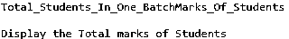
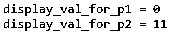

# C++中的内存管理

> 原文：<https://www.educba.com/memory-management-in-c-plus-plus/>


## C++中的内存管理介绍

C++中的内存管理是一种管理计算机内存并将所需的内存空间分配给程序执行的技术。它几乎是可关联的，并且基于与其他编程语言相同的概念。它根据整个计算机系统及其性能的即兴创作来处理空间和内存分配。数组在内存管理中起着非常重要的作用，因为它有助于以适当的间距对齐来存储数据，保持时间约束，从而通过使用 new 关键字分配内存来进行有效的资源管理。

### C++中的内存管理是如何工作的？

*   对于任何编程语言来说，内存管理都是一个关键而重要的概念，C++也是如此。内存管理的概念大纲主要围绕着时间-空间权衡和内存分配概念。它有助于在阵列的帮助下管理空间和内存相关的问题。数组是数据结构的主要组成部分，或者可以说是辅助内存管理的概念。如何让我们检查流量。数组是包含所有存储在内存中的数据的数据结构，它在声明数组时分配内存，通过适当的时间和空间有效分配资源，然后为了避免内存浪费，需要使用 new 运算符在运行时动态分配内存。
*   有时，程序员可能会声明一个具有最大大小的数组，然后根据需求分配内存，但在这种情况下，会有一些内存空间或单元未被使用。为了避免这种不必要的活动，非常需要记住用 new 关键字声明数组的内存分配技术，它将处理这种情况。
*   此外，任何程序员在实现时都必须记住，程序流将如何，以及资源如何能够在内存管理方面有效地管理时空交易。虽然内存管理操作符在运行时负责内存分配，但仍然应该更加谨慎，因为这将有助于他们不去争取任何类型的内存分配。如果与另一种编程语言(如 C)相比，内存管理也以类似的方式发生，只是在命名约束方面有一点小小的变化，这涉及到 C 中用于内存管理的 calloc 和 malloc 函数。
*   在 C++内存管理中，内存操作符使用 new 和 delete 操作符。与 C 语言不同，C 语言使用 malloc 和 calloc 函数在运行时动态分配内存，然后使用 free()函数释放动态分配的内存，C++内存管理使用一元运算符，如前面提到的 new 和 delete，来执行分配内存和创建空闲空间的相同任务，以便有效地分配资源。

### C++中的内存管理运算符

内存管理是任何编程语言的关键处理技术之一，需要有效地执行任何代码库。它涉及 C++中用于内存管理的某些一元运算符，如下所示:

<small>网页开发、编程语言、软件测试&其他</small>

*   新操作员
*   删除运算符

#### 新操作员

一个新的操作符用于创建对象，该对象存在并保持活动模式，这意味着内存分配仍然是活动的。这保持在活动状态，即在调用 delete()操作符之前，新对象一直存在，这将在下一节讨论。

与内存管理分配相关的 new 运算符的语法流程如下:

```
ptr_var = new data_tp
```

*   **ptr_var:** 这代表指针变量的名称。
*   **new:** 用于创建待分配对象的操作符。
*   **data_tp:** 表示分配时使用的数据类型。

示例:这个程序演示了 New 操作符，该操作符用于为对象分配和内存管理创建新对象，如输出所示。

**代码:**

```
#include <iostream>
#include <cstring>
using namespace std;
int main()
{
int no;
cout << "Total_Students_In_One_Batch";
cin >> no;
float* pon_tr;
pon_tr = new float[no];
cout << "Marks_Of_Students" << endl;
for (int k = 0; k < no; ++k)
{
cout << "Student_mrk" << k + 1 << ": ";
cin >> *(pon_tr + k);
}
cout << "\nDisplay the Total marks of Students" << endl;
for (int k = 0; k < no; ++k) {
cout << "Student_mrk" << k + 1 << " :" << *(pon_tr + k) << endl;
}
delete [] pon_tr;
return 0;
}
```

**输出:**




#### 删除运算符

另一方面，delete 操作符也是一个用于内存管理的一元操作符，只有当 new 操作符用于内存分配时才起作用，这意味着另一个事实，即 Delete 操作符完全依赖于 new 操作符。一旦新操作符完成了它的分配工作，并试图释放它的内存或删除未使用的或多余的分配内存，它将立即调用删除操作符。

**语法:**

```
delete ptr_var;
```

*   **删除:**表示调用 new 运算符后需要使用的一元运算符。
*   **ptr_var:** 这指向由新的一元运算符创建的对象，以便进一步删除。

这个程序演示了内存管理中删除一元操作符的功能，如输出所示。

**代码:**

```
#include <iostream>
#include <cstring>
using namespace std;
int main()
{
int* p1 = new int;
int* p2 = new int(11);
cout << "display_val_for_p1 = " << *p1 << "\n";
cout << "display_val_for_p2 = " << *p2 << "\n";
delete p1;
delete p2;
return 0;
}
```

**输出:**




### 结论

C++中的内存管理是 C++的基本和重要概念之一，它确保在内存管理运算符的帮助下有效地进行内存分配，其中包括一元运算符，以使未使用的内存得到正确使用。对于任何编程语言的程序员来说，浪费内存都不是一个好习惯。

### 推荐文章

这是一个 C++的内存管理指南。这里我们讨论一个介绍，内存管理是如何工作的，用例子来实现。您也可以浏览我们的其他相关文章，了解更多信息——

1.  [c++中的信号](https://www.educba.com/signal-in-c-plus-plus/)
2.  [c++中的阶乘程序](https://www.educba.com/factorial-program-in-c-plus-plus/?source=leftnav)
3.  [c++中的多级继承](https://www.educba.com/multilevel-inheritance-in-c-plus-plus/?source=leftnav)
4.  [c++中的构造函数](https://www.educba.com/constructor-in-c-plus-plus/?source=leftnav)


