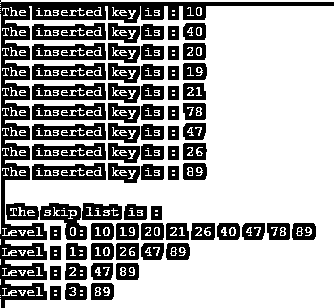

# 跳过列表 C++

> 原文：<https://www.educba.com/skip-list-c-plus-plus/>


## C++跳过列表简介

C++中的跳转列表用于存储元素的排序列表和链表。跳转列表是链接列表的版本。它在一次移动中跳过了整个列表中的多个元素，这就是它被称为跳过列表的原因。它可以有效地查看元素或数据。

跳过列表使用户能够快速搜索、删除和插入列表中的元素。它由一个基本列表和一个元素集合组成，这些元素保持后续元素的关系层次不变。因此，跳表的最坏情况运行访问、搜索、插入和删除复杂度是 O(n)，跳表的一般情况运行访问、搜索、插入和删除复杂度是 O(log(n))。

<small>网页开发、编程语言、软件测试&其他</small>

**跳过列表插入操作的算法是-**

```
skip_Insert( Ls, k)
local u [0...MxLevel + 1]
a = Ls → header
for x = Ls → level down to 0 do.
while a → f[x] → k  f[x]
u[i] = a
a = a → f[0]
l = createLevel()
if l > Ls → level then
for x = Ls → level + 1 to l do
u[x] = Ls → header
Ls → level = l
a = createNode(l, k, value)
for x = 0 to level do
a → f[x] = u[x] → f[x]
u[x] → f[x] = a
```

跳过列表搜索操作的算法是

```
Sip_Search (Ls, k)
a = Ls → header
loop invariant: a → key level down to 0 do.
while a → f[i] → key f[i]
a = a → f[0]
if a → key = k then return a → value
else return fail
```

跳过列表删除操作的算法是–

```
Deletion (Ls, k)
local u [0... MxLevel + 1]
a = Ls → header
for x = Ls → level down to 0 do.
while a → f[x] → key f[x]
u[x] = a
a = a → f[0]
if a → key = k then
for x = 0 to Ls → lvl do
if u[x] → f[x] ? a then break
u[x] → f[x] = a → f[x]
free(a)
while  Ls → header → f[Ls → lvl] = NIL and Ls → lvl > 0 do
Ls → lvl = Ls → lvl - 1
```

### C++中跳转表的使用

为了绕过某些节点，它使用了几层。参见下面的示例列表，它有 16 个节点和两层。

列表:[11，21，23，24，28，31，44，46，51，55，58，59，60，63，66，68]

快速通道:[11，31，58，68]

正常车道:[11，21，23，24，28，31，44，46，51，55，58，59，60，63，66，68]

第一层表现为“快速通道”，仅连接主要的外部元素，而第二层表现为连接所有元素的“正常通道”。如果我们想找到 51，它将从“快速路径”的第一个节点开始，并继续前进，直到找到下一个节点大于 51 的节点。它使用来自该节点的指针切换到“正常通道”，并且一旦找到这样的节点，就线性地检查“正常通道”上的 51(因为在下面的例子中 31 是节点)。因此，它从“正常车道”上的 31 号开始，借助线性搜索找到 51 号。

### C++中的跳转列表示例

C++中的跳过列表示例，用于将元素插入到列表中

#### 代码:

```
#include <bits/stdc++.h>
#include <iostream>
using namespace std;
//create node
class Node
{
public:
int k;
Node **forward;
Node(int, int);
};
Node::Node(int k, int lvl)
{
this->k = k;
// for forward allocate memory
forward = new Node*[lvl+1];
// forward fill with null
memset(forward, 0, sizeof(Node*)*(lvl+1));
};
// create Skip list
class Skip_List
{
// skip list maximum level and current level
int MxLVL, lvl;
float P;
// pointer point to header node
Node *header;
public:
Skip_List(int, float);
int randomLvl()
{
float r = (float)rand()/RAND_MAX;
int lvl = 0;
while (r < P && lvl < MxLVL)
{
lvl++;
r = (float)rand()/RAND_MAX;
}
return lvl;
}
Node* createNode(int key, int lvl)
{
Node *n = new Node(key, lvl);
return n;
}
void insert(int k)
{
Node *current = header;
// create a local update array and initialize
Node *update[MxLVL+1];
memset(update, 0, sizeof(Node*)*(MxLVL+1));
for (int i = lvl; i >= 0; i--)
{
while (current->forward[i] != NULL &&
current->forward[i]->k < k)
current = current->forward[i];
update[i] = current;
}
current = current->forward[0];
if (current == NULL || current->k != k)
{
// create a random level for node
int rlevel = randomLvl();
if (rlevel > lvl)
{
for (int i=lvl+1;i<rlevel+1;i++)
update[i] = header;
// Update the list current level
lvl = rlevel;
}
// create new node with random level generated
Node* n = createNode(k, rlevel);
for (int i=0;i<=rlevel;i++)
{
n->forward[i] = update[i]->forward[i];
update[i]->forward[i] = n;
}
cout << "The inserted key is : " << k << "\n";
}
}
void display()
{
cout<<"\n The skip list is : "<<"\n";
for (int i=0;i<=lvl;i++)
{
Node *node = header->forward[i];
cout << "Level : " << i << ": ";
while (node != NULL)
{
cout << node->k<<" ";
node = node->forward[i];
}
cout << "\n";
}
}
};
Skip_List::Skip_List(int MxLVL, float P)
{
this->MxLVL = MxLVL;
this->P = P;
lvl = 0;
// make header node and initialize key with -1
header = new Node(-1, MxLVL);
};
int main()
{
// Seed random number generator
srand((unsigned)time(0));
// create SkipList object with MAXLVL and P
Skip_List l(3, 0.5);
l.insert(10);
l.insert(40);
l.insert(20);
l.insert(19);
l.insert(21);
l.insert(78);
l.insert(47);
l.insert(26);
l.insert(89);
l.insert(26);
l.display();
}
```

上述代码的输出是–




和上面的程序一样，创建 node 类是为了创建 Node，创建 Skip_List 类是为了定义变量和不同的函数。skip_List 定义了执行特定任务的 randomLvl()、createNode()、insert()和 display()函数。最后，主要功能是创建 skip_list 对象，插入元素，并显示所有元素，正如我们在上面的输出中所看到的。

### 结论

C++中的跳转列表是用来对链表中的元素进行排序的。跳过列表允许用户快速搜索、删除和插入列表中的元素。

### 推荐文章

这是一个跳过列表 C++的指南。在这里，我们讨论了 C++中的跳转列表的工作方式，并给出了例子和输出。您也可以看看以下文章，了解更多信息–

1.  [C++ getline()](https://www.educba.com/c-plus-plus-getline/)
2.  [C++快速排序](https://www.educba.com/c-plus-plus-quicksort/)
3.  [C++ search()](https://www.educba.com/c-plus-plus-search/)
4.  [C++移动语义](https://www.educba.com/c-plus-plus-move-semantics/)


