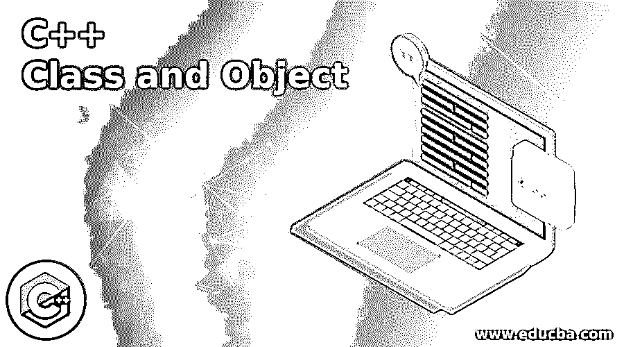

# C++类和对象

> 原文：<https://www.educba.com/c-plus-plus-class-and-object/>




## C++类和对象介绍

C++类和对象是编程必不可少的。c++中的类是结构块，它提示面向对象编程。对象是类的一个实例。它是一种客户化的信息类型，拥有自己的信息个体和部分作品，可以通过创建该类的一个场合来获取和利用。C++类类似于一篇文章的图表。类别是一种客户特征化的信息类型，包含有关个人和零件工作的信息。

信息个体是信息因素，而部分作品是用于控制这些因素的能力，并且这些信息个体和部分作品一起表征了一个类别中的物品的属性和行为。当一个类被特征化的时候，除了启动的时候，没有内存被指定，也就是说，一个对象被创建，然后内存被分配。

<small>网页开发、编程语言、软件测试&其他</small>

### 语法和参数

这是 C++中类和对象的通用语法。

```
ClassTypeObjectType
```

在哪里，

*   ClassType 表示必须提供的类的名称。
*   ObjectType 表示必须在类中分配的对象的名称。
*   在 C++中，类的特征是使用关键字 class，后跟类名。一个类的分类在波形部分中被描述，并以一个分号结束。

### C++中的类和对象是如何工作的？

现在我们看到了 C++中类和对象如何工作的各种例子。

#### 示例# 1–单个类的多个对象

**代码:**

```
#include <string>
#include <iostream>
using namespace std;
class Auto {
public:
string company;
string name;
int date;
};
int main() {
Auto autoObj1;
autoObj1.company = "Honda";
autoObj1.name = "City";
autoObj1.date = 2010;
Auto autoObj2;
autoObj2.company = "Mercedes";
autoObj2.name = "E";
autoObj2.date = 2021;
cout<< autoObj1.company << " " << autoObj1.name << " " << autoObj1.date << "\n";
cout<< autoObj2.company << " " << autoObj2.name << " " << autoObj2.date << "\n";
return 0;
}
```

**输出:**


在上面的程序中，我们首先创建了一个名为 auto 的类，public 是我们在输入值之前需要赋值的访问说明符。然后，我们输入 auto 类的字符串。之后，我们创建第一个对象，并提供特定字符串的值和类 auto 的整数值，类似地，我们创建第二个对象，并在其中赋值，最后运行代码。程序已经实现，auto 类中两个对象的输出显示在上面的快照中。

#### 示例# 2–具有单个类的单个对象

**代码:**

```
#include <string>
#include <iostream>
using namespace std;
class Something {
public:
string String;
int Num;
};
int main() {
Something Obj;
Obj.String = "Span";
Obj.Num = 25;
cout<<Obj.String<< "\n";
cout<<Obj.Num;
return 0;
}
```

**输出:**


在上面的程序中，我们首先创建一个名为 something 的类，然后在该类中定义一个对象。与前面的程序类似，我们在那个特定的对象中赋值，然后最终实现代码。因此，输出显示在上面的快照中。公共信息个人被附加地以类似的方式给出，而私人信息个人不允许被该项目直接得到。到达信息部分完全依赖于该信息部分的入口控制。

在类定义中描述的所有部分能力自然是内联的，然而，你同样可以通过使用与它们内联的标语来使任何非类工作内联。内联容量是真实的容量，在收集过程中可以在任何地方复制，因为预处理器规模很大，所以容量调用的开销减少了。

当一个类被特征化时，只有该物品的细节被特征化；没有分配内存或容量。为了利用类中的信息和访问能力，你必须创建对象。利用点号(' . ')可以得到类的个体和部分元素的信息)项目管理员。例如，如果项目的名称是 obj，并且您需要使用名称 printName()来访问零件工作，那么您应该编写 obj.printName()。

在描述一个类的时候，你描述了一个信息类型的轮廓。这并没有真正描述任何信息的特征，但是，它描述了类名的含义，也就是说，这个类的一个对象将由什么组成，以及在这样一个文章上可以执行什么任务。

### 结论–c++类和对象

最后，我想以说明 C++编写计算机程序的主要原因是将对象直接添加到 C 编程语言中，而类是 C++的核心组成部分，它支持对象安排的编程，通常被称为客户端特征化类型。一个类被用来表示一篇文章的类型，它将信息描述和控制信息的技术结合成一个完美的包。一个类中的信息和能力被称为类中的个体。

### 推荐文章

这是一个 C++类和对象的指南。这里我们还讨论了 c++中的介绍以及类和对象是如何工作的？以及语法和参数。您也可以看看以下文章，了解更多信息–

1.  [C++ free()](https://www.educba.com/c-plus-plus-free/)
2.  [C++ sizeof()](https://www.educba.com/c-plus-plus-sizeof/)
3.  [C++哈希表](https://www.educba.com/c-plus-plus-hashset/)
4.  [C++ wchar_t](https://www.educba.com/c-plus-plus-wchar_t/)


