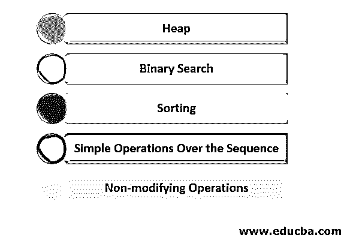
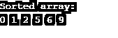

# C++算法

> 原文：<https://www.educba.com/c-plus-plus-algorithm/>


## C++算法简介

按顺序排列的有限步骤集，作为解决任何问题的指南。这个 c++算法词是专门用在计算机科学中的[来定义解决复杂问题的程序。对于不同的算法，解决方案的架构可以不同。与其他算法解决方案相比，最有效的算法是在更短的时间内提供解决方案并且消耗更少的内存。在 C++头文件<中，算法>包含了设计用于在数字范围内操作的函数。这些函数对数字进行操作，但不对数据进行任何操作。它只是在迭代或指向数字时工作，而不接触它的数据。](https://www.educba.com/what-is-computer-science/)

<algorithm>标题下的一些成员函数有:</algorithm>

<small>网页开发、编程语言、软件测试&其他</small>

*   **算法::adjacent_find():** 指向第一次出现的两个相同的连续数字。
*   **algorithm::all_of():** 如果数字位于第一个和最后一个元素的范围内，则返回 true。
*   **algorithm::binary _ search():**检查排序后的序列中是否存在“要搜索的值”。
*   **algorithm::copy():** 这个函数帮助将一系列元素从一个位置复制到新位置。
*   **algorithm::count_if():** 如果满足“if condition”中提到的条件，该函数返回特定元素出现的次数。
*   **算法::equal():** 这个函数测试两组元素是否相等。在 C++中预定义了许多类似的函数，编码人员可以利用它们的业务优势。

### C++算法讲解

C++在名称空间 std::ranges 中提供了这些算法的版本。算法是一个庞大的主题，涵盖了从搜索、排序到最小/最大堆的主题。这些可以分类为:




**1。Heap:** 在这样的类型中，我们构造一个堆来找出序列的最大值或最小值。这使用了树的数据结构来实现它的输出。

**2。二分搜索法:**这个 C++算法迭代地将整个序列分成两部分，直到它从目标序列中找到我们要搜索的实际值。这是一个非常有效的算法，因为它减少了一半的时间。使用这个 C++算法的基本条件是提供给它的序列应该以任意顺序排序。

**3。排序:**有不同类型的排序可以用来生成排序后的序列。分别是插入排序、[、](https://www.educba.com/bubble-sort-in-data-structure/)、[选择排序、](https://www.educba.com/selection-sort-in-data-structure/)、堆排序、快速排序、归并排序。其中一些算法的工作原理是“分而治之”，比如合并和快速排序。虽然在操作中使用了更多的内存，但是与其他方法相比，这些方法是快速有效的。

**4。简单的序列操作:**算法可以用来执行简单的操作，比如替换、删除、反转序列中的数字。使用不同的算法有许多方法可以达到这个输出，所有算法都旨在实现相同的输出。

**5。非修改操作:**一些像搜索、查找、计算序列中元素个数的操作。这些操作不会修改元素的数据值，但会围绕这些元素运行。

### 带步骤的算法示例

以下是 C++算法的一些示例，其步骤解释如下:

#### 示例#1

写一个 C++算法写一个程序把两个数相加。

**算法**

步骤如下所示:

1.  开始
2.  接受数量 1，数量 2
3.  Sum= num1+ num2
4.  显示总和
5.  停止

#### 实施例 2

写一个 C++算法来根据分数决定一个学生是通过还是失败。成绩是所有科目总成绩的平均值。

**算法**

步骤如下所示:

1.  开始
2.  输入标记 1、标记 2、标记 3、标记 4
3.  等级=(分数 1+分数 2+分数 3+分数 4)/4
4.  如果(分数< 50)则
5.  打印“失败”
6.  其他
7.  打印“通行证”
8.  如果…就会结束
9.  停止

#### 实施例 3

这是一个 C++算法，以升序或降序对数字序列进行排序。它比较最接近的两个数字，如果按升序排序，则将较小的数字放在较大的数字之前。这个过程一直持续到我们找到一个序列，在这个序列中我们找到了所有按顺序排序的数字。

该算法的时间复杂度为 O(n ),因为控件必须遍历序列中的所有元素，然后检查两个相邻的数字是否排序。如果不是，那么它排序并移动到系列中的另外两个相邻对。

**上述 C++算法的实现**

下面是带有代码实现的 C++算法示例:

**代码:**

```
#include <iostream>
void swap(int *p1, int *p2)
{
int temp = *p1;
*p1 = *p2;
*p2 = temp;
}
// This is an optimised code for the bubble sort
void bSort(int arrnumbers[], int n)
{
int i, j;
bool check;
for (i = 0; i < n-1; i++)
{
check = false;
for (j = 0; j < n-i-1; j++)
{
if (arrnumbers[j] > arrnumbers[j+1])
{
swap(&arrnumbers[j], &arrnumbers[j+1]);
check = true;
}
}
// We are breaking from the loop in case two elements were not swapped by inner loop.
if (check == false)
break;
}
}
//This function is to print the array sequence as final output after sorting
void print(int arrnumbers[], int sizeofarray)
{
int i;
for (i=0; i < sizeofarray; i++)
printf("%d ", arrnumbers[i]);
}
// This the main program from where the execution will start
int main()
{
int arrnumbers[] = {5, 6, 1, 0, 2, 9};
int n = sizeof(arrnumbers)/sizeof(arrnumbers[0]);
bSort(arrnumbers, n);
printf("Sorted array: \n");
print(arrnumbers, n);
return 0;
}
```

**输出:**




### 结论

C++算法是一个详细的逐步通用解决方案指南，旨在为任何问题提供最有效、最省时的解决方案。有很多工具可以检查算法的效率，比如 big Oh 符号、Omega 或 Gama 符号，这些工具对于发现算法的有效性非常有用。每种算法都有自己的特权和优势，我们根据问题陈述选择合适的解决方案。这在我们设计问题的解决方案时扮演着至关重要的角色，因为它是最终产品性能的基础。

### 推荐文章

这是一个 C++算法的指南。在这里，我们讨论 C++算法的介绍和详细解释，以及各种示例和代码实现。您也可以阅读以下文章，了解更多信息——

1.  [c++中的 3D 数组](https://www.educba.com/3d-arrays-in-c-plus-plus/)
2.  [Rust vs C++](https://www.educba.com/rust-vs-c/)
3.  [c++中的抽象类](https://www.educba.com/abstract-class-in-c-plus-plus/)
4.  [c++中的重载和重写](https://www.educba.com/overloading-and-overriding-in-c-plus-plus/)


