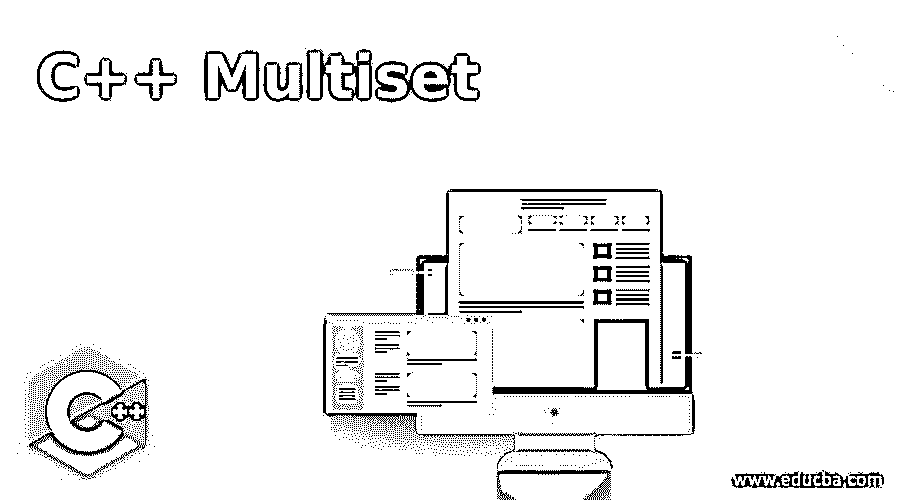
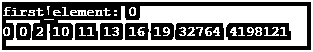
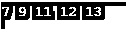
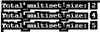
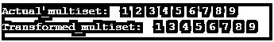
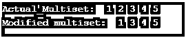
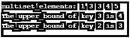
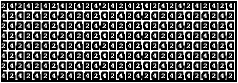
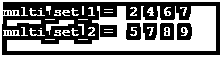

# C++多组

> 原文：<https://www.educba.com/c-plus-plus-multiset/>




## C++多重集函数简介**函数**

C++中的多重集是一种特殊类型的容器，它以特定的顺序存储元素，其中两个以上的元素或多个元素可以拥有一些等价的值。存在于多重集中的这些值用其键值和对值来标识元素，并且一旦它们被插入多重集中，它们在任何时间点都不能被修改，但是可以被执行的一个主要条件是附加元素可以在任何时间被插入和检索。应用了一些内部条件，其中元素中的这些值遵循某种排序。

### C++多重集的顶级函数

下面是 c++ multiset 的函数及其例子:

<small>网页开发、编程语言、软件测试&其他</small>

#### 1.#查找(常量 g)

它搜索通过参数传递的迭代器；如果在多重集中找到它，它将返回迭代器，否则它将在最后返回迭代器。

这个程序演示了多重集合中的查找(const g)函数。

**代码:**

```
#include <bits/stdc++.h>
using namespace std;
int main()
{
multiset<int> k;
k.insert(6);
k.insert(7);
k.insert(3);
k.insert(2);
cout << "The _elements_ within_the _set_ are: ";
for (auto pr_ = k.begin(); pr_ != k.end(); pr_++)
cout << *pr_ << " ";
auto psn = k.find(6);
cout << "\n Set_of_elements after 7 are:";
for (auto pr_ = psn; pr_ != k.end(); pr_++)
cout << *pr_ << " ";
return 0;
}
```

**输出:**


#### 2.开始()

迭代器返回到多重集数组的第一个元素。

这个程序演示了多重数组的 begin()函数。

**代码:**

```
#include <bits/stdc++.h>
using namespace std;
int main()
{
int arr[] = {10, 16, 19, 13, 11};
multiset<int> o(arr, arr + 10);
cout << "first_element: " << *(o.begin()) << endl;
for (auto pl = o.begin(); pl != o.end(); pl++)
cout << *pl << " ";
return 0;
}
```

**输出:**




#### 3.结束()

当多重集中的最后一个元素被前一个元素跟随时，迭代器返回。

这个程序演示了 multiset 中的 end()函数。

**代码:**

```
#include <bits/stdc++.h>
using namespace std;
int main()
{
int arr[] = { 11, 7, 13, 12, 9, 2, 17, 13 };
multiset<int> b(arr, arr + 5);
for (auto kl = b.begin(); kl != b.end(); kl++)
cout << *kl << " ";
return 0;
}
```

**输出:**




#### 4.大小()

size 函数返回多重集中的元素总数。

这个程序演示了多重集的大小函数。

**代码:**

```
#include <bits/stdc++.h>
using namespace std;
int main()
{
multiset<int> n;
n.insert(10);
n.insert(13);
cout << "Total_multiset_size: " << n.size();
n.insert(14);
n.insert(21);
cout << "\nTotal_multiset_size: " << n.size();
n.insert(32);
cout << "\nTotal_multiset_size: " << n.size();
return 0;
}
```

**输出:**




#### 5.max_size()

它返回多重集可以包含的最大元素数。

**例子:**这个程序演示了 max_size()函数。

**代码:**

```
#include <iostream>
#include <unordered_set>
using namespace std;
int main()
{
unordered_multiset<int> jun;
unsigned int mx_elemnt;
mx_elemnt = jun.max_size();
cout << "No_Of-Elements "
<< "multiset can-consider_ "
<< mx_elemnt << endl;
return 0;
}
```

**输出:**


#### 6.key_comp()

对象按顺序返回多重集中的元素。

**例子**:这个程序演示了 key_comp()函数。

**代码:**

```
#include <bits/stdc++.h>
using namespace std;
int main()
{
multiset<int> j;
multiset<int>::key_compare
comp
= j.key_comp();
j.insert(11);
j.insert(12);
j.insert(15);
j.insert(36);
cout << "Multiset_Elements\n";
int high_est = *j.rbegin();
multiset<int>::iterator tr = j.begin();
do {
cout << " " << *tr;
} while (comp(*tr++, high_est));
return 0;
}
```

**输出:**


#### 7.空()

检查并返回空的多重集状态。

**例子**:这个程序演示了 empty()函数。

**代码:**

```
#include <bits/stdc++.h>
using namespace std;
int main()
{
int arr[] = { 23, 12, 18, 6, 19, 8, 30, 10, 16 };
multiset<int> s(arr, arr + 8);
if (!s.empty())
cout << "Verify for multiset_not_Empty";
else
cout << "Verify for multiset_is_Empty";
return 0;
}
```

**输出:**


#### 8.擦除(常数 g)

该函数删除作为参数一部分传递的常数 g。

**例子**:这个程序演示了擦除(常量 g)功能。

**代码:**

```
#include <bits/stdc++.h>
using namespace std;
int main()
{
multiset<int> mul_ti_set;
multiset<int>::iterator ms_itr;
for (int i = 1; i < 10; i++) {
mul_ti_set.insert(i);
}
cout << "Actual_multiset: ";
for (ms_itr = mul_ti_set.begin();
ms_itr != mul_ti_set.end();
++ms_itr)
cout
<< ' ' << *ms_itr;
cout << '\n';
ms_itr = mul_ti_set.begin();
ms_itr++;
mul_ti_set.erase(ms_itr);
cout << "Transformed_multiset: ";
for (ms_itr = mul_ti_set.begin();
ms_itr != mul_ti_set.end();
++ms_itr)
cout << ' ' << *ms_itr;
cout << '\n';
return 0;
}
```

**输出:**




#### 9.成对插入(常数 g)

该函数在多重集中添加一个新元素。

这个程序演示了函数对插入(const g)。

**代码:**

```
#include <bits/stdc++.h>
using namespace std;
int main()
{
multiset<int> k;
k.insert(2);
k.insert(8);
k.insert(6);
k.insert(4);
k.insert(1);
cout << "Multiset_Elements are: ";
for (auto sd = k.begin(); sd != k.end(); sd++)
cout << *sd << " ";
return 0;
}
```

**输出:**


#### 10.迭代器插入(迭代器位置，常量 g)

迭代器指向的位置作为一个新元素添加到多重集中。

这个程序演示了迭代器插入(迭代器位置，常量 g)。

**代码:**

```
#include <bits/stdc++.h>
using namespace std;
int main()
{
multiset<int> d;
d.insert(8);
d.insert(4);
d.insert(6);
d.insert(0);
d.insert(1);
cout << "The elements in multiset are: ";
for (auto lp = d.begin(); lp != d.end(); lp++)
cout << *lp << " ";
return 0;
}
```

**输出:**


#### 11.擦除(迭代器位置)

迭代器的位置指针删除位置中的元素。

**例子:**这个程序演示了 erase(迭代器位置)。

**代码:**

```
#include <bits/stdc++.h>
using namespace std;
int main()
{
multiset<int> mul_ti_set;
multiset<int>::iterator ms_itr;
for (int d = 1; d < 6; d++) {
mul_ti_set.insert(d);
}
cout << "Actual_Multiset: ";
for (ms_itr = mul_ti_set.begin();
ms_itr != mul_ti_set.end();
++ms_itr)
cout
<< ' ' << *ms_itr;
cout << '\n';
ms_itr = mul_ti_set.begin();
ms_itr++;
mul_ti_set.erase(ms_itr);
cout << "Modified multiset: ";
for (ms_itr = mul_ti_set.begin();
ms_itr != mul_ti_set.end();
++ms_itr)
cout << ' ' << *ms_itr;
cout << '\n';
return 0;
}
```

**输出:**




#### 12.清除()

它只是删除了 multiset 中存在的所有元素。

**例子:**这个程序演示了 clear()函数。

**代码:**

```
#include <bits/stdc++.h>
using namespace std;
int main()
{
int arr[] = {4 , 12, 16, 19, 20 };
multiset<int> o(arr, arr + 5);
cout << "Multiset_Elements: ";
for (auto uo = o.begin(); uo != o.end(); uo++)
cout << *uo << " ";
cout << "\nAfter_clear_size is: ";
o.clear();
cout << o.size();
return 0;
}
```

**输出:**


#### 13.上限(常数 g)

这个函数的工作方式是，添加的元素或者到第一个元素，或者等价地到函数的末尾。

**例子:**这个程序代表 upper_bound(const g)函数。

**代码:**

```
#include <bits/stdc++.h>
using namespace std;
int main()
{
multiset<int> o;
o.insert(1);
o.insert(3);
o.insert(3);
o.insert(5);
o.insert(4);
cout << "multiset_elements: ";
for (auto pq = o.begin(); pq != o.end(); pq++)
cout << *pq << " ";
auto pq = o.upper_bound(3);
cout << "\nThe_upper_bound of key 3 is ";
cout << (*pq) << endl;
pq = o.upper_bound(2);
cout << "The_upper_bound of key 2 is ";
cout << (*pq) << endl;
return 0;
}
```

**输出:**




#### 14.下限(常数 g)

它将迭代器返回到元素的第一个或最后一个。

这个程序演示了多重集中的 lower_bound 函数。

**代码:**

```
#include <bits/stdc++.h>
using namespace std;
int main()
{
multiset<int> i;
i.insert(1);
i.insert(2);
i.insert(3);
cout << "Multiset_elements : ";
for (auto op = i.begin(); op != i.end(); op++)
cout << *op << " ";
auto op = i.lower_bound(2);
cout << "\nThe lower_bnd_of_ny_key : ";
cout << (*op) << endl;
}
```

**输出:**


#### 15.计数(常数 g)

返回与传递的元素匹配的所有元素，如“g”。

这个程序演示了 count(const g)。

**代码:**

```
#include <bits/stdc++.h>
using namespace std;
int main()
{
int arr[] = { 15, 10, 15, 11, 10, 18, 18, 20, 20 };
multiset<int> o(arr, arr + 9);
cout << "12 occrs " << o.count(10)
<< " 12th times of container occuring";
return 0;
}
```

**输出:**


#### 16.multiset::launte()

这个函数用来在容器中插入一个新元素。

这个程序演示了 multiset::launte()。

**代码:**

```
#include <iostream>
#include <set>
using namespace std;
int main()
{
multiset<int> m_mul_ti_set{};
m_mul_ti_set.emplace(20);
m_mul_ti_set.emplace(46);
m_mul_ti_set.emplace(15);
m_mul_ti_set.emplace(10);
m_mul_ti_set.emplace(2);
m_mul_ti_set.emplace(87);
for (auto po = m_mul_ti_set.begin();
po != m_mul_ti_set.end(); ++po)
cout << ' ' << *po;
return 0;
}
```

**输出:**


#### 17.multiset::operator =-

容器中的所有现有内容都将被新内容替换。

这个程序演示了 multiset::operator =-

**代码:**

```
#include <iostream>
#include <set>
using namespace std;
int main()
{
multiset<int> my_multi_st1{ 1, 7, 4, 9, 0};
multiset<int> my_multi_st2{ 3, 4 };
my_multi_st1 = my_multi_st2;
cout << " = ";
for (auto ho = my_multi_st1.begin();
ho != my_multi_st2.end(); ++ho)
cout << ' ' << *ho;
return 0;
}
```

**输出:**




#### 18.multiset::swap()

具有相同大小但不同元素的元素集可以使用考虑两个多重集的函数进行交换。

这个程序演示了 multiset::swap()函数。

**代码:**

```
#include <bits/stdc++.h>
using namespace std;
int main()
{
multiset<int> multi_set_ini1{ 8, 7, 5, 9 };
multiset<int> multi_set_ini2{ 2, 4, 7, 6 };
multi_set_ini1.swap(multi_set_ini2);
cout << "multi_set_1 = ";
for (auto ui = multi_set_ini1.begin();
ui != multi_set_ini1.end(); ++ui)
cout << ' ' << *ui;
cout << endl
<< "multi_set_2 = ";
for (auto ui = multi_set_ini2.begin();
ui != multi_set_ini2.end(); ++ui)
cout << ' ' << *ui;
return 0;
}
```

**输出:**




#### 19.多重集 equal_range()

迭代器返回一个对，该对引用容器中包含的所有元素的范围，相当于传递的参数。

这个程序演示了多重集合 equal_range()。

**代码:**

```
#include <bits/stdc++.h>
using namespace std;
int main()
{
multiset<int> q;
q.insert(1);
q.insert(6);
q.insert(2);
cout << "The mul_ti_set elements are: ";
for (auto op = q.begin(); op != q.end(); op++)
cout << *op << " ";
auto op = q.equal_range(3);
cout << "\nThe lower_bound_of 3 is " << *op.first;
return 0;
}
```

**输出:**


#### 20.multiset::crend()

这个函数返回一个常量反向迭代器，指向多重集中的最后一个元素。

这个程序演示了 multiset::crend()函数。

**代码:**

```
#include <bits/stdc++.h>
using namespace std;
int main()
{
int arr[] = { 13, 10, 5, 11, 8, 12, 10, 11 };
multiset<int> q(arr, arr + 8);
for (auto mi = q.crbegin(); mi != q.crend(); mi++)
cout << *mi << " ";
return 0;
}
```

**输出:**


#### 21.multiset::launte _ hint()

它在 multiset 中插入一个新元素。

这个程序演示了 multiset::launte _ hint()函数。

**代码:**

```
#include <bits/stdc++.h>
using namespace std;
int main()
{
multiset<int> o;
auto ui = o.emplace_hint(o.begin(), 2);
ui = o.emplace_hint(ui, 3);
o.emplace_hint(ui, 5);
o.emplace_hint(ui, 4);
for (auto ui = o.begin(); ui != o.end(); ui++)
cout << *ui << " ";
return 0;
}
```

**输出:**


#### 第 22 集:crbegin()

它返回一个指向容器中最后一个元素的常量反向迭代器。

这个程序演示了 multiset::crbegin()函数。

**代码:**

```
#include <bits/stdc++.h>
using namespace std;
int main()
{
int arr[] = { 18, 6, 11, 14, 10 };
multiset<int> e(arr, arr + 5);
cout << " Last_Element: " << *(e.crbegin()) << endl;
for (auto pr = e.crbegin(); pr != e.crend(); pr++)
cout << *pr << " ";
return 0;
} Output:
```


#### 第 23 集:贝尔金()

返回一个反向迭代器，它指向多重集容器中的最后一个元素。

这个程序演示了 multiset::rbegin()函数。

**代码:**

```
#include <bits/stdc++.h>
using namespace std;
int main()
{
int arr[] = { 10, 11, 5, 8, 10, 9 };
multiset<int> y(arr, arr + 6);
multiset<int>::reverse_iterator rv_itr;
for (rv_itr = y.rbegin(); rv_itr != y.rend(); rv_itr++)
cout << *rv_itr << " ";
cout << "\nlast_element_multi_set " << *(y.rbegin());
return 0;
} Output:
```


#### 24.multiset::cend()

这个函数返回常量反向迭代器，指向过去已经过最后一个元素的位置。

这个程序演示了多重集的 cend 函数。

**代码:**

```
#include <bits/stdc++.h>
using namespace std;
int main()
{
int arr[] = { 13,10,9,8,76,13,25,20 };
multiset<int> o(arr, arr + 4);
for (auto rs = o.cbegin(); rs != o.cend(); rs++)
cout << *rs << " ";
return 0;
}
```

**输出:**


#### 25 .多重集::cbegin()

这个函数返回一个常量元素，指向数组的第一个元素。

这个程序演示了 multiset::cbegin()。

**代码:**

```
#include <bits/stdc++.h>
using namespace std;
int main()
{
int arr[] = { 12, 10, 9, 18, 6 };
multiset<int> j(arr, arr + 2);
cout << "First_elements : " << *(j.cbegin()) << endl;
return 0;
} Output:
```


#### 26.multit::render()

这将返回反向迭代器，指向位于多集容器中第一个元素之前的元素。

这个程序演示了 multiset::rend()。

**代码:**

```
#include <bits/stdc++.h>
using namespace std;
int main()
{
int arr[] = { 10, 13, 12, 11, 10, 9 };
multiset<int> m(arr, arr + 3);
multiset<int>::reverse_iterator rmi;
for (rmi = m.rbegin(); rmi != m.rend(); rmi++)
cout << *rmi << " ";
return 0;
}
```

**输出:**


#### 27.multiset::get_allocator()

与多重集相关联的对象返回分配器的副本。

这个程序演示了 multiset::get_allocator()。

**代码:**

```
#include <iostream>
#include <set>
using namespace std;
int main()
{
multiset<int> m_multi_set;
int* k;
unsigned int u;
k = m_multi_set
.get_allocator()
.allocate(5);
k[0] = 10;
k[1] = 10;
k[2] = 20;
cout << "Allocated_array_contains: ";
for (u = 0; u < 5; u++) {
cout << k[u] << " ";
}
cout << endl;
m_multi_set.get_allocator().deallocate(k, 5);
return 0;
}
```

**输出:**


### 结论

C++ multiset 是一个包含内置功能的标准库，在实现方面对程序员非常有用，并为代码库提供了强大而灵活的用法。它使语言变得多才多艺，并帮助程序员轻松简单地使用不同的功能。

### 推荐文章

这是一个 C++多重集的指南。在这里，我们讨论 C++多重集函数的介绍及其语法，并举例说明代码实现和输出。您也可以浏览我们推荐的文章，了解更多信息——

1.  [c++中的递归函数(示例)](https://www.educba.com/recursive-function-in-c-plus-plus/)
2.  [c++的 11 大特性](https://www.educba.com/features-of-c-plus-plus/)
3.  [机器学习 C++库](https://www.educba.com/machine-learning-c-plus-plus-library/)
4.  [C 语言中类型为](https://www.educba.com/hashing-function-in-c/)的哈希函数


