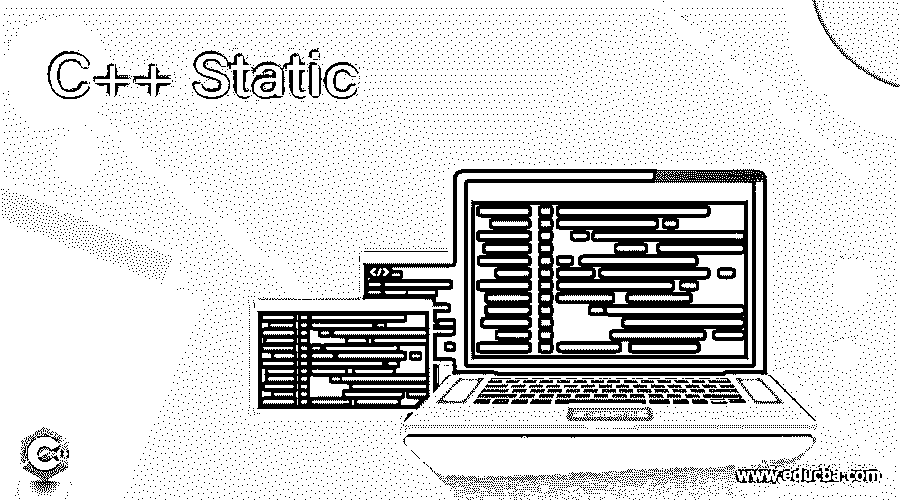

# C++静态

> 原文：<https://www.educba.com/c-plus-plus-static/>




## C++静态简介

C++是一种为程序员提供对系统资源和内存进行广泛控制的能力的语言。一般用于开发高性能 app。Static 是 C++中的一种方法，用于创建变量、对象和函数，以便在程序的整个生命周期中拥有专门分配的空间。static 关键字与变量、函数或数据成员一起使用，一旦使用，就不能反复修改。静态成员的初始化只进行一次，编译器保留变量直到程序完成。

静态变量允许在函数内部或外部定义。零是静态变量的默认值。在这篇文章中，针对在 C++中使用 static 的不同方法讨论了不同的例子。下面描述的在 C++中使用 static 的方法解释了 static 如何使用不同的方法工作，以及它们如何用于不同的目的。

<small>网页开发、编程语言、软件测试&其他</small>

### C++静态语法

**静态变量的语法**

```
static <datatype> <name_of_variable> = it’s_value; // Static variable
```

**静态函数的语法**

```
static <return_type> <name_of_function> { // Static functions syntax
...
}
```

### C++ Static 的使用实例

让我们讨论 C++静态的例子。

#### 示例 1–静态变量

**函数中的静态变量**

静态变量是一种在程序的整个生命周期中都有分配空间的变量。一旦一个静态变量被声明，它就为整个程序占据了一个分配给它的空间。甚至可以多次调用该函数，但空间只分配给静态变量一次，上次调用中更新的变量的值将被带入下一次调用。静态变量有助于在 C++中实现协同例程，其中函数的最后状态必须被存储。

在下面的例子中，定义了一个静态变量“add ”,每次调用函数 demo()时，它都会更新。这是函数中静态变量的一个基本例子。静态变量的前一个值将在下一次调用中结转，并且变量计数不会在每次函数调用时初始化。

**代码:**

```
//Static Variable in a function
#include <iostream>
#include <string>
using namespace std;
void demo()
{
// static variable is defined
static int add = 0;
cout << add << "/";
//update in the value
//it runs till the next function is called.
add++;
}
int main()
{
for (int i=10; i>0; i--)
demo();
return 0;
}
```

**输出:**


**类中的静态变量**

声明为静态的变量只被初始化一次，分配给它们的空间在单独的静态存储器中。这使得静态变量被不同的对象共享。不能为可变对象的单个静态变量创建多个副本。这也导致了使用构造函数时静态变量的非初始化。

在下面的例子中，我们可以看到一个静态变量“j”已经被创建并被显式初始化。在类外部使用了范围解析运算符。

**代码:**

```
//Static Variable in a class
#include<iostream>
using namespace std;
class EDUcba
{
public:
static int j;
EDUcba()
{
// Nothing is done here
};
};
int EDUcba::j = 5;
int main()
{
EDUcba pipe;
// value of j is printed
cout << pipe.j;
int p= pipe.j - 6;
cout << endl;
cout << p;
}
```

**输出:**


#### 示例 2–类的静态成员

**类的静态对象**

对象也可以声明为静态的，与上面例子中声明变量的方式相同。当我们声明对象是静态的时，它也有程序生命周期的范围。在下面的例子中，对象“nex”已经作为静态对象在 if 块中创建。在这种情况下，如果对象被创建为一个非静态对象，那么变量的作用域应该只在 if 块内部，一旦 if 块的控制结束，析构函数就会被调用。这个问题需要避免，所以对象必须像在程序中那样静态创建。这使得析构函数在主函数结束时被调用。这是因为静态对象及其在整个程序生命周期中的作用域。

**代码:**

```
// Static Class in Object.
#include<iostream>
using namespace std;
class EDUcba
{
int m = 0;
public:
EDUcba()
{
m = 0;
cout << "We Offer Trainings on:\n";
}
~EDUcba()
{
cout << "Data Science\n";
}
};
int main()
{
int o = 0;
if (o==0)
{
static EDUcba nex;
}
cout << "Machine Learning\n";
}
```

**输出:**


**类中的静态函数**

静态成员函数从来不像类中的静态变量和静态数据成员那样依赖于类的对象。允许使用“.”调用静态成员函数运算符和对象。通常，建议使用范围解析运算符和类名来调用静态成员。静态成员函数只允许访问静态数据成员，不允许访问非静态成员函数或非静态成员。

在下面的例子中，创建了一个静态函数 printtext()，当使用范围解析操作符和类名调用该函数时，将调用该函数。

**代码:**

```
//Static function in a class
#include<iostream>
using namespace std;
class EDUcba
{
public:
// static function
static void printtext()
{
cout<<"Heyoo! Welcome to EDUcba";
}
};
// important function
int main()
{
//static function is invoked
EDUcba::printtext();
}
```

**输出:**


### 结论

在以上文章的基础上，我们就可以理解 C++中静态的概念了。本文结合实例讨论了使用 static 的不同方法及其工作原理。这些例子将有助于理解这个概念，并根据程序员的要求使用它。

### 推荐文章

这是一个 C++静态的指南。在这里，我们还讨论了 C++ Static 的介绍和工作原理，以及它的例子和代码实现。您也可以看看以下文章，了解更多信息–

1.  [C++ fstream](https://www.educba.com/c-plus-plus-fstream/)
2.  [C++ sort()](https://www.educba.com/c-plus-plus-sort/)
3.  [C++保留()](https://www.educba.com/c-plus-plus-reserve/)
4.  [C++格式化程序](https://www.educba.com/c-plus-plus-formatter/)


