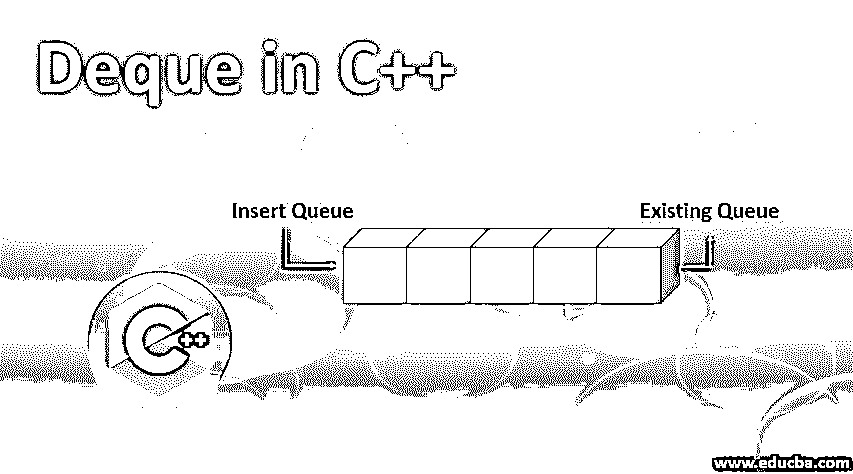
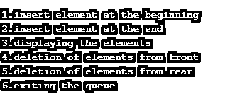
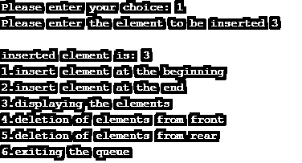
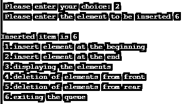
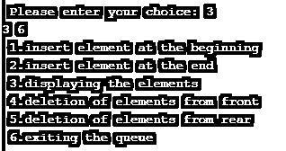
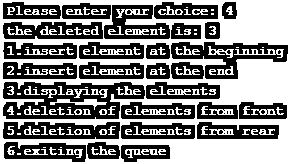
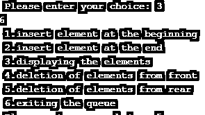
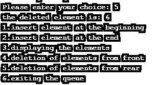
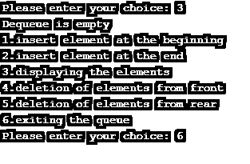

# C++中的 Deque

> 原文：<https://www.educba.com/deque-in-c-plus-plus/>




## C++中的 Deque 是什么？

Deque 是双端队列的标准首字母缩略词，它基本上是一个动态大小的序列容器。这里的动态大小指的是队列两端的收缩和扩展。这是向量的一种替代，因为它允许我们在前面和后面插入或删除元素。Vector 不提供这种两端插入和删除的特性。Deque 基本上是数据结构的一种实现。在插入和删除任何队列两端的元素时，双端队列比其他任何队列都更高效、更快。

**语法:**

<small>网页开发、编程语言、软件测试&其他</small>

```
deque < object_type > deque_name ;
```

对象类型可以是 int 等。然后根据你的选择命名！

### 一个 Deque 在 C++中是如何工作的？

现在我们将看看在 C++编程语言中 Deque 实际上是如何工作的。基本上有两种分类:

*   **输出受限的队列:**在这个分类中，你可以从队列的两端插入元素，但是删除只能在队列的前端进行。
*   **输入受限的队列:**在这个分类中，您可以从队列的两端删除元素，但是只能在队列的后端插入。

对于代码中的 dequee 实现，我们需要理解 dequee 的基本成员函数。以下是我们需要使用的功能:

**1。push_back (element p):** 这个 dequee 的成员函数允许用户在 dequee 的末尾插入一个元素 p。

**2。push_front (element p):** 这个队列的成员函数允许用户在队列的前面插入一个元素 p。

**3。这个队列的成员函数允许用户在队列中插入一个元素。在哪里以及如何插入取决于要传递的参数，因为这个插入成员函数有三种变体。让我们来看看它们:**

*   **Insert(迭代器 x，元素 p):** 这个方法允许用户在队列中迭代器 x 指向的位置插入元素 p。
*   **Insert( iterator x，int count，element p):** 这个方法允许用户在 dequee 中 iterator x 指向的位置插入元素 p，同时计算 x 在 dequee 中指向的位置的次数。
*   **Insert( iterator x，iterator first，iterator last):** 该方法允许用户在队列中 iterator x 指向的位置插入[first，last]范围内的元素。

### 在 C++中实现 Deque 的示例

作为一个例子，我们将看到一个 C++编程语言代码在我们的代码中实现 deque 特性。

**Note: **The deque container is empty when you run this program you have to push values into the container from the beginning of the end as per your choice after that only you will be able to add ( insert ) or delete values from the front end and the rear end. As the size is 10 so you will get error according to the input given by you.

**代码:**

```
#include<iostream>
using namespace std;
#define SIZE 10
class dequeue {
int a[20], fr ,re;
public:
dequeue();
void insert_starting(int);
void insert_ending(int);
void delete_front();
void ddelete_rear();
void display();
};
dequeue::dequeue() {
fr = -1;
re = -1;
}
void dequeue::insert_ending(int i) {
if ( re>=SIZE-1 ) {
cout << " \n insertion is not possible, overflow!!!! ";
} else {
if ( fr==-1 ) {
fr++;
re++;
} else {
re = re+1;
}
a[re] = i;
cout << " \nInserted item is " << a[re];
}
}
void dequeue::insert_starting(int i) {
if ( fr == -1 ) {
fr = 0;
a[++re] = i;
cout << " \n inserted element is: " << i;
} else if ( fr != 0 ) {
a[--fr] = i;
cout << " \n inserted element is: " << i;
} else {
cout << " \n insertion is not possible, overflow !!! ";
}
}
void dequeue::delete_front() {
if ( fr == -1 ) {
cout << " deletion is not possible :: dequeue is empty ";
return;
}
else {
cout << " the deleted element is: " << a[fr];
if ( fr == re ) {
fr = re = -1;
return;
} else
fr = fr+1;
}
}
void dequeue::ddelete_rear() {
if ( fr == -1 ) {
cout << " deletion is not possible::dequeue is empty ";
return;
}
else {
cout << " the deleted element is: " << a[re];
if ( fr == re ) {
fr = re = -1;
} else
re = re-1;
}
}
void dequeue::display() {
if ( fr == -1 ) {
cout << " Dequeue is empty ";
} else {
for ( int i = fr; i <= re; i++ ) {
cout << a[i]<< " ";
}
}
}
int main () {
int c,i;
dequeue d;
do{
cout << " \n 1.insert element at the beginning ";
cout << " \n 2.insert element at the end ";
cout << " \n 3.displaying the elements ";
cout << " \n 4.deletion of elements from front ";
cout << " \n 5.deletion of elements from rear ";
cout << " \n 6.exiting the queue ";
cout << " \n Please enter your choice: ";
cin>>c;
switch(c) {
case 1:
cout << " Please enter the element to be inserted ";
cin>>i;
d.insert_starting(i);
break;
case 2:
cout << " Please enter the element to be inserted ";
cin >> i;
d.insert_ending(i);
break;
case 3:
d.display();
break;
case 4:
d.delete_front();
break;
case 5:
d.ddelete_rear();
break;
case 6:
exit(1);
break;
default:
cout << " invalid choice, Please enter valid choice ";
break;
}
} while (c!=7);
}
```

**输出:**

首先，它显示了可供选择的选项数量。




在这里，我们输入 1 在开头添加元素。在下面的快照中，您可以看到我们添加了 3 作为元素。




然后，我们选择第二个选项，在末尾输入元素，并在末尾添加 6。




然后我们选择第三个选项来显示队列中的元素。它显示 3 和 6。




然后我们输入第四个选择，从前面删除元素。




我们再次选择选项 3 来检查元素是否从前面被删除。它只显示了一个元素，即 6。这意味着前面的元素被删除。




然后我们选择 5 从后面删除元素。




我们再次选择 3 来检查元素是否从队列中删除。它显示出队是空的。然后我们输入 6 退出队列。




### 结论

总之，对于在程序中经常在队列的开始和结尾插入和删除元素的操作，Deque 是您可以使用的最佳特性，因为它速度更快，有助于提高代码的执行速度。对于对数序列，deque 的性能更好。

### 推荐文章

这是一个用 C++编写的 Deque 的指南。在这里，我们讨论了在 C++编程语言中 dequee 是如何工作的，并给出了在代码中实现 dequee 特性的示例代码。您也可以浏览我们的其他相关文章，了解更多信息——

1.  [C++算法](https://www.educba.com/c-plus-plus-algorithm/)
2.  [C++关键词](https://www.educba.com/c-plus-plus-keywords/)
3.  [c++中的多重映射](https://www.educba.com/multimap-in-c-plus-plus/)
4.  [Else If in C++](https://www.educba.com/else-if-in-c-plus-plus/)


