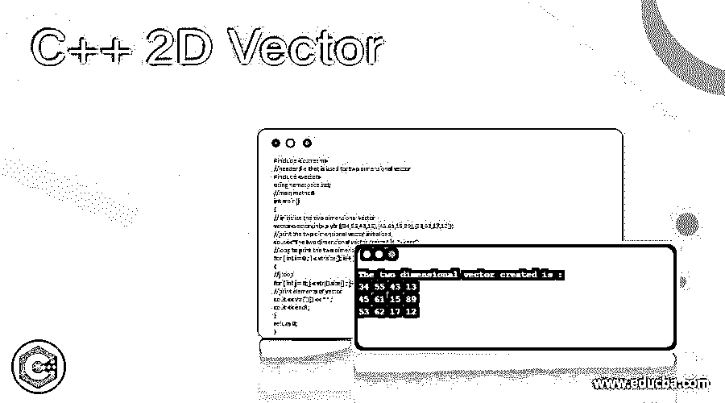
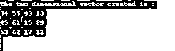
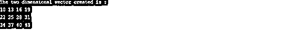
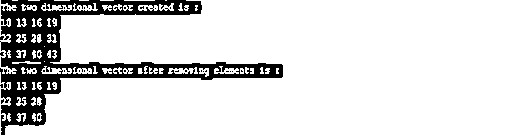

# C++ 2D 向量

> 原文：<https://www.educba.com/c-plus-plus-2d-vector/>




## C++ 2D 向量的定义

在 C++中，向量被称为动态数组，当插入或移除一个项目时，它能够自动调整自身大小，其存储由容器自动控制。二维向量，也称为向量的向量，是具有可调行数的向量，其中每一行都是向量。在这里，每个向量索引存储一个向量，这个向量可以在迭代器的帮助下被遍历和访问。也就是说，向量的向量几乎类似于向量数组，但区别仅在于动态属性。在本文中，我们将详细讨论 C++ 2D 向量。

**语法:**

<small>网页开发、编程语言、软件测试&其他</small>

在学习一门编程语言的新概念时，你必须理解它的基本语法。那么，让我们看看二维向量的语法。

```
vector<vector<data_type>> v;
```

### 2D 向量在 C++中是如何工作的？

现在，我们知道了二维向量的语法。是时候看看同样的样品了。

```
vector<vector<int> > vtr{{34,55,43,13},{45,61,15,89},{53,62,17,12}
```

这里，向量 vtr 被初始化为三行四列。如果我们使用 for 循环打印它，它将以向量的形式显示。

从向量外观本身，我们可以知道它类似于矩阵。但与矩阵相比，这是通用的，因为可以根据我们的要求添加或删除元素。二维矢量的应用包括:

*   图像表示和处理
*   二维网格的表示
*   动态编程中的应用

### 例子

下面是一些二维向量的示例程序。

#### 示例#1

初始化二维向量的 CPP 程序。

**代码:**

```
#include <iostream>
//header file that is used for two dimensional vector
#include <vector>
using namespace std;
//main method
int main()
{
// initialize the two dimensional vector
vector<vector<int> > vtr {{34,55,43,13},{45,61,15,89},{53,62,17,12}};
//print the two dimensional vector initialised
cout<<"The two dimensional vector created is :"<<endl;
//loop to print the two dimensional vector
for ( int i = 0 ; i < vtr.size(); i++ )
{
//j loop
for ( int j = 0; j < vtr[i].size() ; j++ )
//print elements of vector
cout << vtr[i][j] << " " ;
cout << endl ;
}
return 0;
}
```

**输出:**




在这个程序中，首先，提到一个头文件来支持向量。然后，在初始化向量时也定义了向量的元素。然后，使用一个循环来打印向量。

#### 实施例 2

CPP 程序，通过将一个一维向量推到后面来初始化一个二维向量。

**代码:**

```
#include <iostream>
#include <vector>
#define R 3
#define C 4
using namespace std;
//main method
int main()
{
// initialize the two dimensional vector
vector<vector<int> > vtr ;
// items to be inserted in the vector
int el = 10;
// code for insertion of elements
for (int i = 0; i < R ; i++) {
// Vector that is used to store items of column
vector<int> vtr1;
for (int j = 0; j < C ; j++)
{
//value added to vector
vtr1.push_back(el);
el += 3;
}
// Push created vector for creating the 2 dimensional vector
vtr.push_back(vtr1);
}
//print the two dimensional vector initialised
cout<<"The two dimensional vector created is :"<<endl;
//loop to print the two dimensional vector
for ( int i = 0 ; i < vtr.size(); i++ )
{
//j loop
for ( int j = 0; j < vtr[i].size() ; j++ )
//print elements of vector
cout << vtr[i][j] << " " ;
cout << endl ;
}
return 0;
}
```

**输出:**




同样在这个程序中，首先，提到一个头文件来支持向量。除此之外，常数 R 和 C 被定义用于提及行数和列数。然后，使用 push_back()方法将向量的元素推回到第一个向量。向量的初始值被称为变量 E1。在执行代码时，vector 被打印出来。

#### 实施例 3

CPP 程序，通过将一维向量推到后面并在后面删除元素来初始化二维向量。

**代码:**

```
#include <iostream>
#include <vector>
#define R 3
#define C 4
using namespace std;
//main method
int main()
{
// initialize the two dimensional vector
vector<vector<int> > vtr ;
// items to be inserted in the vector
int el = 10;
// code for insertion of elements
for (int i = 0; i < R ; i++) {
// Vector that is used to store items of column
vector<int> vtr1;
for (int j = 0; j < C ; j++)
{
//value added to vector
vtr1.push_back(el);
el += 3;
}
// Push created vector for creating the 2 dimensional vector
vtr.push_back(vtr1);
}
//print the two dimensional vector initialised
cout<<"The two dimensional vector created is :"<<endl;
//loop to print the two dimensional vector
for ( int i = 0 ; i < vtr.size(); i++ )
{
//j loop
for ( int j = 0; j < vtr[i].size() ; j++ )
//print elements of vector
cout << vtr[i][j] << " " ;
cout << endl ;
}
// Remove last items from the created vector
vtr[2].pop_back();
vtr[1].pop_back();
//print the two-dimensional vector after removing elements
cout<<"The two dimensional vector after removing elements is :"<<endl;
//loop to print the two dimensional vector
for ( int i = 0 ; i < vtr.size(); i++ )
{
//j loop
for ( int j = 0; j < vtr[i].size() ; j++ )
//print elements of vector
cout << vtr[i][j] << " " ;
cout << endl ;
}
return 0;
}
```

**输出:**




在这个程序中，加入了类似于上述的程序元素。但是，使用 pop_back()方法删除了 vector 的最后一个元素，为了更好地理解，在删除元素之前和之后都打印了 vector。

### 结论

二维向量是具有可调行数的向量，其中每一行都是向量。在本文中，将详细解释二维向量的不同方面。

### 推荐文章

这是一个 C++ 2D 矢量指南。这里我们讨论 2D 向量的定义以及它在 C++中是如何工作的？并分别给出了几个例子。您也可以看看以下文章，了解更多信息–

1.  [C++静态](https://www.educba.com/c-plus-plus-static/)
2.  [C++静态转换](https://www.educba.com/c-plus-plus-static_cast/)
3.  [C++ find_if()](https://www.educba.com/c-plus-plus-find_if/)
4.  [c++中的反射](https://www.educba.com/reflection-in-c-plus-plus/)


